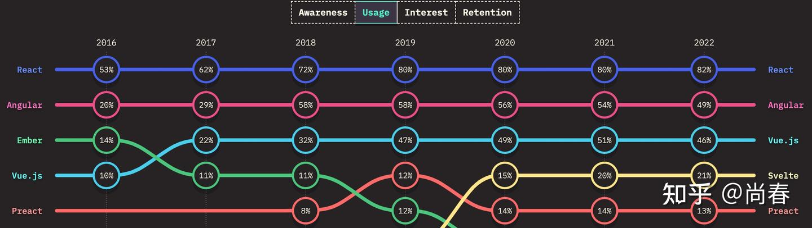
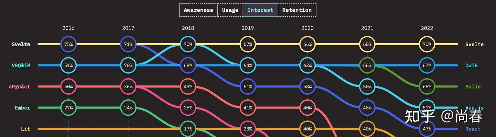
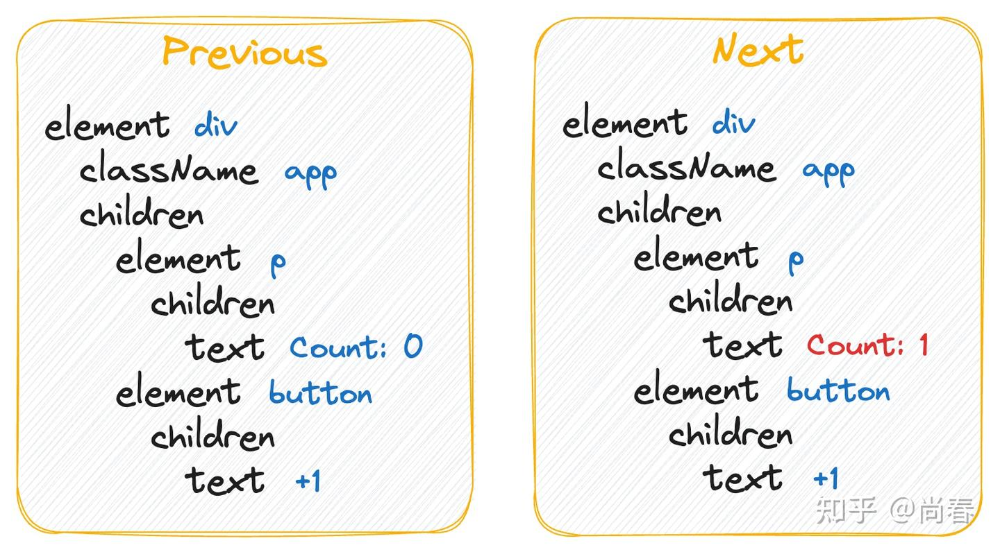
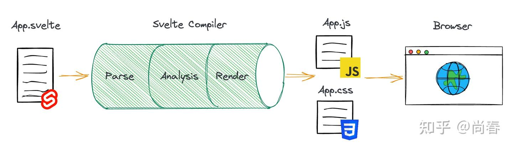
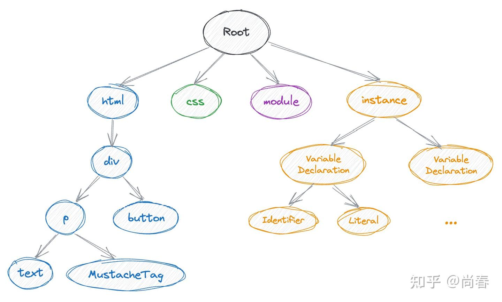
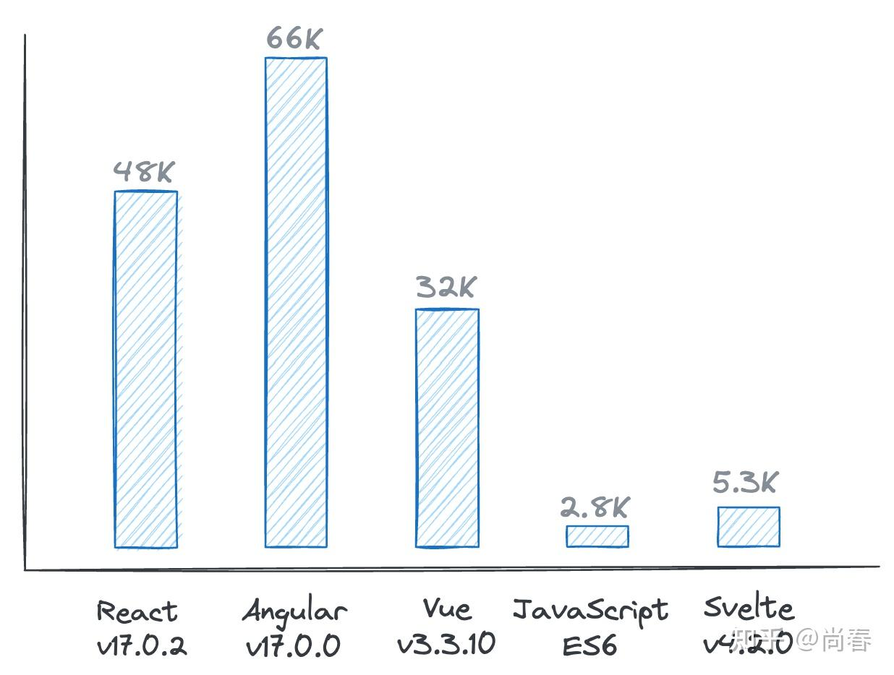
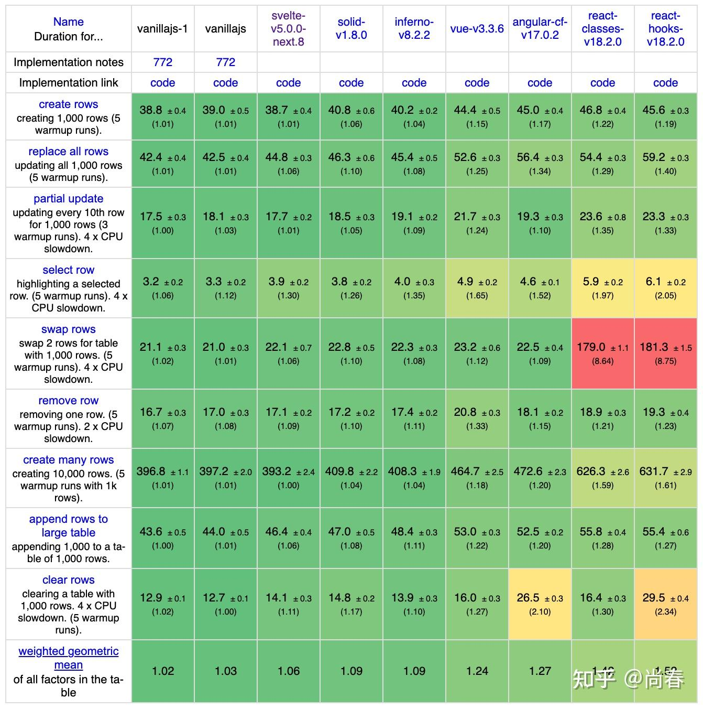
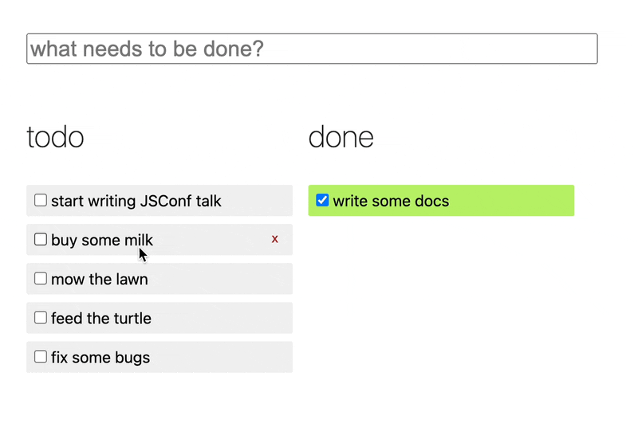
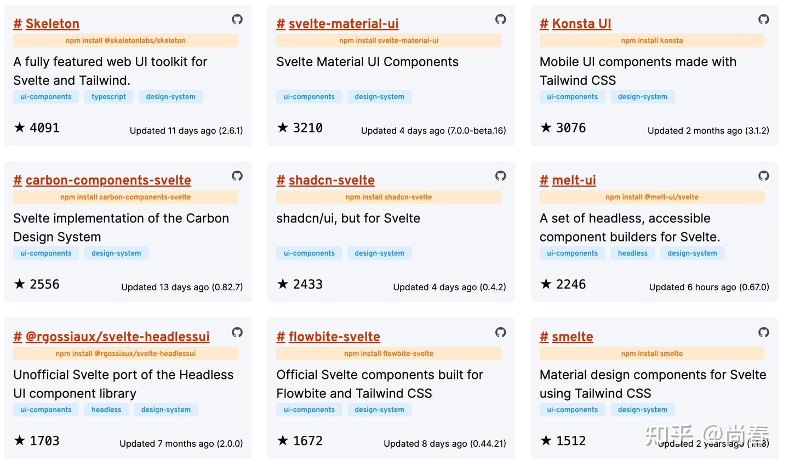
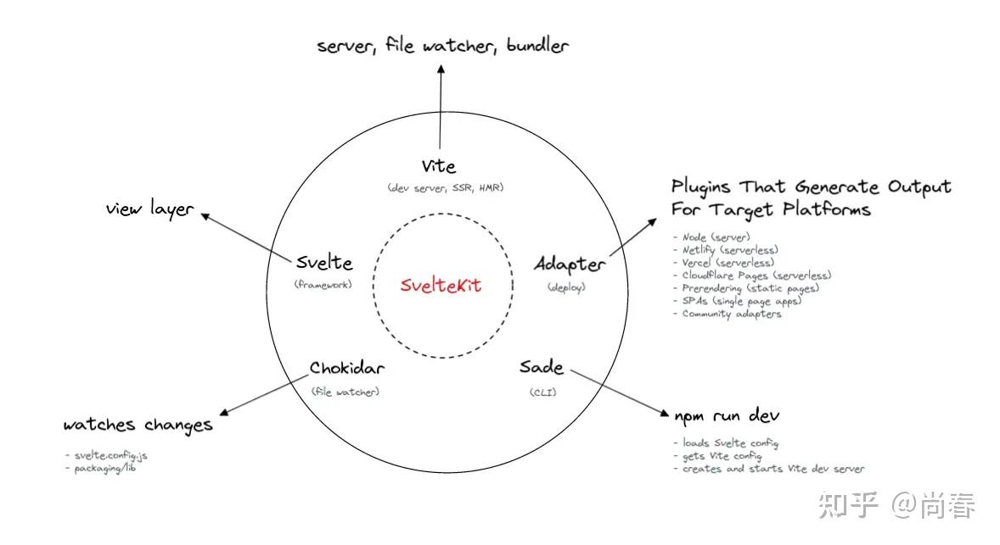

2016 年，Rollup 等工具的作者 Rich Harris 推出了又一力作：Svelte。这一新兴框架独辟蹊径，旨在解决 React 等框架的一系列问题。这几年 Svelte 虽然没有大红大紫，但从 [State of JS](https://2022.stateofjs.com/en-US/libraries/front-end-frameworks/)  统计来看，它一直保持着持久的热度：

*使用度紧跟三大框架*

*兴趣度蝉联榜首多年*

本文尝试由浅入深的介绍 Svelte，希望更多人在适合的场景下可以考虑尝试它。

## 缘起

Rich 非常喜欢 React 等前端库和框架带来的更加声明式、低心智负担的开发方式，这让前端工程师可以更好地控制复杂度、提升开发效率和质量。然而他也敏锐地洞察到了一些不那么尽如人意之处。

### Virtual DOM 真的快吗？

React、Vue 都引入了 Virtual DOM 的概念，从而能够进行现有 DOM 以及期望 DOM 的对比，然后再执行相对较重的 DOM 操作使得两者一致。

在 [Virtual DOM is pure overhead](https://svelte.dev/blog/virtual-dom-is-pure-overhead) 一文中， Rich 指出 Virtual DOM 其实更多的是一种实现声明式、状态驱动 UI 开发的一种手段，并非不可或缺。它主要的问题在于有很多没有必要的 Diff。

举个例子，假设我们有如下一个 React App：

```js
function App() {
  const [count, setCount] = useState(0);
  const handleClick = () => setCount(count + 1);
  return (
    <div className="app">
       <p>Count: {count}</p>
       <button onClick={handleClick}>+1</button>
    </div>
  );
}
```

如果点击一次按钮，新旧 Virtual DOM 对比如下：


<!--more-->

虽然只有 p 节点下的文本需要更新，然而，实际上 React 会遍历上述所有的节点，造成不必要的额外开销。

或许很多人觉得纯粹的 JS 运算不会有很显著的开销，不过在页面内容和逻辑足够复杂的情况下这个问题会愈加明显。因此，React 才提供了 `useMemo`, `useCallback` 等 Hooks 来避免一些耗时操作的重复执行或者不必要的重复渲染。但这些其实可以视作为一种**错误设计的副作用：**让开发者需要关注一些本是实现原理层面的技巧，增加了额外的心智负担。

那么是否有一种新的方式，可以在`count` 变化的时候仅仅更新那一个引用它的 DOM 文本节点呢？ 如果能够做到这一点，那岂不是更加响应式？

### Runtime 真的有必要吗？

React、Angular、Vue 等前端框架都有运行时，用以处理用户操作或者数据请求等情况下引发的组件状态变化，尽可能高效率地更新相应 DOM 节点。因此，运行时代码也会被打包到最终产物中。以典型的 [TodoMVC](https://github.com/tastejs/todomvc) 应用举例，我们看一下几种方案下的 JS 包体积：

| 框架 | JS 包体积 | JS 包体积（Gzip） |
|---|---|---|
| React v17.0.2 | 148K | 48K |
| Angular v17.0.0 | 219K | 66K |
| Vue v3.3.10 | 80K | 32K |
| JavaScript ES6 | 8.2K | 2.8K |

如果我们以 JavaScript ES6 为基准来衡量其它方案因为运行时而带来的额外包体积来看，那么 Vue 大概是 10 倍，React 大约为 18 倍，Angular 则达到了近 27 倍。

诚然，这些优秀的框架为我们提供了更为便捷和高效的开发方式，而且现在动辄上兆的中大型前端应用比比皆是，更快的网络条件下这区区几十 K 压缩后的 JS 包并不是那么关键。不过，退一步想，如果有一个新的方案可以提供比肩主流框架的特性但是最终包体积接近原生 JavaScript，鱼和熊掌兼得，那岂不是更好？

## 基本原理

基于以上两点洞见，Rich 开始从另一个全新的角度来重新理解和思考前端框架：

> Instead, the reason that ideas like React are so wildly and deservedly successful is that they make it easier to manage the complexity of your concepts. Frameworks are primarily **a tool for structuring your thoughts, not your code**.  
> Given that, what if the framework *didn't actually run in the browser*? What if, instead, **it converted your application into pure vanilla JavaScript**, just like Babel converts ES2016+ to ES5? You'd pay no upfront cost of shipping a hefty runtime, and your app would get seriously fast, because there'd be no layers of abstraction between your app and the browser.   
> [Frameworks without the framework: why didn't we think of this sooner?](https://www.svelte.cn/blog/frameworks-without-the-framework)

他认为前端框架应该是主要用来**结构化想法而非代码**，它们使得一个应用的种种复杂度能够受到合理的控制。如果我们有办法能够在提供结构化想法的种种功能的同时，在**编译阶段**将应用源代码转换为接近原生 JS 实现的最终代码，那么就不再需要浏览器和源代码之间的中间抽象层，我们的应用也会运行的更快。

知易行难，虽然有了一个崭新的思路，但是落实在实现层面还会有众多挑战。接下来我们简要介绍下 Svelte 的具体实现。

### 基于模板的组件

为了能够最大限度地理解和推断开发者的意图，Svelte 采用了模板为先的组件封装方案。每个组件都存储在`.svelte` 文件中，语法是 HTML 的超集。

下面这个示例把前面的计数器 App 用 Svelte 来重新实现：

```html
<script>
  let count = 0;
  const handleClick = () => count += 1;
</script>

<div class="app">
  <p>Count: {count}</p>
  <button on:click={handleClick}>+1</button>
</div>

<style>
  .app { text-align: center }
</style>
```

*完整示例见 [Counter App • REPL • Svelte](https://svelte.dev/repl/e8f0d2ebd57242b0915d070464611272?version=4.2.8)。*

看起来真的非常像 Vue，组件的 JS、CSS、HTML 都写在同一文件中集中管理。因此从开发者的角度来看， Svelte 编程方式十分熟悉、自然。

选择模板而非灵活的 JSX 的原因也可以在这个例子中有所体现。编译器很容易发现结构化的视图中 p 元素有一部分文本需要用到`count`，以及点击按钮时需要调用一个回调函数，其它的部分都是确定的。因此只需在`count`变更时刷新相应的 DOM 文本节点即可。

为了在有一定约束的情况下提供足够多的功能，Svelte 也提供了一系列的模板语法：

```html
<!-- if block -->
{#if answer === 42}
  <p>what was the question?</p>
{/if}

<!-- each block -->
<ul>
  {#each items as item}
    <li>{item.name} x {item.qty}</li>
  {/each}
</ul>

<!-- bind events -->
<form on:submit|preventDefault={handleSubmit}>
  <!-- the `submit` event's default is prevented, so the page won't reload -->
</form>

<!-- bind properties -->
<input bind:value={name} />
<!-- same as <input on:input={e => name = e.target.value} value={name} /> -->

<!-- nested components -->
<script>
  import Widget from './Widget.svelte';
</script>
<div>
  <Widget />
</div> 
```

### Compiler as Framework

在介绍 Svelte 编译器如何工作之前，我们不妨设想：如果让我们自己使用原生 JS 实现上面的计数器 App 的话，会是什么样的呢？

一个可供参考的实现如下（暂时忽略 CSS）：

```js
function App() {
  // Step 1: Declare variables and functions in script tag
  let count = 0;
  const handleClick = () => {
    count += 1;
    lifecycle.update("count"); // Update the DOM nodes related to `count`
  };

  // Step 2: Declare HTML elements
  let div;
  let p;
  let text1;
  let text2;
  let button;
  let text3;

  // Step 3: Declare component lifecycle
  const lifecycle = {
    // Create DOM nodes and mount them under the target node
    create: (target) => {
      div = document.createElement("div");
      p = document.createElement("p");
      text1 = document.createTextNode("Count: ");
      text2 = document.createTextNode(count);
      button = document.createElement("button");
      text3 = document.createTextNode("+1");

      p.appendChild(text1);
      p.appendChild(text2);
      div.appendChild(p);
      button.addEventListener("click", handleClick);
      button.appendChild(text3);
      div.appendChild(button);
      target.appendChild(div);
    },
    // Update DOM nodes referring to some variable which has changed
    update: (changed) => {
      if (changed === "count") { // If the changed variable is `count`, only update `text2` then
        text2.data = count;
      }
    },
    // Clean DOM nodes created in this component
    destroy: () => {
      div.removeChild(p);
      button.removeEventListener("click", handleClick);
      div.removeChild(button);
      div.parentNode.removeChild(div);
    },
  };

  return lifecycle;
}
```

*可运行的完整示例见 [Naive Compiled App](https://codesandbox.io/p/sandbox/naive-compiled-app-hp8nmj?file=%2Findex.html%3A4%2C29)。*

上述实现有如下特点：

- 组件模板 script 中的部分基本原封不动，放在 App 组件函数的头部，因为一般这里会声明一些 DOM 中会用到的变量、回调等
- App 组件返回的是其生命周期对象，具体包括如下三个阶段：
- 为了能够在`count`变量发生变化时更新对应 DOM 节点，一个可以考虑的方案是**通过静态分析找到所有`count`变量更新的地方**，然后插入`lifecycle.update('count')`语句

下面让我们看一下使用 Svelte 生成的 JS 结果：

```js
/* App.svelte generated by Svelte v4.2.8 */
import { SvelteComponent, append, ... } from "svelte/internal";

function create_fragment(ctx) {
  let div, p, ...

  return {
    c() {
      div = element("div");
      t1 = text(/*count*/ ctx[0]);
      ...
    },
    m(target, anchor) {
      insert(target, div, anchor);
      append(div, p);
      ...
      if (!mounted) {
        dispose = listen(button, "click", /*handleClick*/ ctx[1]);
        mounted = true;
      }
    },
    p(ctx, [dirty]) {
      if (dirty & /*count*/ 1) set_data(t1, /*count*/ ctx[0]);
    },
    d(detaching) {
      ...
    },
  };
}

function instance($$self, $$props, $$invalidate) {
  let count = 0;
  const handleClick = () => $$invalidate(0, (count += 1));
  return [count, handleClick];
}

class App extends SvelteComponent {
  constructor(options) {
    super();
    init(this, options, instance, create_fragment, safe_not_equal, {});
  }
}
```

*完整代码见 [Simple Counter App • REPL • Svelte](https://svelte.dev/repl/534e69f9c93046958241337ccbc8f8dd?version=4.2.8)。*

可以看出，虽然细节上有些许不同，但是整体的代码结构和我们前面人肉编译的版本非常相像。令人惊叹的是，Svelte 也能够在 `count` 变更时精准地更新对应的文本节点，十分高效。这里回调函数中的`$$invalidate`可以理解成一种更具效率的数据变更处理机制，具体实现运用了位掩码（bitmask）来标记脏数据的变量索引，然后安排一个 [microtask](https://developer.mozilla.org/en-US/docs/Web/API/HTML_DOM_API/Microtask_guide/In_depth) 异步进行批量更新。

此外，除了一些简单的 `append`、`element`、`set_data`等工具方法和`SvelteComponent`基类以外，最终构建的应用几乎没有使用任何额外的框架代码，所有的框架工作都基本在编译阶段完成，真所谓是“编译器即框架”！

### 编译过程

Svelte 编译器将 .svelte 文件中的组件编译成一个 JS 文件和一个可选的 CSS 文件，这些产物可以在浏览器中直接运行：


在编译器内部，可以细分为解析模板、分析代码、构建产物三个步骤。

**Step 1. 解析模板**

读取输入的 .svelte 组件内容后，Svelte 开始进行解析：

- 对于`<script>`标签：使用 [Acron](https://www.npmjs.com/package/acorn) 将其内容解析为抽象语法树 AST
- 对于`<style>`标签：使用 [CSSTree](https://www.npmjs.com/package/css-tree) 将其内容解析为抽象语法树 AST
- 其它标签：使用自带的解析器将其内容解析为抽象语法树 AST，支持包括 HTML 标签、组件标签、逻辑语句块等

这一步的处理结果结构大致如下：

```js
{
  // HTML AST
  html: { type: 'Fragment', children: [...] },
  // CSS AST
  css: { ... },
  // Script AST
  instance: { context: 'default', content: {...} },
  // Module script AST (<script context="module">)
  module: { context: 'context', content: {...} },
}
```

以计数器 App 为例，处理结果如图所示：


**Step 2. 分析代码**

这是非常核心的一个步骤，主要的工作是通过遍历上述 AST 来追踪视图用到的变量及其依赖，为接下来的代码生成做好准备。

仍然以计数器 App 为例，Svelte 分析过程大致如下：

1. 创建一个新的 Component 实例，用以存储分析结果信息，譬如 DOM 树 fragment、追踪的变量 vars 等
2. 解析 instance 和 module 的 AST，从中找到所有的变量声明、变量引用和变量更新的表达式。在该例中，变量声明为 `let count = 0`，变量更新为 `count += 1` ，因此 Svelte 确定需要追踪的变量为`count`
3. 解析 html 的 AST，从中找到所有视图中使用到的变量。在该例中，有一个文本节点引用了`count`，因此 Svelte 标记该变量为 referenced，确定它更新时需要更新视图
4. 处理 CSS selector 等

有很多的优化手段都可以在这一步进行，譬如：

```html
<script>
  function square(num) {
    return num * num;
  }

  let count = 0;
  const handleClick = () => count += 1;
</script>

<div class="app">
  <p>Square count: {square(count)}</p>
  <button on:click={handleClick}>+1</button>
</div>
```

添加的新函数`square`是一个不依赖任何外部变量的纯函数，虽然也被视图使用，但不需要每次创建这个组件的时候都重新声明，因此 Svelte 使用了变量提升（Hoisting）将其放在输出 JS module 的顶层而非`instance`函数内部。

**Step 3. 构建产物**

一切准备妥当，接下来就是组装最终的 JS 和 CSS 文件内容了。在这一步，一个主要的挑战是如何让生成的代码尽可能少。如无必要，勿增实体。

举一个例子，假设我们希望让计数器 App 可以通过属性来设定`count`的初始值，代码改动如下：

```html
<script>
  // If this component is called with prop `count`, use its value. Otherwise use 0 by default
  export let count = 0;
  const handleClick = () => count += 1;
</script>

<div>
  <p>Count: {count}</p>
  <button on:click={handleClick}>+1</button>
</div>
```

这时我们发现编译后的 JS 中`instance`方法变成了：

```js
function instance($$self, $$props, $$invalidate) {
  let { count = 0 } = $$props;
  const handleClick = () => $$invalidate(0, count += 1);

  $$self.$$set = $$props => {
    if ('count' in $$props) $$invalidate(0, count = $$props.count);
  };

  return [count, handleClick];
}
```

这里新定义的 `$$self.$$set` 方法专门提供给 [component.$set](https://svelte.dev/docs/client-side-component-api#%24set) 方法以便动态更新组件属性。如果我们没有这样的需求，则最终的产物中就不会包含这样的逻辑。

想进一步了解整个编译过程的朋友可以阅读下 Svelte 核心贡献者陈立豪的这篇文章 [The Svelte Compiler Handbook](https://lihautan.com/the-svelte-compiler-handbook/) 或者他的这个油管视频 [Build your own Svelte](https://www.youtube.com/watch?v=mwvyKGw2CzU)。

### 效果

介绍完基本原理，现在让我们看下 Svelte 的具体表现吧。

从生成最终代码的体积来看，同样以 TodoMVC 为例，Svelte 代码的最终体积是：JS 包 13K，Gzip 压缩后 5.3K。下面是和其它框架对照的图表：


Svelte 构建 JS 包的体积是 Vue 的 1/6，React 的 1/9，Angular 的 1/12，已经非常接近于原生 JS。可以说是非常精巧了。

从运行速度来看，[JS Framework Benchmark](https://krausest.github.io/js-framework-benchmark/2023/table_chrome_120.0.6099.62.html) 的测试结果如下：


从最后一行的加权结果来看，Svelte 的性能非常接近原生 JS，与同类型编译型框架 Solid 以及以快著称的类 React 框架 Inferno 相当，优于 Vue、Angular，更是大幅领先 React。

## 进阶特性

了解完基本原理，我们这一小节来介绍几个常用的进阶特性。

### 显式声明响应性

在实际开发中，我们常常遇到一些类似这样的场景：一个变量依赖了另外一个或者多个变量，且这种依赖关系非常确定。譬如：

- 更新正方形的边长，其体积需要进行更新
- 添加一个新商品到购物车，购物车的商品数量和总价格需要相应的更新
- 标记一个待办事项为已完成，待办事项数量需要进行更新

得益于编译器即框架的优势，Svelte 使用`$`标签来更为显式地声明这类依赖关系，建立更具效率的响应性：依赖的变量有变化则需要重新执行赋值操作。下面是一个示例：

```html
<script>
  let count = 1;

  // the `$:` means 're-run whenever count changes'
  $: doubled = count * 2;
  // the `$:` means 're-run whenever doubled changes'
  $: quadrupled = doubled * 2;
</script>

<button on:click={() => count += 1}>
  Count: {count}
</button>

<p>{count} * 2 = {doubled}</p>
<p>{doubled} * 2 = {quadrupled}</p>
```

*完整示例见 [Reactive declarations • Svelte Examples](https://svelte.dev/examples/reactive-declarations)。*

实现这一特性的思路并不复杂：遇到有标签`$`的赋值语句时，则在等号右侧变量变化的时候执行`$$invalidate`将左侧变量标记为脏数据，进而触发后续的更新逻辑。

进一步地，Svelte 还支持使用`$`标签来声明任意`<script>`标签内顶层语句的响应性，下面是官网提供的一些例子：

```html
<script>
  export let title;
  export let person;

  // this will update `document.title` whenever
  // the `title` prop changes
  $: document.title = title;

  $: {
    console.log(`multiple statements can be combined`);
    console.log(`the current title is ${title}`);
  }

  // this will update `name` when 'person' changes
  $: ({ name } = person);
</script>
```

顺便提一句，这类显式声明响应性的方式可以 work，但是如果我们忘了添加，遗漏了一些地方（毕竟这种方式不是那么的常规），就会造成一些问题。Svelte 5 提出了一个更加函数式的解决方案：Runes，有兴趣的朋友可以去读下官方博客的这篇文章：[Introducing runes](https://svelte.dev/blog/runes)。

### 动画

Svelte 走编译路线也带来动画处理上的优势：一方面可以利用直接生成 DOM 操作的便利，在声明周期对象中添加各种动画所需的处理逻辑；另一方面，它可以做到只添加模板中使用到的动画逻辑，而不像普通的框架一样需要全部打包到 Runtime 中。

给节点添加过渡动画非常声明式，下面是一些示例：

```html
{#if visible}
  <!-- Fade in, and fade out -->
  <p transition:fade>Fades in and out</p>
{/if}

{#if visible}
  <!-- Fly in, and fade out -->
  <p in:fly={{ y: 200, duration: 2000 }} out:fade>Flies in, fades out</p>
{/if}

{#if visible}
  <!-- You can even define your own transition function -->
  <p transition:typewriter>The quick brown fox jumps over the lazy dog</p>
{/if}
```

下图是官方动画的[一个示例](https://svelte.dev/examples/animate)，Svelte 能够原生支持这种跨父节点的 DOM 节点移动动画，真的令人赞叹不已：


### 服务端渲染 (SSR)

既然对标 React 的功能，那么 SSR 是必不可少的，也是在 Svelte 1.0 版本之前就已经支持的特性。

接下来我们来看下计数器 App 在服务端渲染出来的内容：

```js
/* App.svelte generated by Svelte v4.2.8 */
import { create_ssr_component, escape } from "svelte/internal";

const App = create_ssr_component(($$result, $$props, $$bindings, slots) => {
  let count = 0;
  return `<div><p>Count: ${escape(count)}</p> <button data-svelte-h="svelte-1usigck">+1</button></div>`;
});

export default App;
```

与客户端生成代码非常不同，上面的 App 组件直接返回了一段字符串，也即根据当前的数据和组件模板渲染出的视图内容。其它的更新、销毁等声明周期在服务端这个场景下并不需要。

生成客户端代码时，需要开启 [hydratable](https://svelte.dev/docs/svelte-compiler#types-compileoptions) 设置来让 Svelte 在 DOM 节点挂载阶段（mount）加入相应的逻辑，从而能够在保持由服务端输出的原始 DOM 结构的基础上让页面“动“起来。

## 周边生态

作为一个新兴的前端框架，Svelte 也逐步获得了越来越多的周边工具支持。譬如本专栏之前介绍过的 React Query 在更名为 Tanstack Query 后就推出了 [Svelte Query](https://tanstack.com/query/v5/docs/svelte/overview)，他们团队的 React Table 目前也推出了 [Svelte Table](https://tanstack.com/table/v8/docs/adapters/svelte-table)。在这一节，让我们从状态管理、UI 库和集成开发方案几个方面了解下 Svelte 的周边生态。

### 状态管理

Svelte 从 1.42 版本开始就提供了一个内置的轻量级 store，内部实现采用 PubSub 模式，对外提供了`readable`、`writable`、`derived` 三个不同类型 store 数据的接口。下面是采用 Svelte store 重写的计数器组件：

```html
// stores.js
import { writable } from 'svelte/store';
export const count = writable(0);

// App.svelte
<script>
  import { count } from './stores.js';
	
  function increment() {
    // writble store has a `update` method to write its new value
    count.update((n) => n + 1);
  }
</script>

<div>
  <!-- we need to add a prefix `$` in the store to use its value in the template -->
  <p>The count is {$count}</p>
  <button on:click={increment}>+1</button>
</div>
```

一般情况下，store 建议写在单独的 JS/TS 文件中，这样方便让各个组件共享。Svelte store 并不是以 Svelte 组件为核心，而是以数据为核心。在这一点上，按照本专栏 [尚春：基于 Context 做 React 状态管理](https://zhuanlan.zhihu.com/p/607970423) 最后关于状态管理工具分类的表格，考虑到它的原子性和通过`derived`数据类型建立的依赖关系管理，应该类似右下角的 observables。

另一点需要指出的是，为了让 Svelte 编译器识别组件中引用的 store 数据，在模板中需要使用`$`作为 store 数据的前缀，这样的话，Svelte 就会在组件创建的`instance`函数中添加相应的订阅 store 数据更新的逻辑。

Svelte 提供了一个 [store contract](https://svelte.dev/docs/svelte-components#script-4-prefix-stores-with-%24-to-access-their-values-store-contract) 以便社区贡献更多的 store 实现，目前已经有一些诸如 [svelte-persisted-store](https://github.com/joshnuss/svelte-persisted-store)、[XState](https://github.com/statelyai/xstate) 等状态管理工具。

### UI 库

如果一个前端框架没有丰富的 UI 库，那么它就很难被更多人使用。对于 Svelte 来说，目前已经有足够多的选择：


*完整列表见 [https://sveltesociety.dev/packages?tag=design-system](https://sveltesociety.dev/packages?tag=design-system)。*

### SvelteKit

类似 Next 之于 React、Nust 之于 Vue，[SvelteKit](https://kit.svelte.dev/) 是 Svelte 应用开发的一套集成开发方案，提供了开箱即用的 SSR、路由、数据请求、热更新等一系列功能，方便开发者迅速上手。

借用一张 [Learn How SvelteKit Works](https://joyofcode.xyz/learn-how-sveltekit-works#sveltekit-uses-the-web-platform) 文中的图片，SvelteKit 采用的主要工具如下：


推荐刚入门的朋友优先考虑使用 SvelteKit 进行应用开发，有了 Vite 等工具的支持，开发体验非常顺滑。构建出的应用也做了性能、预渲染、SEO 等方面的优化，加上本就体积小巧的 Svelte 产物，用户体验也有一定保障。

## 结语

在 React、Angular 和 Vue 等主流框架之后，前端似乎陷入了一个发展瓶颈，很难再有引人瞩目的新概念，直到出现了像 Svelte 和 Solid 这样的编译型框架。它们不再依赖 Virtual DOM，而是直击本质，力求为开发者提供声明式、简化认知复杂度的开发体验，同时在浏览器中实现高效执行。

通过本文的分析，相信大家对Svelte也有了初步的了解，能够认识到相较于传统框架，这些新技术在性能上有着明显的优势，使得前端开发能够更加高效地交付产品。正是这种技术的革新，推动着前端开发领域不断前行。与此同时，它们也引发了开发者对编译过程和底层实现的更深层次思考。这种探索精神正是推动技术进步的动力，我们期待看到更多创新技术的出现，为前端开发带来新的可能性。

## 参考资料

1. [Rich Harris - Rethinking reactivity](https://www.youtube.com/watch?v=AdNJ3fydeao)
2. [新兴前端框架 Svelte 从入门到原理](https://zhuanlan.zhihu.com/p/350507037)
3. [Elab：Svelte 原理浅析与评测](https://zhuanlan.zhihu.com/p/448469958)
4. [Virtual DOM is pure overhead](https://svelte.dev/blog/virtual-dom-is-pure-overhead)
5. [Frameworks without the framework: why didn't we think of this sooner?](https://svelte.dev/blog/frameworks-without-the-framework)
6. [Rendering Mechanism - VueJS](https://vuejs.org/guide/extras/rendering-mechanism)
7. [Svelte Crash Course (in 10 pics!)](https://dev.to/methodcoder/svelte-crash-course-with-pics-27cc)
8. [The Svelte Compiler Handbook](https://lihautan.com/the-svelte-compiler-handbook/)
9. [A Look at Compilation in JavaScript Frameworks](https://dev.to/this-is-learning/a-look-at-compilation-in-javascript-frameworks-3caj)
10. [Compile Svelte in Your Head](https://www.youtube.com/watch?v=FNmvcswdjV8)
11. [Build your own Svelte](https://www.youtube.com/watch?v=mwvyKGw2CzU)
12. [Svelte State Management Guide](https://joyofcode.xyz/svelte-state-management)
13. [Learn How SvelteKit Works](https://joyofcode.xyz/learn-how-sveltekit-works)
14. [从 Svelte 3 的编译器中得到的启示](https://blog.rexskz.info/enlightenment-from-svelte-3-compiler.html)

## 彩蛋

Rich 在 2021 年底加入了 Vercel，让这个团队的阵容更加豪华。随后他参加了一个[关于 Svelte 未来想法的访谈](https://vercel.com/blog/the-future-of-svelte-an-interview-with-rich-harris)，里面介绍了不少”背后的故事“以及将来的畅想。


作为前端轮子哥，Rich 谈及了一个 2013 年他做的第一个开源项目 [Reactive](https://github.com/ractivejs/ractive)。那时 React 还没有宣布，等他在 Hacker News 上看到 React 开源的消息的时候，觉得非常惋惜。不过后来他还是将其开源并坚持了很长时间去维护这个项目。这些点点滴滴为之后 Rollup、Svelte 的发展积累了丰富经验。

谈及加入 Vercel 最大的变化，Rich 坦言：

> They're worried a project without any real financial backing is just going to disappear. Some of those people are now starting to turn around and say, *Well okay, it has a full-time engineer. Vercel is clearly excited about Svelte and is investing real resources into Svelte.*  
> 有些人担心一个没有任何真正财务支持的项目会消失。现在，其中一些人开始转变态度，他们说*，好吧，它有一个全职工程师。Vercel 明显对 Svelte 感到兴奋，并正在对 Svelte 进行实质性的投资。*

我相信这是真心话，也是 Rich 加入 Vercel 的最大理由之一（另一个可能是 Vercel 真给钱啊）。

还有一个有意思的问题：让 Rich 向 CTO 或者技术高管兜售 Svelte 和 SvelteKit，他的回复是：

> It kind of doesn't matter what you're building. Your competitive advantage is essentially limited by how fast you can ship stuff, and SvelteKit will let you ship stuff faster. That is what it boils down to.  
> 不管你在开发什么，你的竞争优势基本上取决于你能够多快地上线产品，而 SvelteKit 能让你更快地完成。这就是核心所在。  
> I believe moving from React to Svelte will allow you to write stuff faster. We have a whole thesis about how Svelte is a UI language that is designed explicitly for solving this problem and it allows you to write things in a more idiomatic way.  
> 我相信从 React 转向 Svelte 会让你更快地编写代码。我们有一个完整的论点，认为 Svelte 是一种专门设计用来解决这个问题的**用户界面语言**，它可以让你以更符合惯例的方式编写代码。

让我们祝福他和 Vercel 团队吧！
