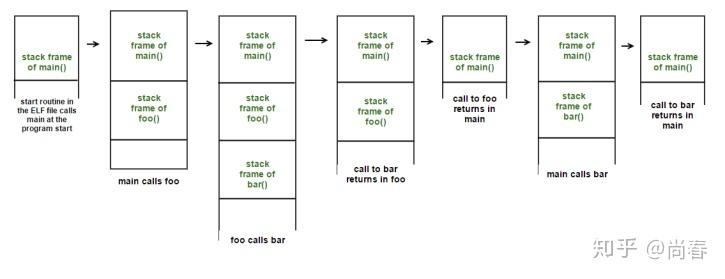
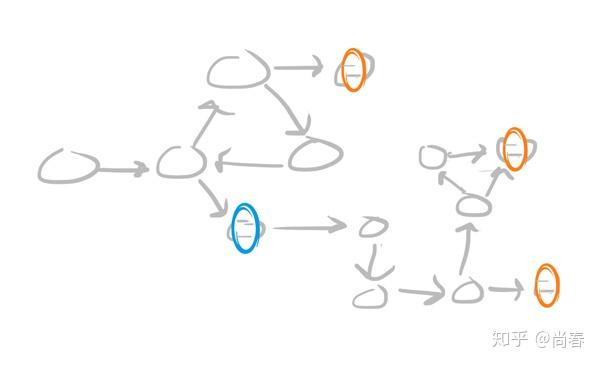
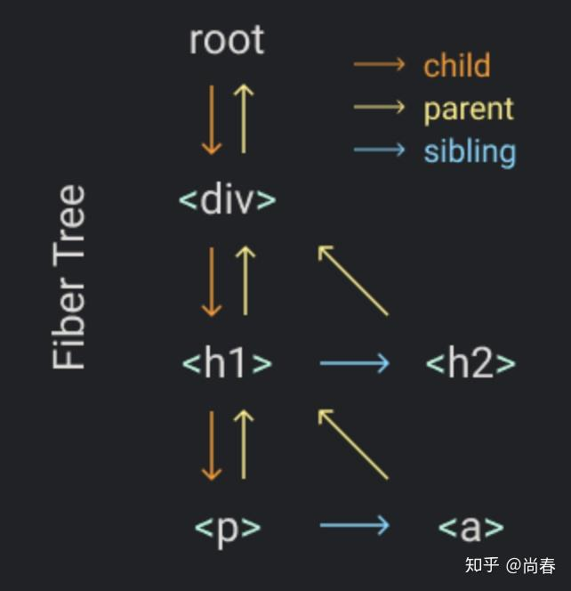

React 新近发布的 Hooks、Suspense、Concurrent Mode 等新功能让人眼前一亮，甚至惊叹 JS 居然有如此魔力。同时，这几个功能或多或少附带一些略显奇怪的规则，没有更深层次理解的话难以把握。其实这里面并没有什么“黑科技”，就大的趋势来讲，前端整体上还是在不断借鉴计算机其它领域的优秀实践，来帮助我们更方便地解决人机交互问题。本文着眼于支撑这些功能的一个底层编程概念 Continuation（译作“续延”），期望能够在了解它之后，大家对这几个功能有进一步的理解和掌握。当然，Continuation 在 React 之外也有很多的应用，可以一眼窥豹。

## Continuation 是什么？

有些人对 Continuation 并不陌生，因为有时候在谈到 Callback Hell（回调地狱）时会有提到这一概念。但其实它和回调函数大相径庭。

维基百科对它的定义是：

> A continuation is an abstract representation of the control state of a computer program.

即，continuation 是计算机程序控制状态的抽象表示。一个坊间更通俗的说法是：它代表程序的剩余部分。像 continue、break 这类控制流操作符一样，continuation 能够暴露给用户程序从而可以在恰当时机恢复执行，这种基本能力大大扩展了编程语言使用者的发挥空间，也为 excpetion handling、generators、coroutines、algebraic effects 等提供了坚实基础。


相信很多人和我一样，对这样不明就里的官方解释迷惑不解。没关系，我们首先举一个现实生活中的例子——Continuation 三明治：

> 譬如说你现在站在厨房的冰箱前，正在想要不要做一个三明治吃。这时候你做了一个 continuation 小纸条，上面写了你的位置和想要做的事情，然后把 continuation 小纸条贴在口袋上。然后你从冰箱里拿了一些面包和火鸡，自己做了一个三明治，放在柜子上。之后，你拿起口袋上的 continuation 小纸条，然后你发现自己现在又站在了冰箱前面，正在想着要不要做个三明治吃。不过不幸的是，在柜子上已经摆着一个三明治了，而且所有做三明治的食材也都不见了。所以，你就拿起那个三明治开心地吃了起来 :-)

<!--more-->

## 默认 Continuation

事实上，所有的程序都自带一个默认的 continuation，那就是调用栈（Call Stack）。调用栈中存放着当前程序的一系列剩余任务，每个任务在调用栈中表示为一个栈帧（Stack Frame），用以存放任务的数据、变量和调用信息。当调用栈为空时，意味着整个程序执行结束了。


```js
function main() {
  foo();
  bar();
}

function foo() {
  bar();
}

function bar() {
  // do something
}
```

可以看出，调用栈是严格按照后进先出的方式运行的，无法灵活调整执行顺序。此外，控制流的控制权也被运行环境牢牢掌握，程序员无能为力。

现在，让我们设想下，如果未来有一天我们能够将调用任务以链表的方式存储在堆中，是不是就可以突破调用栈的限制了呢？


首先，因为任务以调用桢的形式存储在堆中，并通过指针相互关联，形成一个调用帧链表。当前任务完成时，运行时可以使用这些指针跳到下一个调用帧。得益于链表这一组织形式，执行程序有能力调整调用帧之间的结构顺序。

## Continuation-Passing Style (CPS)

为了获得更多控制权，广大程序员们进行了艰苦卓绝的努力。CPS 即是第一种有意义的尝试。简单来说，它是将程序控制流通过 continuation 的形式进行显式传递的一种编程方式，具体有三个典型特征：

1. 每个函数的最后一个参数都是它的 continuation
2. 函数内部不能显式地使用 return
3. 函数只能通过调用 continuation 以传递它完成的计算结果

举个栗子：

```js
function double(x, next) {
  next(x * 2);
}

function add(x, y, next) {
  next(x + y);
}

function minus(x, y, next) {
  next(x - y);
}

// ((1 + 2) - 5) * 2
add(1, 2, resultAdd => {
  minus(resultAdd, 5, resultMinus => {
    double(resultMinus, resultDouble => {
      console.log(`result: ${resultDouble}`);
    });
  });
});
```

这不就是我们前端工程师耳熟能详的回调函数么，最后的调用也再次让我们想起了恐怖的回调地狱。表面上看的确如此，但是从控制流的角度来进一步考虑，这种模式的确赋予了程序员更多控制权，因为所有的计算步骤（函数）的 continuation 都是显式传递的。

例如，假设我们希望能够在计算的中间点进行检查，一旦计算结果小于 0 则直接返回该结果。基于 CPS 的三点特征，我们可以定义如下一个 evaluate 的计算过程：

```js
function evaluate(frames, operate, next) {
  let output;
  const run = (index) => {
    // Finish all frames, go to run the top level continuation
    if (index === frames.length) return next(output);

    // Pick up the next frame and run it with assembled arguments
    const { fn, args = [] } = frames[index];
    const fnArgs = index > 0 ? [output, ...args] : [...args];
    fnArgs.push((result) => {
      output = result;
      operate(output, next, () => run(++index));
    });
    fn(...fnArgs);
  };

  // Kick off
  run(0);
}

// ((1 + 2) - 5) * 2
evaluate(
  [
    { fn: add, args: [1, 2] },
    { fn: minus, args: [5] },
    { fn: double },
  ],
  (output, abort, next) => {
    if (output < 0) return abort(`the intermedia result is less than zero: ${output}`);
    next(output);
  },
  (output) => {
    console.log(`output: ${output}`);
  },
);
```

*[CPS 示例](https://jsbin.com/bidayeg/3/edit?js,console)*

可以看出，一方面，通过合理组织计算步骤模型，evaluate 可以帮助避免回调地狱的问题，另一方面，evaluate 的第二个参数会在每个计算步骤完成时进行检查，并且有能力 abort 后续所有计算步骤，直接调用顶层 continuation 返回中间结果。

这个示例展示了 CPS 为我们拓展的控制流操作能力，除此之外，CPS 还有如下优点：

- **尾调用**。每个函数都是在最后一个动作调用 continuation 返回计算结果，因此执行上下文不需要被保存到当前调用栈，编译器可以针对这种情况做尾调用消除（Tail Call Elimination）的优化，这种优化在函数式语言编译器中大量应用
- **异步友好**。众所众知，JavaScript 是单线程的，如果使用直接函数调用来处理远程请求等操作，那么我们将不得不暂停这唯一的线程直到异步操作结果返回，这意味着用户的其它交互得不到及时响应。CPS 或者换言之的回调模式提供了一种有效易用的方式来处理这类问题

然而，程序终究是人来编写和维护的，CPS 虽然有众多好处，但让所有人都遵循这样严格的方式编程非常困难，目前这种技术更多地在编译器中作为中间表示层应用。

## CallCC

目前 Continuation 的主流应用方式是通过形如 [callCC](https://en.wikipedia.org/wiki/Call-with-current-continuation)（call with current continuation）的过程调用以捕获当前 continuation，并在之后适时执行它以恢复到 continuation 所在上下文继续执行后续计算从而实现各种控制流操作。

Scheme、Scala 等语言提供了 call/cc 或等效控制流操作符，JS 目前并没有原生支持，但是通过后续介绍的两种方式可以间接实现。

现在假设我们已经可以在 JS 中使用 callCC 操作符，让我们试试看它都能为我们带来什么样的头脑风暴吧。

**小试牛刀**

让我们从一个非常简单的例子开始，了解下 callCC 如何运作：

```js
const x = callCC(function (cont) {
  for (let i = 0; i < 10; i++) {
    if (i === 3) {
      cont('done');
    }
    console.log(i);
  }
});

console.log(x);

// output:
// 0
// 1
// 2
// done
```

从输出结果可以看出，程序的 for 循环并没有全部完成，而是在 i 为 3 时执行 callCC 捕获的 continuation 过程时直接退出了整个 callCC 调用，并将 'done' 返回给了变量 x。我们可以总结下 callCC 方法的逻辑：

- 接受一个函数为唯一参数
- 该函数也有唯一一个参数 cont，代表 callCC 的后续计算，在这个例子中，即将 callCC 的计算结果赋值给 x，然后执行最后的 console.log(x) 打印结果
- callCC 会立即调用其函数参数
- 在该函数参数执行过程中，cont 可以接受一个参数作为 callCC 的返回值，一旦调用，则忽略后续所有计算，程序控制流跳转会 callCC 的调用处继续执行

得益于 [James Long](https://github.com/jlongster) 开发的 [Unwinder](https://github.com/jlongster/unwinder) 在线编译工具，非常推荐各位去 *[Simple 示例](https://jlongster.github.io/unwinder/browser/?code=Y29uc3QgeCA9IGNhbGxDQyhmdW5jdGlvbiAoY29udCkgewogIGZvciAobGV0IGkgPSAwOyBpIDwgMTA7IGkrKykgewogICAgaWYgKGkgPT09IDMpIHsKICAgICAgY29udCgnZG9uZScpOwogICAgfQogICAgY29uc29sZS5sb2coaSk7CiAgfQp9KTsKCmNvbnNvbGUubG9nKHgpOw==)* 尝试在浏览器里执行下，你甚至可以打断点然后单步执行哦~

**重新实现列表 some 方法**

进一步地，让我们检验下刚刚介绍的对 callCC 的理解，重新实现下列表的 some 方法：

```js
function some(predicate, arr) {
  const x = callCC(function (cont) {
    for (let index = 0; index < arr.length; index++) {
      console.log('testing', arr[index]);
      if (predicate(arr[index])) {
        cont(true);
      }
    }

    return false;
  });

  return x;
}

console.log(some(x => x >= 2, [1, 2, 3, 4]));
console.log(some(x => x >= 2, [1, -5]));

// output:
// testing 1
// testing 2
// true
// testing 1
// testing -5
// false
```

*[列表 some 示例](https://jlongster.github.io/unwinder/browser/?code=ZnVuY3Rpb24gc29tZShwcmVkaWNhdGUsIGFycikgewogIGNvbnN0IHggPSBjYWxsQ0MoZnVuY3Rpb24gKGNvbnQpIHsKICAgIGZvciAobGV0IGluZGV4ID0gMDsgaW5kZXggPCBhcnIubGVuZ3RoOyBpbmRleCsrKSB7CiAgICAgIGNvbnNvbGUubG9nKCd0ZXN0aW5nJywgYXJyW2luZGV4XSk7CiAgICAgIGlmIChwcmVkaWNhdGUoYXJyW2luZGV4XSkpIHsKICAgICAgICBjb250KHRydWUpOwogICAgICB9CiAgICB9CgogICAgcmV0dXJuIGZhbHNlOwogIH0pOwoKICByZXR1cm4geDsKfQoKY29uc29sZS5sb2coc29tZSh4ID0+IHggPj0gMiwgWzEsIDIsIDMsIDRdKSk7CmNvbnNvbGUubG9nKHNvbWUoeCA9PiB4ID49IDIsIFsxLCAtNV0pKTs=)*

在第一个 some 函数调用中，当 predicate 返回为 true 时，cont(true) 执行后程序控制流跳转到 callCC 调用处，然后 some 函数返回 true 并被打印。然而在第二个 some 调用中，因为所有 predicate 都为 false，没有 cont 被调用，因此 callCC 返回了其函数参数的最后一个 return 语句的结果。

在这个例子中，我们进一步了解了 callCC 的运行原理，并能用它实现一些工具方法。

**重新实现 Try-Catch**

接下来，让我们挑战一个难度更大的 callCC 应用：重写 try-catch。

```js
const tryStack = [];

function Try(body, handler) {
  const ret = callCC(function (cont) {
    tryStack.push(cont);
    return body();
  });
  tryStack.pop();

  if (ret.__exc) {
    return handler(ret.__exc);
  }
  return ret;
}

function Throw(exc) {
  if (tryStack.length > 0) {
    tryStack[tryStack.length - 1]({ __exc: exc });
  }
  console.log("unhandled exception", exc);
}
```

Try 函数接受两个参数：body 是接下来准备执行的主体逻辑，handler 是异常处理逻辑。关键点在于 Try 内部在执行 body 前会先将捕获的 cont 压入到堆栈 tryStack 中，以便在 Throw 时获取 cont 从而继续从 callCC 调用处恢复，从而实现类似 try-catch 语句的功能。

下面是一个 Try-Catch 的应用示例：

```js
function bar(x) {
  if (x < 0) {
    Throw(new Error("error!"));
  }
  return x * 2;
}

function foo(x) {
  return bar(x);
}

Try(
  function () {
    console.log(foo(1));
    console.log(foo(-1));
    console.log(foo(2));
  },
  function (ex) {
    console.log("caught", ex);
  }
);

// output:
// 2
// caught Error: error!
```

*[Try-Catch 示例](https://jlongster.github.io/unwinder/browser/?code=Y29uc3QgdHJ5U3RhY2sgPSBbXTsKCmZ1bmN0aW9uIFRyeShib2R5LCBoYW5kbGVyKSB7CiAgY29uc3QgcmV0ID0gY2FsbENDKGZ1bmN0aW9uIChjb250KSB7CiAgICB0cnlTdGFjay5wdXNoKGNvbnQpOwogICAgcmV0dXJuIGJvZHkoKTsKICB9KTsKICB0cnlTdGFjay5wb3AoKTsKCiAgaWYgKHJldC5fX2V4YykgewogICAgcmV0dXJuIGhhbmRsZXIocmV0Ll9fZXhjKTsKICB9CiAgcmV0dXJuIHJldDsKfQoKZnVuY3Rpb24gVGhyb3coZXhjKSB7CiAgaWYgKHRyeVN0YWNrLmxlbmd0aCA+IDApIHsKICAgIHRyeVN0YWNrW3RyeVN0YWNrLmxlbmd0aCAtIDFdKHsgX19leGM6IGV4YyB9KTsKICB9CiAgY29uc29sZS5sb2coInVuaGFuZGxlZCBleGNlcHRpb24iLCBleGMpOwp9CgpmdW5jdGlvbiBiYXIoeCkgewogIGlmKHggPCAwKSB7CiAgICBUaHJvdyhuZXcgRXJyb3IoImVycm9yISIpKTsKICB9CiAgcmV0dXJuIHggKiAyOwp9CgpmdW5jdGlvbiBmb28oeCkgewogIHJldHVybiBiYXIoeCk7Cn0KClRyeSgKICBmdW5jdGlvbiAoKSB7CiAgICBjb25zb2xlLmxvZyhmb28oMSkpOwogICAgY29uc29sZS5sb2coZm9vKC0xKSk7CiAgICBjb25zb2xlLmxvZyhmb28oMikpOwogIH0sCiAgZnVuY3Rpb24gKGV4KSB7CiAgICBjb25zb2xlLmxvZygiY2F1Z2h0IiwgZXgpOwogIH0KKTs=)*

和我们预期的效果一致，异常处理函数可以捕获 Throw 抛出的异常，同时主体逻辑 body 中的剩余部分也不再执行。另外，Throw 也像 JavaScript 原生的 throw 一样，能够击穿多层函数调用，直到被 Try 语句的异常处理逻辑处理。

**可恢复的 Try-Catch**

基于上一小节中 Try-Catch 实现，我们现在尝试一个真正的能体现 continuation 魔力的改造：让 Try-Catch 在捕获异常后，能够从抛出异常的地方恢复执行。

为了实现这一效果，我们只需要对 Throw 进行改造，使其也通过 callCC 过程捕获调用 Throw 时的 continuation，并将该 continuation 赋值给异常对象以供 Resume 过程调用从而实现异常恢复：

```js
function Throw(exc) {
  if (tryStack.length > 0) {
    return callCC(function (cont) {
      exc.__cont = cont;
      tryStack[tryStack.length - 1]({ __exc: exc });
    });
  }
  throw exc;
}

function Resume(exc, value) {
  exc.__cont(value);
}
```

实际使用的例子如下：

```js
function double(x) {
  console.log('x is', x);
  if (x < 0) {
    x = Throw({ BAD_NUMBER: x });
  }
  return x * 2;
}

function main(x) {
  return double(x);
}

Try(
  function () {
    console.log(main(1));
    console.log(main(-2));
    console.log(main(3));
  },
  function (ex) {
    if (typeof ex.BAD_NUMBER !== 'undefined') {
      Resume(ex, Math.abs(ex.BAD_NUMBER));
    }
    console.log('caught', ex);
  }
);

// output:
// x is 1
// 2
// x is -2
// 4
// x is 3
// 6
```

*[Resumable Exception 示例](https://jlongster.github.io/unwinder/browser/?code=Y29uc3QgdHJ5U3RhY2sgPSBbXTsKCmZ1bmN0aW9uIFRyeShib2R5LCBoYW5kbGVyKSB7CiAgY29uc3QgcmV0ID0gY2FsbENDKGZ1bmN0aW9uIChjb250KSB7CiAgICB0cnlTdGFjay5wdXNoKGNvbnQpOwogICAgcmV0dXJuIGJvZHkoKTsKICB9KTsKICB0cnlTdGFjay5wb3AoKTsKCiAgaWYgKHJldCAmJiByZXQuX19leGMpIHsKICAgIHJldHVybiBoYW5kbGVyKHJldC5fX2V4Yyk7CiAgfQogIHJldHVybiByZXQ7Cn0KCmZ1bmN0aW9uIFRocm93KGV4YykgewogIGlmICh0cnlTdGFjay5sZW5ndGggPiAwKSB7CiAgICByZXR1cm4gY2FsbENDKGZ1bmN0aW9uIChjb250KSB7CiAgICAgIGV4Yy5fX2NvbnQgPSBjb250OwogICAgICB0cnlTdGFja1t0cnlTdGFjay5sZW5ndGggLSAxXSh7IF9fZXhjOiBleGMgfSk7CiAgICB9KTsKICB9CiAgdGhyb3cgZXhjOwp9CgpmdW5jdGlvbiBSZXN1bWUoZXhjLCB2YWx1ZSkgewogIGV4Yy5fX2NvbnQodmFsdWUpOwp9CgovLyBSZXN1bWFibGUgZXhjZXB0aW9uCgpmdW5jdGlvbiBkb3VibGUoeCkgewogIGNvbnNvbGUubG9nKCd4IGlzJywgeCk7CiAgaWYgKHggPCAwKSB7CiAgICB4ID0gVGhyb3coeyBCQURfTlVNQkVSOiB4IH0pOwogIH0KICByZXR1cm4geCAqIDI7Cn0KCmZ1bmN0aW9uIG1haW4oeCkgewogIHJldHVybiBkb3VibGUoeCk7Cn0KCgpUcnkoCiAgZnVuY3Rpb24oKSB7CiAgICBjb25zb2xlLmxvZyhtYWluKDEpKTsKICAgIGNvbnNvbGUubG9nKG1haW4oLTIpKTsKICAgIGNvbnNvbGUubG9nKG1haW4oMykpOwogIH0sCiAgZnVuY3Rpb24oZXgpIHsKICAgIGlmKHR5cGVvZiBleC5CQURfTlVNQkVSICE9PSAndW5kZWZpbmVkJykgewogICAgICBSZXN1bWUoZXgsIE1hdGguYWJzKGV4LkJBRF9OVU1CRVIpKTsKICAgIH0KICAgIGNvbnNvbGUubG9nKCdjYXVnaHQnLCBleCk7CiAgfQopOw==)*

从上例输出中，我们可以清晰地注意到，在执行 main(-2) 时抛出的错误被准确地识别并且恢复为正确的正整数，并最终执行完所有主体逻辑。

**Algebraic Effects**

这种异常恢复的机制，也被称作 Algebraic Effects。它有一个非常核心的优势：**将主体逻辑与异常恢复逻辑分离**。例如我们可以在 UI 组件中抛出一个数据读取的异常，然后在更上层的异常处理逻辑中尝试获取该数据后恢复执行，这样既简化了 UI 组件的复杂度，也将数据获取的逻辑交给了调用方，更加灵活高效。

实际上 Algebraic Effects 还有着诸多的应用，Eff、Ocaml 等编程语言对 Algebraic Effects 有着[丰富的支持](https://github.com/ocamllabs/ocaml-effects-tutorial)。React 有不少团队成员是 Ocaml 的拥趸，新近推出的 Hooks、Suspense 都深受这种思想启发，能够让我们类似线性同步地调用各种状态读取、数据获取等异步过程。

下面我们来分析一个 Suspense 示例，体会下背后解决思路的相似之处：

```js
function ProfilePage() {
  return (
    <Suspense fallback={<h1>Loading profile...</h1>}>
      <ProfileDetails />
    </Suspense>
  );
}

function ProfileDetails() {
  // Try to read user info, although it might not have loaded yet
  const user = resource.user.read();
  return <h1>{user.name}</h1>;
}

const rootElement = document.getElementById("root");
ReactDOM.createRoot(rootElement).render(
  <ProfilePage />
);
```

*[Suspense 示例](https://codesandbox.io/s/happy-voice-mf4ol?file=/src/index.js)*

在 ProfileDetails 组件中，执行 resource.user.read() 时，由于当前数据并不存在，所以需要 throw 一个 promise 实例。位于上层的 Suspense 在捕获这个 promise 后会先展示 fallback 指定的 UI，然后等待 promise resolve 后再次尝试渲染 ProfileDetails 组件。虽然对比基于 Continuation 实现的异常恢复仍然有一定差距，并不能精确地从主体逻辑中抛出异常的语句处恢复，而是将主体逻辑重新执行一遍。不过 React 内部做了大量优化，尽最大可能地避免不必要开销。

## **CallCC 实现**

相信很多读者在一览 callCC 的强大能力之后，已经忍不住想要尽快了解下它的实现方式，很难想象土鳖的 JS 是如何能做到这一切的。这一章节我们就为大家揭开它的神秘面纱。

**编译**

类似 Babel 帮助我们将各种 JS 新标准甚至是草案阶段的语言特性转化为主流浏览器都能运行的最终代码一样，我们可以借助增加一个编译阶段将含有 callCC 调用的代码转化为普通浏览器都能运行的代码。

Prettier 作者 James Long 早些年开发网页游戏编辑器时曾打算制作一款交互式代码调试工具，种种尝试之后，他在友人的指导下学习了 [Exceptional Continuations in JavaScript](http://www.schemeworkshop.org/2007/procPaper4.pdf) 论文中介绍的高性能方法，并基于当时 Facebook 刚刚开源不久的编译 generator 利器 [Regenerator](http://facebook.github.io/regenerator/)，开发了 Unwinder 来编译 callCC，同时还提供了一个运行时以及实时在线 debug 工具。

Unwinder 或者说 Regenerator 的核心是状态机，即将源代码中的所有计算步骤打散，相互之间的跳转通过状态变换来进行。例如下面这段简短的代码：

```js
function foo() {
  var x = 5;
  var y = 6;
  return x + y;
}
```

在经过状态机转换后，变成了如下形式：

```js
function foo() {
  let $__next = 0, x, y;
  while (1) {
    switch($__next) {
      case 0:
        x = 5;
        $__next = 1;
        break;
      case 1:
        y = 6;
        $__next = 2;
        break;
      case 2:
        return x + y;
    }
  }
}
```

基于这种核心能力，辅以 Exceptional Continuations 特有的 try-catch、restore 等逻辑支持，Unwinder 能够很好地实现 Continuation。不过后续作者并没有再对其进行维护，同时它在异步操作方面的支持有一定缺陷，导致目前并不是非常流行。

**Generator**

另外一派是直接采用 Generator 来实现，这非常符合直觉，毕竟 Generator 就是一种转移控制流的非常独特的方式。

Yassine Elouafi 在系列文章 [Algebraic Effects in JavaScript](https://dev.to/yelouafi/algebraic-effects-in-javascript-part-1---continuations-and-control-transfer-3g88) 中系统性地介绍了 Continuation、CPS、使用 Generator 改造 CPS 并实现 callCC、进一步支持 Delimited Continuation 以及最终支持 Algebraic Effects 等内容，行文顺畅，内容示例夯实，是研究 JS Continuation 上乘的参考资料。

限于篇幅，本文不再对其原理进行深入介绍，感兴趣的同学可以读一下他的系列文章。下面是非常核心的 callcc 实现部分：

```js
function callcc(genFunc) {
  return function(capturedCont) {
    function jumpToCallccPos(value) {
      return next => capturedCont(value);
    }
    runGenerator(genFunc(jumpToCallccPos), null, capturedCont);
  };
}
```

为了支持类似上文中提到的 Try-Catch，我们可以定义如下方法：

```js
const handlerStack = [];

function* trycc(computation, handler) {
  return yield callcc(function*(k) {
    handlerStack.push([handler, k]);
    const result = yield computation;
    handlerStack.pop();
    return result;
  });
}

function* throwcc(exception) {
  const [handler, k] = handlerStack.pop();
  const result = yield handler(exception);
  yield k(result);
}
```

*[Try-Catch Generator 示例](https://jsbin.com/pekuxoq/edit?js,console)*

从实现层面来看，Generator 方式比编译方式更加简单，[核心代码](https://github.com/yelouafi/algebraic-effects.js/blob/master/algebraic-effects.js)不到百行。但是因为 Generator 本身的认知复杂度导致一定门槛，另外所有调用 callCC 的相关代码都必须使用 Generator 才能够顺利运行，这对于应用开发来说太过艰难，更不必说需要改造的海量的第三方模块。

## 缺点

Continuation 并非银弹，究其本质，它是一个高级版本的能够处理函数表达式的 Goto 语句。众所众知，由于高度灵活导致的难以理解和调试，Goto 语句在各个语言中都属于半封禁甚至封禁状态。Continuation 面临类似的窘境，需要使用者思虑周全，慎之又慎，将其应用控制在一定合理范围，甚至像 React 这样完全封装在自身实现内部。

## 结语

Continuation 是个非常复杂的概念，为了能够由浅入深、结合 JS 实际地来系统性阐述这一概念，笔者花费了自专栏开设以来最长的时间做各种梳理准备。不期望大家读过这篇文章后就马上开始使用 Continuation 或者 Algebraic Effects。如前文所述，目前 Continuation 还存在各方面的问题，应该实事求是，因地制宜，取其精华去其糟粕。正如 React Hooks、Suspense 一样，它们并没有真的搞了内部的编译器或者引入 Generator，而是结合实际，神似而形不同，最大限度地满足了设计目标。此外，期望这篇长文能帮助大家理解一些设计背后的思路，拓展一点前端工程师的技术视野，了解到整个编程领域内的优秀实践。

## 彩蛋

React Fiber 是 React 16 引入的最为重要的底层变化，主要解决阻塞渲染的问题。为了实现这一目标，Fiber 化整为零，将组件中的每一个子组件或者子元素都视为一个 Fiber，通过类似 DOM Tree 的组织方式形成一个 Fiber Tree：


每个 Fiber 都有独立的 render 过程和状态存储，在渲染时，我们可以把整个 Fiber Tree 的渲染过程理解成遍历整个 Fiber Tree 的过程，每个 Fiber 的渲染工作可以理解为一个函数调用，为了不阻塞页面交互，React 核心的任务调度算法是这样的：

```js
function workLoop(deadline) {
  let shouldYield = false;
  while (nextUnitOfWork && !shouldYield) {
    nextUnitOfWork = performUnitOfWork(
      nextUnitOfWork
    );
    shouldYield = deadline.timeRemaining() < 1;
  }

  if (!nextUnitOfWork && wipRoot) {
    commitRoot();
  }

  requestIdleCallback(workLoop);
}

requestIdleCallback(workLoop);
```

在每个浏览器 idle 的时间片内，workLoop 会尽可能多地执行 Fiber 渲染任务，如果时间到期且仍然有未完成任务时，nextUnitOfWork 会更新到最后一个待执行任务，然后等待下一个 idle 时间片继续执行。

虽然这部分代码并没有明确地使用我们前文提到的种种 Continuation 方式，但是究其本质，React 是将 Fiber 引入之前的递归调用实现一次性完整渲染改变成以 Fiber  Tree 为基础的虚拟任务堆栈（或许不应该称为栈，因为它是一个树形结构），从而实现了对渲染任务的灵活调度。因此，nextUnitOfWork 在这里可以视作某种程度上的 Continuation，它代表着 React 渲染任务的“剩余部分”。

联想到前面提到的 React Hooks、Suspense 背后借鉴的 Algebraic Effects 思想，难怪 React 团队核心成员 Sebastian Markbåge 曾经放言：

> *React is operating at the level of a language feature*

## 参考文献

1. [Continuation - WikiPedia](https://en.wikipedia.org/wiki/Continuation)
2. [What is a Continuation](https://jlongster.com/Whats-in-a-Continuation)
3. [Exceptional Continuation in JavaScript](http://www.schemeworkshop.org/2007/procPaper4.pdf)
4. [Algebraic Effects in JavaScript part 1 - continuations and control transfer](https://dev.to/yelouafi/algebraic-effects-in-javascript-part-1---continuations-and-control-transfer-3g88)
5. [Continuations, coroutines, fibers, effects](https://www.yld.io/blog/continuations-coroutines-fibers-effects/)
6. [Didact Fiber: Incremental reconciliation](https://engineering.hexacta.com/didact-fiber-incremental-reconciliation-b2fe028dcaec)
7. [Build your own React](https://pomb.us/build-your-own-react/)
8. [Continuation passing style in JavaScript](https://delapuente.github.io/presentations/cps-javascript/index.html#/)
9. [Algebraic Effects，以及它在React中的应用](https://segmentfault.com/a/1190000020110166)
