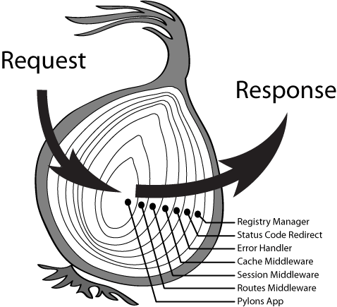
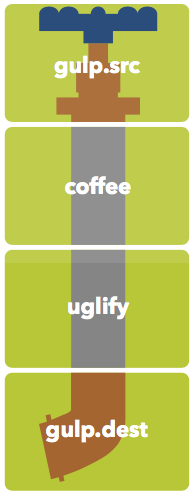

计算机领域的 Pipeline 通常认为起源于 Unix。最初 Douglas Mcllroy 发现很多时候人们会将 shell 命令的输出传递给另外一个 shell 命令，因此就提出了 Pipeline 这一概念。后来同在贝尔实验室的大牛 Ken Thompson 在 1973 年将其实现，并使用 | 作为 pipe 的语法符号：

```bash
$ ls -l | grep key | less
```

如此优雅而又实用的 Pipeline 很快在各种操作系统中传播开来。

简单来说，Pipeline 一般具有如下特点：

1. 各个子过程高内聚，专注于解决特定问题，Simple & Sharp
2. 所有子过程具有一致的接口，例如从标准输入读取数据，正常结果输出到标准输出，异常结果输出到标准错误
3. 能够通过一定形式将子过程组合起来解决复杂问题，例如 pipe

事实上，Pipeline 作为化整为零、去繁就简的重要手段，在前端中也有诸多应用。

## Middleware Pipeline

NodeJS 框架 Express 在 1.0 版本中引入的 Middleware Pipeline 可以说为 Express 的流行居功至伟。透过下面简单几行代码，你就能感受到它散发的优雅气息：

```js
express()
  .use(bodyParser.json())
  .use(cookieParser())
  .use(session(sessionOptions))
  .use('api', apiRoutes)
  .use(errorHandler);
```

或许对于很多后来人来说，并不觉得这有什么精巧独到之处。但在 NodeJS 刚刚开始流行的那个蛮荒年代，大多数人写的还是流水账一样的过程式代码，好一些的会去整理一些工具函数以供抽象和复用：

```js
var srv = http.createServer(function (req, res) {
  req.parsedBody = bodyParser(req);
  req.parsedCookie = cookieParser(req);
  session(req, res, function (err) {
    if (err) {
      errorHandler(err);
      return;
    }

    // routes
  });
});
```

相比之下，我们可以明显看出 Middleware 的几个优势：

1. 代码简练、符合直觉。这是一个很重要的优势，因为代码的大部分生命周期内都是由程序员在维护，符合直觉的代码更容易被理解，在维护和定位问题时能够更有效率
2. 合理的错误处理。任意 Middleware 出现问题，会越过后续所有普通 Middleware，直接由 Error Middleware 进行处理

事实上，还有一个更为重要的优势：标准化，为解决高层次问题提供了良好基础。这一点在迷思专栏的 [再谈 API 的撰写 - 架构](https://zhuanlan.zhihu.com/p/20691649) 这篇文章中得到了充分的诠释：通过将 API 执行路径上的各个环节抽象为中间件，然后再将中间件划分为通用逻辑（Pre-processing / Post-processing 等）和开发者需要关注的逻辑（Processing）等类别，并提供精细化的控制，最终得到一个流程清晰、功能完善、标准统一的 API 开发方案。

Middleware Pipeline 还有一个值得提及的独特之处：由于本质是是一种递归调用，因此整个调用过程更像是一个环环相扣的洋葱：


有兴趣了解其实现的同学，可以查看早期 Express 所使用的 [connect](https://github.com/senchalabs/connect/blob/3.6.3/index.js) 或者 Koa 的 [compose](https://github.com/koajs/compose)。

## Stream Pipeline

Stream 是 NodeJS 的一个核心功能，使得快速、高效处理数据成为了可能。例如读写大文件、处理高并发网络请求等。

建立在 Stream 之上的 Pipeline 非常自然而形象：数据像水流一样依次经过不同的处理流程，并最终得到期望的结果。下面这张 [Gulp Cheet Sheet](https://github.com/osscafe/gulp-cheatsheet) 中的图片能够形象地说明这一比喻：


```js
gulp.task('js', () => {
  return gulp.src('./js/src/*.coffee')
    .pipe(coffee())
    .pipe(uglify())
    .pipe(gulp.dest('./js/'));
});
```

凭借对 Stream 惟妙惟肖地运用，Gulp 在与配置为主的 Grunt 的竞争中迅速取得了领先优势。

另一个必须提及的例子是 substack 的 [Browserify](http://browserify.org/)。作为 [Stream Handbook](https://github.com/substack/stream-handbook) 的作者，substack 对 Stream 的理解可谓深刻。于是在 Browserify 的实现中，我们可以看到下面这段核心逻辑：

```js
var pipeline = splicer.obj([
  'record', [ this._recorder() ],
  'deps', [ this._mdeps ],
  'json', [ this._json() ],
  'unbom', [ this._unbom() ],
  'unshebang', [ this._unshebang() ],
  'syntax', [ this._syntax() ],
  'sort', [ depsSort(dopts) ],
  'dedupe', [ this._dedupe() ],
  'label', [ this._label(opts) ],
  'emit-deps', [ this._emitDeps() ],
  'debug', [ this._debug(opts) ],
  'pack', [ this._bpack ],
  'wrap', []
]);
```

Browserify 的设计目标是将 CommonJS 模块组织的 JS 代码打包为可以在浏览器中运行的代码。实现这一目标所需要做的工作非常复杂，因此 Browserify 将其拆解为职责单一的多个子过程，例如分析依赖、拓扑排序、模块去重、打包合并等，并通过 Stream Pipeline 打通整个流程。这使得整个代码的架构异常清晰，对将来的维护和优化提供了良好基础。

点睛之笔在于，这个基于 [labeled-stream-splicer](https://github.com/browserify/labeled-stream-splicer) 实现的 pipeline 还支持动态修改和扩展，而且不仅在内部实现中多处应用，还暴露为外部接口方便调用方进行定制。下面这个示例展示了将 deps 子过程输出结果的 source 属性改为大写的逻辑：

```js
pipeline.get('deps').push(through.obj(function (row, enc, next) {
  row.source = row.source.toUpperCase();
  this.push(row);
  next();
}));
```

Browserify 众多的 Plugin 也大多利用了这一特性进行功能的增强。例如编译 TypeScript 的插件 [Tsify](https://github.com/TypeStrong/tsify/blob/v3.0.3/index.js#L46) 就是在 record 这一子过程之后插入一个遍历所有输入文件并进行编译的过程：

```js
b.pipeline.get('record').push(gatherEntryPoints());
```

毫不夸张的说，这是笔者从业以来所见到过最为优秀的设计，没有之一。在为一个使用 SeaJS 的团队设计组件化方案时，由于各种限制并不能直接应用 Browserify，因此就借（chao）鉴（xi）它的设计思路，完成了一个简单的组件打包工具 [Tiler](https://github.com/springuper/tiler/blob/master/index.js#L44)，并受用至今。

## Promise Pipeline

由 Promise 组成的 Pipeline 与 Middleware Pipeline 有一些相通之处，例如都支持异步，错误处理也有异曲同工之妙。但毫无疑问 Promise 天生就在异步处理上更加得心应手，而且在函数式编程中具有一席之地，有人专门证明了下，[Promise 属于 Monad](https://gist.github.com/briancavalier/3296186)（感兴趣的可以看下蝴蝶书的作者 Douglas Crockford 这个专门介绍 Monad 的讲座：[Monads and Gonads](https://www.youtube.com/watch?v=dkZFtimgAcM)）。有了理论上的保证，我们总是可以通过 Promise.resolve/Promise.reject 将非 promise 的值转换为 promise，而 promise.then/promise.catch 也总是返回一个新的 promise 从而方便链式调用。

此外，Promise 还有一个 Killer Feature：一旦有一个 promise 出现异常，那么会忽视后面所有的 then 直到第一个 catch。这样的错误处理机制和先前介绍的 Middleware Pipeline 非常类似，但却更为强大，例如 catch 后还可以在做必要的处理后再次返回一个正常的 promise，实现优雅降级等业务需求。

下面是笔者在实现 VPAID Player 时的核心逻辑：

```js
client.prototype.playAd = function (vastXMLString) {
  return constructResponseFromString(vastXMLString)
    .then(this.loadAdUnit)
    .then(this.handshake)
    .then(this.initAd)
    .then(this.bindEvents)
    .then(this.startAd)
    .then(this.finish)
    .catch(this.handleError);
};
```

通过将播放广告的逻辑划分为构建返回值对象、加载第三方 JS、初始化广告等各个小而精的细分子过程，然后串联成 Promise Pipeline，并在最后做统一的错误处理，使得整体逻辑十分流畅清晰，提高了代码的可维护性。

## Ramda Pipeline

最后，让我们再看一个函数式编程领域中的 Pipeline：[Ramda](http://ramdajs.com/) Pipeline。

假设我们需要解决这个问题：将如下对象转换为 query 字符串

```js
const obj = {
  foo: 'bar',
  baz: true,
  qux: 3.1415,
};
```

先来看下 Lodash 的解法：

```js
const objToQueryStr = (obj) =>
  _.join(_.map(_.toPairs(obj), (kvs) => _.join(kvs, '=')), '=');
```

再来看下 Ramda 的解法：

```js
const objToQueryStr = R.pipe(
  R.toPairs,
  R.map(R.join('=')),
  R.join('&')
);
```

可以看出，Ramda 在如下两个方面更加出色：

1. 借助 currying 和数据后置，Ramda 并不需要显式创建新函数，代码更简练
2. 顺序执行，容易理解（虽然很多函数式编程的童鞋们更喜欢 R.compose）

因此，在推崇函数式编程的团队中，Ramda 基本已成为必需品。

## 结语

前端中的 Pipeline 远不止本文介绍的这几种，比较知名的还有 RxJS 等等。从表面上看，它们每个都有着不同的目标问题域和因此而设计的特性，不过从本质上来讲，基本都遵循了 Unix Pipeline 的基本思路：化整为零 + 灵活组合。希望我们前端工程师们再接再厉，将这种精神发扬光大，更好地解决实际问题，不断推动前端的发展。

## 彩蛋

macOS 中的 workflow 定制工具 Automator 应用的图标是一个机器人，它的手上拿着的正是一根管子（Pipe）：


怎么样，非常的可爱吧~

## 参考

1. [Pipeline (Unix)](https://en.wikipedia.org/wiki/Pipeline_(Unix))
2. [Understanding the Middleware Pattern in Express.js - DZone Web Dev](https://dzone.com/articles/understanding-middleware-pattern-in-expressjs)
3. [You're Missing the Point of Promises](https://gist.github.com/domenic/3889970)
4. [Pipelines & Ramda](https://github.com/toastal/Curried-Functional-Pipelines-and-Ramda-Slides)
