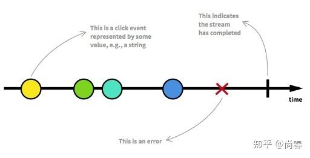
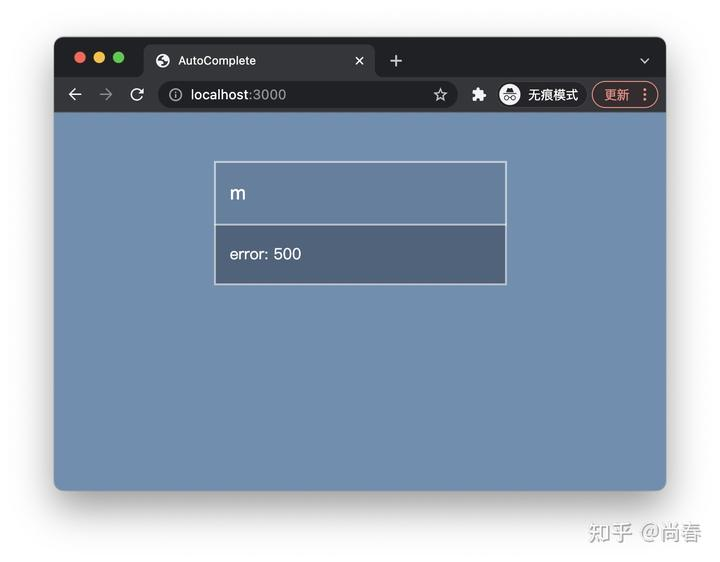
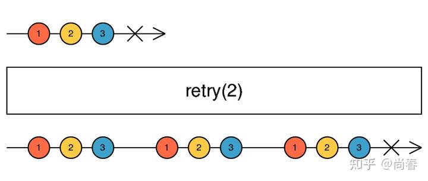
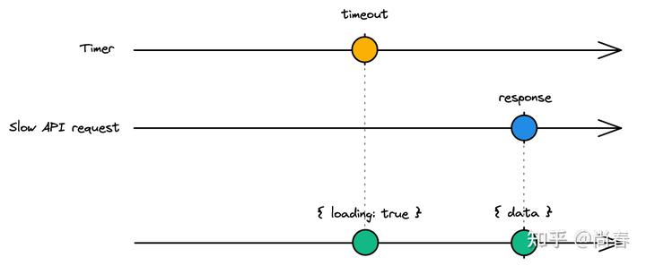
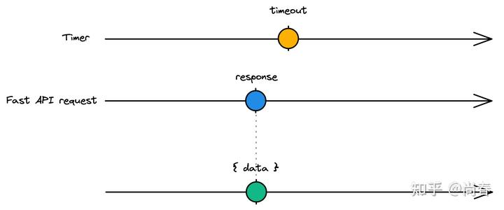

在上一篇文章[尚春：前端中的 Functional Reactive Programming](https://zhuanlan.zhihu.com/p/77687564)末尾我们挖了个坑，提出在基于 RxJS 的自动补全实现基础上，怎么样添加如下功能以进一步提升体验：

- 失败信息提示
- 失败重试，最多重试 2 次，且在新数据到来时取消之前的重试
- 添加加载提示，且如果请求完成时间小于 200ms 时不显示
- 缓存后端返回结果，可考虑 LRU 等方案
- 其它你能想象到的改进

可能有的小伙伴已经完成了部分挑战，这篇文章让我们一起填坑吧。

*友情提示：本文依赖一些之前的背景知识，建议新朋友先看下上篇文章：*
[尚春：前端中的 Functional Reactive Programming](https://zhuanlan.zhihu.com/p/77687564)

## 错误信息展示

一个显而易见的改进是：在网络出现问题或者搜索字符包含非法字符的情况下展示错误信息，有效传达相关进展给用户。

前文中我们提到，一个 Observable 的结果状态有成功（complete）和失败（error）两种：


基于之前的 RxJS 版本 AutoComplete 实现，我们先来改进下请求数据的部分：

```js
// Observable from API response
const searchByValue = (value) => {
  if (value.length === 0) return of({});

  return from(fetch(`/people?keyword=${value}`)).pipe(
    switchMap((response) => {
      if (response.ok) {
        return from(response.json()).pipe(map(data => ({ data })));
      }
      return throwError(response.status);
    }),
    catchError((error) => of({ error }))
  );
};
```

主要改动如下：

- 根据`response.ok`判断后端请求是否成功，相比之前简单依赖`fetch`来判断请求成功[更准确](https://developer.mozilla.org/zh-CN/docs/Web/API/Fetch_API/Using_Fetch)些
- 在`response.ok`为`false`时调用 RxJS 的 [throwError](https://rxjs.dev/api/index/function/throwError) 运算符抛出封装了错误信息的 Observable
- 调用 [catchError](https://www.learnrxjs.io/learn-rxjs/operators/error_handling/catch) 运算符来捕获失败 Observable 的错误消息，并包装为`{ error }`的形式方便后续 UI 逻辑统一处理

在 UI 方面也需要根据新的 Observable 结果稍作调整：

```js
// Subscribe and print
searchAutoComplete$.subscribe((result) => {
  const autocomplete_results = document.getElementById("autocomplete-results");
  autocomplete_results.innerHTML = "";
  if (result.data) {
    if (result.data.length === 0) {
      autocomplete_results.innerHTML = "<li>no results</li>";
    } else {
      for (let i = 0; i < result.data.length; i++) {
        autocomplete_results.innerHTML += "<li>" + result.data[i] + "</li>";
      }
    }
  } else if (result.error) {
    autocomplete_results.innerHTML += "<li>error: " + result.error + "</li>";
  }
});
```

如上，主要的改动是在`result.error`存在的情况下展示错误信息，效果如图：


源代码及试用参见 CodeSandbox：
[https://codesandbox.io/s/rxjs-autocomplete-error-handling-8spl4h?file=/src/index.js](https://codesandbox.io/s/rxjs-autocomplete-error-handling-8spl4h?file=/src/index.js)

出于演示目的，目前我们在错误信息中仅展示了服务端状态码，可以根据实际情况调整。

通过这一改进，我们可以看出 Observable 对错误情况有足够的支持，包括使用`throwError`将错误信息封装为 Observable、使用`catchError`捕获 Observable 源中的错误等。

## 失败重试

在数据请求失败时仅仅展示错误信息仍然不够完美，有时候错误是因为网络不稳定，或者其它临时发生的各种状况导致，这些情况下我们更希望可以由程序自动进行重试，而不是让用户自己完成。

众所周知，基于 Promise 的原生`fetch`方法本身并不支持重试，需要借助类似 [fetch-retry](https://github.com/jonbern/fetch-retry) 等第三方库解决。RxJS 则提供了多种失败重试机制，方便对出现错误的 Observable 进行适宜的处理。

为了在 AutoComplete 中支持失败重试，我们首先需要改造下如下部分的代码：

```js
return from(fetch(`/people?keyword=${value}`)).pipe(...);
```

这段代码的一个问题是：`fetch(`/people?keyword=${value}``作为一个函数调用，在作为实参传给`from` 时已经变成了一个处理中的 Promise，由于 Promise 开弓没有回头箭，它是**无法进行重试**的。

Observable 和 Promise 的核心区别之一是 Observable 默认是**懒执行**的，直到有下游 subscribe 才会触发。因此，改造的核心思路就是将`fetch`调用进一步封装，放到 Observable 创建函数体中：

```js
const request = new Observable((observer) => {
  fetch(`/people?keyword=${value}`).then((response) => {
    if (!response.ok) {
      return observer.error(response.status);
    }
    response.json().then((data) => {
      observer.next({ data });
      oberver.complete();
    });
  })
});
```

RxJS 提供的 [retry](https://www.learnrxjs.io/learn-rxjs/operators/error_handling/retry) 操作符，能够在错误发生的时候，通过重新 subscribe 源 Observable 进行重试：


接下来，让我们把`retry`添加到搜索请求逻辑中吧：

```js
// Observable from API response
const searchByValue = (value) => {
  if (value.length === 0) return of({});

  const request = new Observable((observer) => {
    fetch(`/people?keyword=${value}`).then((response) => {
      if (!response.ok) {
        return observer.error(response.status);
      }
      response.json().then((data) => {
        observer.next({ data });
        observer.complete();
      });
    });
  });
  return request.pipe(
    timeout(5000), // if the API request doesn't finish in 5000ms, throw a timeout error
    retry(2),
    catchError((error) => of({ error }))
  );
};
```

### 条件重试

除了`retry`操作符，RxJS 还提供了更为强大的 [retryWhen](https://rxjs.dev/api/operators/retryWhen) 操作符，用于处理更复杂的自定义条件重试。譬如，如果我们只希望在出现请求超时的情况下进行失败重试，则可将`retry`部分改为如下逻辑：

```js
// Retry only when timeout error happens
retryWhen((errors) =>
  errors.pipe(
    switchMap((error, index) => {
      if (index < 2 && (error instanceof TimeoutError)) {
        return of(error).pipe(delay(1000)); // wait 1000ms and then retry
      }
      return throwError(error);
    })
  )
)
```

源代码参见 CodeSandbox：
[https://codesandbox.io/s/rxjs-autocomplete-retry-rmcq6o?file=/src/index.js](https://codesandbox.io/s/rxjs-autocomplete-retry-rmcq6o?file=/src/index.js)

## 加载提示

标准的加载提示非常简单，但不够精雕细琢。我们在这个环节希望给 AutoComplete 加一个这样的 loading 效果：

- 如果请求完成时间小于 200ms 时不显示 loading
- 否则显示 loading 直到请求完成

下面是用 RxJS 惯用的弹珠图分别展示请求比较慢和比较快两种情形：

*请求较慢时，展示 loading 效果*

*请求较快时，直接展示结果*

为了实现图示的效果，我们首先创建一个 Timer 的 Observable：

```js
const loadingTimer = timer(200).pipe(
  mapTo({ loading: true }),
  startWith({ loading: false }),
  takeUntil(request),
);
```

上述代码涉及几个运算符，这里详细介绍下：

- `timer(200)`创建一个 Observable，其会在 200ms 后发送一个数字 0
- `mapTo` 运算符是`map`运算符的一个简化版本，将 Obervable 封装的数据转化为另一种数据，这里等同于 `map(_ => ({ loading: true }))`
- `startWith`运算符可以在下游 subscribe 的时候立即发送一个数据，用以进行初始化
- `takeUntil`是一个过滤型的运算符，在`request` 完成时，无论源 Observable 即`timer(200)`完成与否，都会结束这个 Observable

通过这些操作符的合作，`loadingTimer`完成了这样一种效果：

1. 首先发送一个 `{ loading: false }` 数据
2. 如果 request 在 200ms 内完成，则直接结束
3. 否则，会在 200ms 时发送一个`{ loading: true }`数据并结束

此外，为了分离处理数据的逻辑和处理 loading 效果的逻辑，我们希望在 request 结束时，再发送一个`{ loading: false }`数据：

```js
request.pipe(mapTo({ loading: false }));
```

然后，为了整合 loading 效果逻辑，我们可以使用`merge`运算符将这两个 Observable 合并为一个：

```js
const showLoadingIndicator = merge(
  timer(200).pipe(
    mapTo({ loading: true }),
    startWith({ loading: false }),
    takeUntil(request)
  ),
  request.pipe(
    mapTo({ loading: false })
  ),
).pipe(distinctUntilChanged()); // if request finishes in 200ms, there will be two 
                                // duplicated { loading: false } emitted, so here we use
                                // distinctUntilChanged operator to filter duplicated values
```

这里有一个潜在的问题：request 作为一个 Observable，目前已经被至少两处地方使用。然而默认的 Observable 是懒执行的，每次 subscribe 都会重新执行内部逻辑。但显然我们在这几处都希望**共享 request 的当前状态**，而非不断进行新的独立的 API 请求。

为了达成这一效果，我们需要适当改造下 request Observable：

```js
return request.pipe(
  timeout(5000),
  retry(2),
  catchError((error) => of({ error })),
  share() // return a multicast Observable which could be consumed by multiple subscribers,
          // it makes the stream hot
);
```

这里引入了 share 运算符将 request Observable 变为一个可以由多个 Subscribers 共享的 hot Observable：只要有一个 Subscriber 订阅，则后面的 Subscribers 订阅时也会继续获得第一个 Observable 的后续数据，而非重新开始。

最后一步是将 request 和 showLoadingIndicator 两个 Observables 合并：

```js
const searchByValue = (value) => {
  ...
  return merge(showLoadingIndicator, request);
}
```

更新 UI 部分逻辑后，我们第一版加载信息改进就已经完成啦，效果如下：


### 锦上添花

前面的改进都集中在处理单个请求上，对于 AutoComplete，还需要处理用户连续输入等场景，由此引发更多值得注意的问题：

1. 当现在请求还在继续，loading 信息已展示的情况下，用户输入了新的字符，是否需要继续展示 loading 信息？
2. 当现在请求还在继续，loading 信息已展示的情况下，用户清除了最后的字符甚至所有字符，应当如何处理？
3. 请求在 loading 信息刚刚出现时就很快完成，导致 loading 信息闪现，体验比较糟糕，应当如何处理？

这里没有简单的答案，需要针对性的进行讨论和优化。为了展示下 RxJS 解决这类复杂问题的优秀能力，我们尝试解决一下第一个问题。

假设我们的方案是：在当前请求还在进行且 loading 信息已展示的情况下，用户又输入了新的字符，继续展示 loading 信息，直到新的请求完成。

下面我们推演下整个流程：

1. 第一个请求发出
2. Observable 发出`{ loading: false }`数据
3. 200ms 后请求未完成，Observable 发出`{ loading: true }` 数据
4. 用户输入新字符
5. 第二个请求发出
6. Observable 发出`{ loading: false }`数据，但在这种情况下，我们不希望隐藏 loading 信息

为了达成这一效果，需要有能力对 Observable 连续产生多个值之间进行逻辑处理，即`{ loading: true }` 后面如果紧跟着`{ loading: false }`的话，则将该值舍弃或者变更为`{ loading: true }`。

对应到 RxJS，我们可以结合使用 `startWith`、`pariwise`和`map`运算符实现该逻辑：

```js
// Observable from keyup event
const obs = fromEvent(document.querySelector("input"), "keyup").pipe(
  map((e) => e.target.value),
  tap((x) => console.log("input:", x, Date.now())),
  debounceTime(200),
  distinctUntilChanged(),
  switchMap(searchByValue),

  startWith({}),
  pairwise(),
  map((pair) => {
    // if the latest two emitted values are { loading: true } and { loading: false },
    // it means a new API request starts while the last request is still ongoing,
    // so here we return { loading: true } to keep showing the loading indicator
    if (pair[0].loading === true && pair[1].loading === false) return pair[0];
    return pair[1];
  }),

  distinctUntilChanged()
);
```

源代码可以参阅 CodeSandbox：
[RxJS AutoComplete Loading - CodeSandbox](https://codesandbox.io/s/rxjs-autocomplete-loading-sxeb6g?file=/src/index.js)

## 结语

通过上述三项改进，我们不能看出，一方面精益求精是永无止境的，只要场景足够复杂，对体验的要求足够高，我们总是可以找出更多的可以改善的地方；另一方面，也可以看出 RxJS 优异的抽象能力和丰富的工具集，能够帮我们将复杂的异步问题简单化，用为数不多的代码实现一个又一个有挑战的功能。诚然 RxJS 的门槛非常高，Observable、Subscriber、Subject 还有繁多的 operators 足够复杂，不过假以时日，经过岁月和经历的磨练，相信你也可以某种程度上掌握它的精髓。

## 参考文献

1. [Loading indication with a delay and anti-flickering in RxJS](https://stackoverflow.com/a/56361092/1131882)
2. [Rx fromPromise and retry](https://stackoverflow.com/a/33072989/1131882)
3. [What is the RxJs Retry Operator and how does it work?](https://www.educative.io/edpresso/what-is-the-rxjs-retry-operator-and-how-does-it-work)
4. [RxJS: retryWhen operator](https://medium.com/javascript-everyday/rxjs-retrywhen-operator-15e3c83b97eb)
5. [Understanding RxJS Multicast Operators](https://netbasal.com/understanding-rxjs-multicast-operators-77b3f60af0a2)
6. [Marble testing Observable Introduction](https://medium.com/@bencabanes/marble-testing-observable-introduction-1f5ad39231c)

## 彩蛋

异步逻辑难以思考，针对异步逻辑的测试更是难上加难。为了便于开发者写出更为**正确**的代码，RxJS 提供了[弹珠测试](https://rxjs.dev/guide/testing/marble-testing)的方案。

该方案基于文本化表示的弹珠图，并提供了一系列便捷的 API 支持各种场景的测试需求。弹珠图类似我们前面贴出来的很多图片，但毕竟是在代码中，因此是文本化的：

```bash
# emit value 'a' at 30ms, 'b' at 60ms, and complete at 90ms
--a--b--|

# emit 'a' at 40ms then an error at 70ms
—--a--#

# emit 'a' and 'b' and 'c' at 30ms, and complete at 50ms
--(abc)-|
```

API 包括使用上述文本弹珠图创建 Observable 的`cold`和`hot`方法，以及`TestScheduler`、`expectObservable`、`flush`等辅助方法。

下面我们使用 jasmine-marbles 展示一些弹珠测试的示例：

```js
import { cold, getTestScheduler, hot } from 'jasmine-marbles';
import { interval } from 'rxjs';
import { falter, map, switchMap, take } from 'rxjs/operators';

describe('Marble testing operators', () => {
  describe('Map', () => {
    it('should add "1" to each value emitted', () => {
      const values = { a: 1, b: 2, c: 3, x: 2, y: 3, z: 4 };
      const source = cold('-a-b-c-|', values);
      const expected = cold('-x-y-z-|', values);

      const result = source.pipe(map(x => x + 1));
      expect(result).toBeObservable(expected);
    });
  });

  describe('SwitchMap', () => {
    it('should maps each value to inner observable and flattens', () => {
      const values = { a: 10, b: 30, x: 20, y: 40 };
      const obs1 = cold(    '-a-----a--b-|', values);
      const obs2 = cold(    'a-a-a|', values);
      const expected = cold('-x-x-x-x-xy-y-y|', values);

      const result = obs1.pipe(switchMap(x => obs2.pipe(map(y => x + y))));
      expect(result).toBeObservable(expected);
    });
  });

  describe('Interval', () => {
    it('should keeps only even numbers', () => {
      const source = interval(10, getTestScheduler()).pipe(
        take(10),
        filter(x => x % 2 === 0),
      );
      const expected = cold('-a-b-c-d-e|', { a: 0, b: 2, c: 4, d: 6, e: 8 });

      expect(source).toBeObservable(expected);
    });
  });
});
```

怪不得有人感叹说：

> *When you need to test asynchrone code, Marble testing can be an elegant way to test it. It will be more visual, clearer and with less code.*
