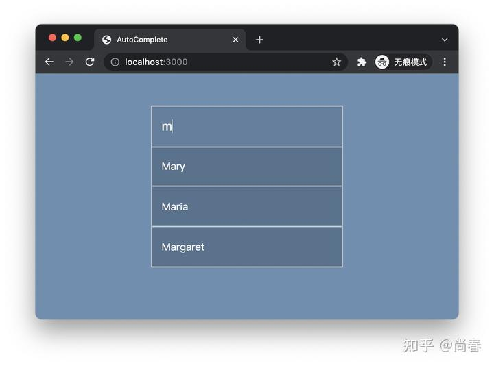
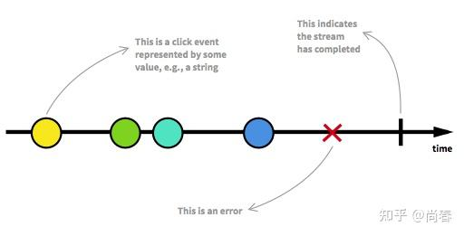
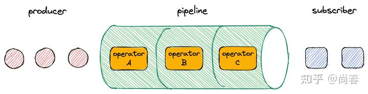
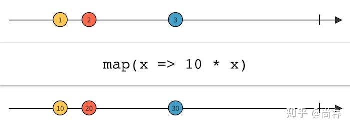
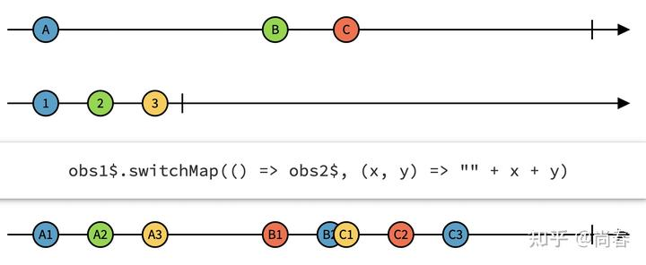
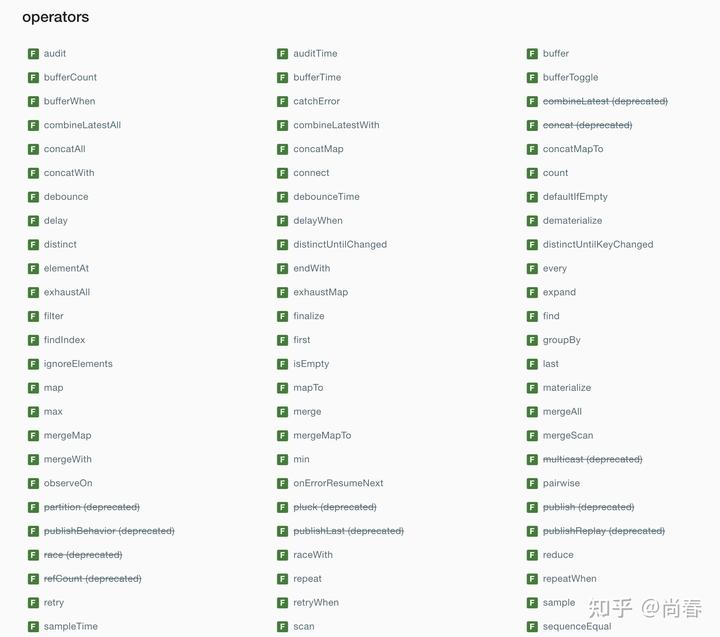
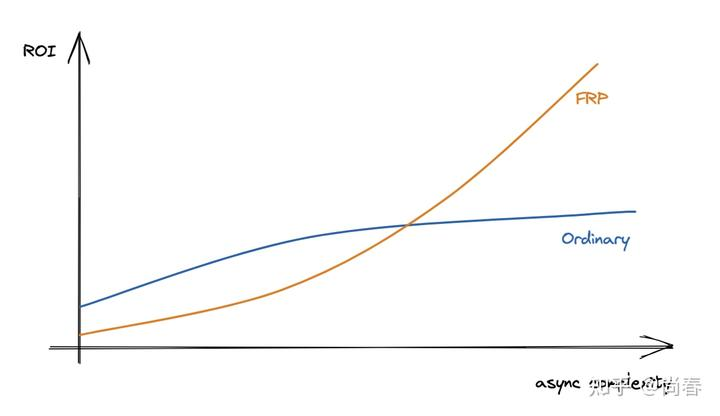
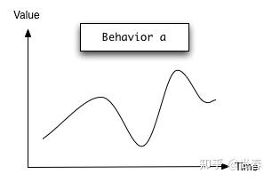
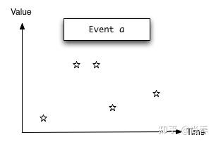
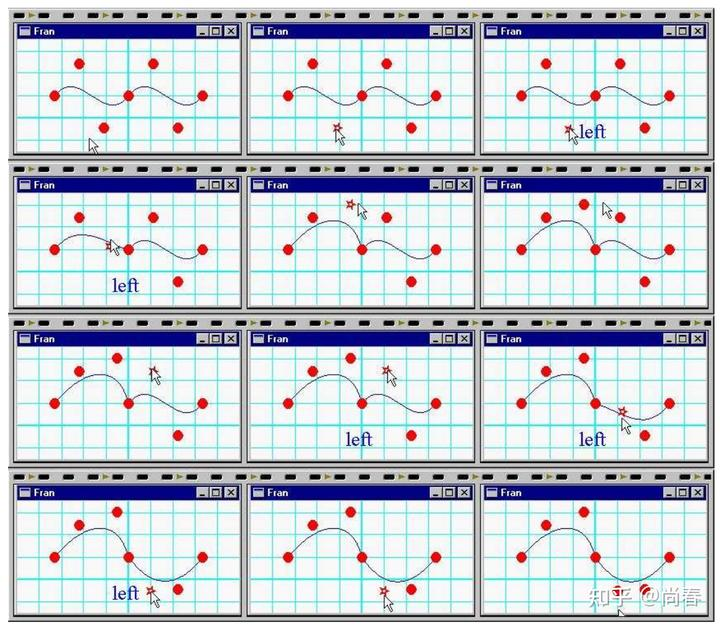

由于思维方式上的显著差异，以 RxJS 为代表的函数式响应式编程（Functional Reactive Programming，简称 FRP）在前端工程师中有些“水土不服”，喜欢的推崇备至，然而对于更多开发者来说它却像“阳春白雪”一般，叫好不叫座。

本文尝试从一个实际案例开始，通过对比普通实现和基于 RxJS 的版本阐释 FRP 的核心要义，之后简要介绍 RxJS 的核心概念，以及一些实际示例。希望能够帮助一些还在观望的同学更进一步了解这种编程范式。

## AutoComplete

自动补全是很多前端工程师都曾接触过的实用功能：当用户在文本框中输入字符时，将当前输入内容传递给后端服务拿到可能的自动补全结果，并在文本框下方列出供用户选择。


### 普通实现

比较传统的实现思路非常直接，直接监听文本框的 keyup 事件，然后取数据后更新 UI 即可。代码如下：

```js
const input = document.querySelector("input");

// 1. Bind keyup event
input.addEventListener("keyup", (event) => {
  const keyword = event.target.value;
  const autocomplete_results = document.getElementById("autocomplete-results");

  autocomplete_results.innerHTML = "";
  if (keyword.length > 0) {
    // 2. Fetch autocomplete list
    fetch(`/people?keyword=${keyword}`)
      .then((response) => response.json())
      .then((data) => {
        // 3. Update UI
        autocomplete_results.innerHTML = "";
        for (let i = 0; i < data.length; i++) {
          autocomplete_results.innerHTML += "<li>" + data[i] + "</li>";
        }
      });
  }
});
```

有经验的朋友可能会注意到上述实现的一些潜在问题：

1. 每一个 keyup 事件都会发送请求到后端，当用户连续输入时前面的请求并没有必要，只有最后一个请求是用户真正想要的结果
2. 由于后端接口响应时间的不确定，有可能出现一些竞态危害（race condition）：譬如用户前后的两个输入内容分别为 `ma` 和 `mar`，有可能 `ma` 对应的后端请求完成时间晚于 `mar` ，先发后至，导致最终展现的结果是 `ma` 的补全数据

第一个问题解决起来并不难，一般我们引入`debounce` 来削减不必要的 keyup 回调执行即可。第二个问题更有挑战一些，不过也难不倒大家。一般可以通过加入哨兵变量、判定条件等方式，验证下后端请求的 `keyword` 是否和当前文本框一致即可。

改进后的实现如下：

```js
const input = document.querySelector("input");
// Debounce callback
const debouncedCallback = debounce((event) => {
  const keyword = event.target.value;
  const autocomplete_results = document.getElementById("autocomplete-results");

  if (keyword.length > 0) {
    fetch(`/people?keyword=${keyword}`)
      .then((response) => response.json())
      .then((data) => {
        // Avoid race condition
        if (keyword !== input.value) return;

        autocomplete_results.innerHTML = "";
        for (let i = 0; i < data.length; i++) {
          autocomplete_results.innerHTML += "<li>" + data[i] + "</li>";
        }
      });
  } else {
    autocomplete_results.innerHTML = "";
  }
}, 200);
input.addEventListener('keyup', debouncedCallback);
```

这一版本的实现基本能够应对大部分实际场景。然而随着业务和体验要求的进一步提高，再添加诸如失败重试、加载图标、请求去重、数据缓存等功能时，就可能遇到由于添加越来越多类似 `debounce`、哨兵变量所带来的维护性灾难。

综合普通实现的迭代过程，我们不难发现如下几个问题：

- 难以一次写对，由于异步所带来的一些隐含问题需要通过`debounce`、防御 race condition 等解决，心智负担高
- 代码偏指令式编程（imperative programming），比较脆弱难维护
- 添加进阶功能成本高，堪比浮沙筑高楼

### 基于 RxJS 的实现

在进一步介绍 RxJS 之前，我们先来看下应用它实现的自动补全代码：

```js
// Observable from API response
const searchByValue = (value) => {
  if (value.length === 0) return of([]);
  const request = fetch(`/people?keyword=${value}`).then((response) => response.json());
  return from(request);
};

// Observable from keyup event
const searchAutoComplete$ = fromEvent(document.querySelector("input"), "keyup")
  .pipe(
    map((event) => event.target.value),
    debounceTime(200),
    distinctUntilChanged(),
    switchMap(searchByValue),
  );

// Subscribe and print
searchAutoComplete$.subscribe((data) => {
  const autocomplete_results = document.getElementById("autocomplete-results");
  autocomplete_results.innerHTML = "";
  for (let i = 0; i < data.length; i++) {
    autocomplete_results.innerHTML += "<li>" + data[i] + "</li>";
  }
});
```

虽然代码行数接近，且有一些 RxJS 引入的操作，但即便对于新手来说，仍然可以看出一些不同之处：

- **逻辑分割清晰**
- **声明式 API** 从`pipe` 开始的几行管线操作部分代码非常直观，分别进行了事件数据提取（`map`）、防抖（`debounceTime`）、过滤无变更输入（`distinctUntilChanged`）和切换映射（`switchMap`）操作，从而将原始的 `keyup` 事件变成了异步的自动补全数据流

还有一点是函数式响应式编程特别提倡的：

> Programming in the style of functional reactive programming means to specify the dynamic behavior of a value completely at the time of declaration.  
> *from: The Model-View-Controller Pattern and Functional Reactive Programming, by Heinrich Apfelmus*

相较于命令式的意大利面条般的代码，函数式响应式编程希望能够**将一个异步数据流的所有动态行为在声明时即全部确定**，正如上例的中间核心部分。这无疑大大提高了代码的健壮性和可维护性。

怎么样？看到这里，是不是感觉 RxJS 还是有一些用武之地，有了些学习的动力？下一个章节，让我们开始进一步了解下它吧。

## RxJS 核心概念

RxJS 是函数式响应式编程在前端领域的典型代表。

> Reactive programming is programming with asynchronous data streams.

响应式编程是围绕**异步数据流**建立的一种编程范式，由于天生契合函数式思维，因此常见的主要流派又称作函数式响应式编程。在前端领域中，因为本身围绕人机交互场景，异步数据流可谓举目皆是：

- 异步请求
- 键盘、鼠标事件
- 窗口滚动
- 定时器
- 动画

更广义地讲，类似物理学中静止是运动的特殊情况，所有同步操作也是异步数据流的特殊情况，可以被其建模和处理。因此函数式响应式编程可以用以解决前端领域中大多数问题，当然它最适合有一定复杂度的异步数据流操作。

### Observable

作为 RxJS 最基础的概念，Observable 是对所有异步数据流的抽象，它一般包括：

- 随时间变化的一系列离散数据
- *[可选]* 异常。这会导致 Observable 终止，即再也不会有后续数据
- *[可选] *完成。类似的，这会导致 Observable 终止

*Observable*

举一些 ：

```js
import { from, fromEvent, interval, of } from 'rxjs';

// Emits document click events
const documentClick$ = fromEvent(document, 'click');

// Emit result of promise
const promiseSource$ = from(new Promise(resolve => resolve('Hello World!')));

// Emits data in an array one by one
const dataSource$ = of(1, 2, 3, 4, 5);

// Emit value in sequence every 1 second
const intervalSource$ = interval(1000);
```

除了以上 RxJS 提供的内置构造工具方法外，还可以自定义 Observable：

```js
const finiteSource$ = new Observable(subscriber => {
  subscriber.next(1);
  subscriber.next(2);
  setTimeout(() => {
    subscriber.next(3);
    subscriber.complete();
  }, 1000);
});

const infiniteSource$ = new Observable(subscriber => {
  let i = 0;
  setInterval(() => {
    subscriber.next(i++);
  }, 1000);
});
```

可谓是**世间万物皆 Observable**！

我们之前有个非常熟悉的概念 Promise，Observable 和它有几点[不同](https://stackoverflow.com/a/37365955)：

- Promise 处理的是单值，而 Observable 可以处理数据流，即随时间变化的多个值
- Promise 只有成功和失败，而 Observable 还可以取消、重试
- Promise 创建时传入的[处理器函数](https://developer.mozilla.org/zh-CN/docs/Web/JavaScript/Reference/Global_Objects/Promise#%E5%88%9B%E5%BB%BApromise)（executer method）会被立即执行，而 Observable 则是惰性的 譬如`fromEvent(document,'click')` 并没有马上在文档上绑定`click`事件回调，而是会一直等到有数据消费者，具体在下一小节中解释

现在有了数据流，相当于数据的生产者，接下来让我们看下如何消费数据。

### Subscription

作为数据消费方，订阅器是让**一切流动起来**的关键。可以把它想象成一个水龙头，Observable 是水箱里的水，当希望接水的时候，你要做的就是——拧开水龙头。自然而然，也可以在需要的时候关闭水龙头。


让我们先看一些简单示例：

```js
// Emits data in an array one by one
const dataSource$ = of(1, 2, 3, 4, 5);
const dataSubscription = dataSource$.subscribe(x => console.log(x));
// output:
// 1
// 2
// 3
// 4
// 5

// Emit result of promise
const promiseSource$ = from(new Promise(resolve => resolve('Hello World!')));
const promiseSubscription = promiseSource$.subscribe({
  next(x) { console.log(x) }
  error(reason) { console.error(reason) }
  complete() { console.log('Done!') }
});
// output:
// "Hello World!"
// "Done!"

// Emit value in sequence every 1 second
const intervalSource$ = interval(1000);
const intervalSubscription = intervalSource$.subscribe(x => console.log(x));
setTimeout(() => {
  // Unsubscribe after 3s
  intervalSubscription.unsubscribe();
}, 3000);
// output:
// 0
// 1
```

在上一小节中我们提到，Observable 是惰性的，需要等到有下游数据消费者订阅的时候才开始执行内部逻辑，下面的示例中我们观察下它的行为：

```js
const inputSource$ = new Observable(observer => {
  const input = document.querySelector('input[name=search]');
  const handler = (event) => observer.next(event);
  console.log('bind event');
  input.addEventListener('keyup', handler);

  return () => {
    console.log('unbind event');
    input.removeEventListener('keyup', handler);
  };
});

console.log('before subscribe');
const inputSubscription = inputSource$.subscribe((event) => console.log(event.target.value));
setTimeout(() => {
  inputSubscription.unsubscribe();
  console.log('after unsubscribe');
});
// output:
// "before subscribe"
// "bind event"
// "unbind event"
// "after unsubscribe"
```

### Operators

介绍完数据的生产者 Observable 和消费者 Subscription，这一小节我们重点介绍下将它们连接起来的管线（pipeline）：各种各样的操作符 Operators。非常类似前文“[尚春：前端中的 Pipeline](https://zhuanlan.zhihu.com/p/28561932)”中提到的其它前端中的管线，RxJS 中丰富的操作符经过合理组合，就能够满足我们日常开发中大部分场景。这正是 RxJS 精华和魅力所在，以至于 RxJS 官方将自己称之为：

> Think of RxJS as **Lodash for events**.

简单来说，操作符提供了一种方法来**处理来自上游数据源的值，并返回转换后的值的 Observable**。例如自动补全例子中应用到的`map`、`debounceTime`、`switchMap`都是比较常用的操作符。多个操作符就组成了类似下图中的管线：


**map 操作符**

为了便于大家进一步理解操作符原理，下面展示下常用的`map`操作符的代码实现：

```js
const myMap = (mapFn) => (source) => {
  // myMap is a transform operator, it returns a new Obervable
  return new Observable((subscriber) => {
    return source.subscribe(
      // Whenever there is next data in the source, apply `mapFn` on it
      // and then pass it to the downstream
      (next) => subscriber.next(mapFn(next)),
      (error) => subscriber.error(error),
      () => subscriber.complete(),
    );
  });
};
```

所有操作符都可以用下面的弹珠图（Marble Diagram）来表示，map 自然也不例外：


更详细的介绍可以移步下面这个精彩的系列教程：
[Video course - Build the operators from RxJS from scratch](https://blog.strongbrew.io/build-the-operators-from-rxjs-from-scratch/?lectureId=map#app)

**switchMap 操作符**

了解完`map`操作符之后，可能很多同学会问：前面一直提到的`switchMap`操作符是做啥的？实不相瞒，最早笔者看到`switchMap`、`mergeMap`、`concatMap`也是晕圈的，不过一旦把它们代入到实际场景中，就能很快意识到精妙所在。

`switchMap`操作符最为适合的场景就是类似自动补全中的异步请求处理：

- 在数据流的新数据（最新的文本框内容）到来时，创建一个新的 observable 来处理异步请求，此为 map 步骤
- 在数据流的新数据到来时，如果之前的异步请求尚未完成，则取消订阅其对应的 observable，转而订阅最新的异步请求 observable，此为 switch 步骤

如此，我们便实现了自动补全异步请求的时序正确性。

`switchMap`也可以用如下的弹珠图表示：

*obs1$ 的每个数据都会在 obs2$ 中 map 为三个，B 对应的 observable 进行到 B2 时接收到 obs1$ 的新数据 C，因此跳过了接下来的 B3，转而开始生产 C1, C2, C3*

感兴趣的同学可以观看下`switchMap`的实现教程，甚至可以考虑和`mergeMap`、`concatMap`一起打包看：
[Video course - Build the operators from RxJS from scratch](https://blog.strongbrew.io/build-the-operators-from-rxjs-from-scratch/?lectureId=switchMap#app)

**操作符分类**

很多同学望 RxJS 止步大抵是因为浩如烟海的操作符：


为了降低 RxJS 学习门槛，RxJS 官方和社区也做了很多工作。除了可以借助弹珠图来具象化各个操作符外，还有一个好的方式是归类，各个击破。常见的几种操作符类型如下：

- **创建** 这些运算符几乎允许你基于任何东西来创建一个 observable。前面 Observable 小节中提到的`of`、`fromEvent`、`interval`等都属于此类
- **过滤** 这些操作符提供了从 observable 源中接受值和处理背压（backpressure）的技术。我们耳熟能详的`filter`、`take`、`skip`、`first`、`last`、`debounce`、`throttle`等都属于此类
- **转换** 这些操作符提供了转换技术几乎可以涵盖你所能遇到的任何场景。譬如`map`、`reduce`、`switchMap`、`groupBy`等
- **组合 ** 组合操作符允许连接来自多个 observables 的信息，例如`merge`、`pairwise`、`zip`等
- **条件 ** 根据一定条件确定创建的`observable`，例如`iff`可以根据判定条件确定订阅传入的第一个 observable 参数还是第二个
- **错误处理** 这些操作符提供了一些高效的方式来优雅地处理错误，例如`retry`、`retryWhen`、`catchError`等

在实践中，如果有一个你需要解决的问题，很可能就会有一个对应的操作符。社区很多人建议刚开始上手时，可以从**各个类别的核心操作符子集开始学习和使用**，例如上文中点名的一些操作符。随着时间的推移，当晦涩难懂的场景不可避免地出现时，你会越来越意识到操作符库的灵活性和多样化是多么重要。

### Subject

在 RxJS 中，Observable 默认是单播的（unicast），即多个订阅者之间不能共享任何信息，完全相互独立。这也被形象地被称为“冷 ”的。

照旧，举个栗子：

```js
// Emits data in an array one by one
const dataSource$ = of(1, 2, 3);
const dataSubscription = dataSource$.subscribe(x => console.log(x));
// output:
// 1
// 2
// 3

const anotherDataSubscription = dataSource$.subscribe(x => console.log(x));
// output:
// 1
// 2
// 3
```

可以看出，第二次订阅同一个 obervable 得到的结果和第一次完全一致。

在实际应用中，有时我们需要支持多播（multicast），即在同一 Observable 的多个订阅者之间共享信息，这便是 Subject 的由来：

> A Subject is like an Observable, but can multicast to many Observers. Subjects are like EventEmitters: they maintain a registry of many listeners.

Subject 类似我们常见的 EventEmitters，它会内部维护多个订阅者从而实现多种模式的信息共享：

```js
const subject = new Subject();

// Add one observer
subject.subscribe({
  next: (v) => console.log(`observerA: ${v}`)
});

subject.next(1);
subject.next(2);

// Add another observer
subject.subscribe({
  next: (v) => console.log(`observerB: ${v}`)
});

subject.next(3);
// output:
// "observerA: 1"
// "observerA: 2"
// "observerA: 3"
// "observerB: 3"
```

在 Angular 项目中，就经常应用 Subject 来在多个组件中共享数据。

## 总结

在前端领域中，为了追求体验和代码的双重完美，不断有新的建模方案喷薄涌现，如滚滚车轮般推动着行业的发展。异步逻辑本身就有悖于直觉，本质复杂度高。以 RxJS 为代表的函数式响应式编程采用了类似 NodeJS Stream 的建模思想为异步编程提供了简洁优雅的解决方案。正如下图所示，虽然上手有一定的门槛，但一旦领会其万物皆流、Observable => Pipeline => Subscription 的要义，随着异步逻辑复杂度的提升，例如表单交互、视频播放器、大型应用等等复杂场景，这种编程范式将会给你带来越来越高的性价比。


在结束之前，我们不妨挖个新坑：在基于 RxJS 的自动补全实现基础上，怎么样添加如下功能以进一步提升体验呢：

- 失败信息提示
- 失败重试，最多重试 2 次，且在新数据到来时取消之前 observable 的重试
- 添加加载提示，且如果请求完成时间小于 100ms 时不显示
- 缓存后端返回结果，可考虑 LRU 等方案
- 其它你能想象到的改进

推荐各位小伙伴积极尝试下，后续我们一起来填坑吧。

## 参考资料

1. [The introduction to Reactive Programming you've been missing](https://gist.github.com/staltz/868e7e9bc2a7b8c1f754)
2. ["Reactive Programming: A Better Way To Write Frontend Applications" by Hannah Howard](https://www.youtube.com/watch?v=NkVfvxaKVVY)
3. ["Controlling Time and Space: understanding the many formulations of FRP" by Evan Czaplicki](https://www.youtube.com/watch?v=Agu6jipKfYw)
4. [A General Theory of Reactivity](https://github.com/kriskowal/gtor)
5. [函数式响应式编程 - Functional Reactive Programming](https://www.cnblogs.com/apolis/p/11437688.html)
6. [RxJS Primer](https://www.learnrxjs.io/learn-rxjs/concepts/rxjs-primer)
7. [Cold vs Hot Observables](https://blog.thoughtram.io/angular/2016/06/16/cold-vs-hot-observables.html)
8. [Build the Operators from RxJS from Scratch - map](https://blog.strongbrew.io/build-the-operators-from-rxjs-from-scratch/?lectureId=map#app)
9. [RxJS：四种 Subject 的用法和区别](https://limeii.github.io/2019/07/rxjs-subject/)

## 彩蛋

函数式响应式编程最早出现于 1997 年，微软的 Conal Elliott 和 Paul Hudak 发表了一篇“[Functional Reactive Animation](http://conal.net/papers/icfp97/)”的论文，文中引入了两个新概念：

- **Behavior** 一个随时间变化的值。你可以把它看作是一个函数，将时间中的每个时刻映射到相应的值。譬如一个动画，每个时刻都会对应某个帧
- **Event** 一个事件发生的序列。可以把它看作是一个有限或无限的事件列表，它是成对的：第一个数据表示事件发生的时间，第二个数据是标记给这个事件的一个值


换句话说，Behavior 就像一个持续变化的值，比如说一个篮球运动员正在投掷的球的位置，而 Event 则是一连串发生的事件，比如说，每当上述球落入篮筐时，都要进行跟踪。通过围绕这两者进行的建模和扩充，Conal 逐步完成了一个基于 Haskell 的 FRP 雏形来处理动画等复杂交互场景。他在后面的一篇论文“[Declarative Event-Oriented Programming](http://conal.net/papers/ppdp00/)”里，更是给出了一个具体的贝塞尔曲线编辑器的案例：


大概读完这两篇文章，实在是佩服大神在 20 多年前就开始琢磨如何建构异步操作流并给出了比较优雅的方案，要知道，JavaScript 1995 年才刚刚诞生，那时候 web 前端还只是处理一些极简单的情况。所以不得不惊叹，这样水平的人称之为开山鼻祖也并不过誉。
