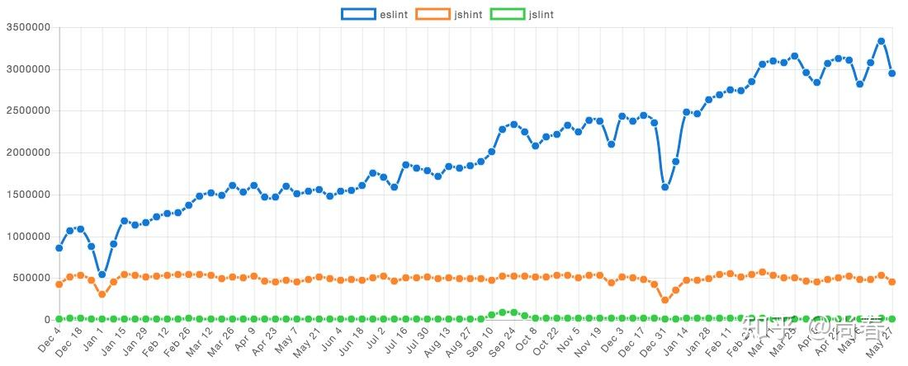

据说在 C 语言刚刚开始起步的时候，有若干常见的代码问题不能被编译器捕获，因此有人开发了一款名为 [Lint](https://en.wikipedia.org/wiki/Lint_(software)) 的附加程序，用于扫描源代码以捕获这些问题。因此后续类似的工具都叫 Lint 或 Linter。

JavaScript 最初被仓促设计出来解决一些网页中的“小”问题，不过蒙幸运女神的眷顾，逐步发发展壮大，成为当前风头最劲的编程语言之一。在这一过程中，Linter 工具应运而生，主要解决如下几个问题：

- 避免最初设计中存在的不少糟粕，提倡更多地使用 Good Parts
- 发现一些 JS 代码中存在的问题，例如忘记声明而导致的全局变量
- 保证代码风格统一，便于大型项目维护

本文主要介绍下 JS Linter 进化史中的三个里程碑式的工具：JSLint、JSHint 和 ESLint。

## 开山鼻祖 JSLint

JSLint 是公认的第一个 JS Linter，由赫赫有名的老道－Douglas Crockford 在 2002 发布。彼时的前端还处于萌芽状态，大部分人还是用 JS 来写一些非常粗糙的页面效果、表单验证。JQuery 也要在四年之后才正式发布。

JSLint 的核心是 [Top Down Operator Precedence](http://crockford.com/javascript/tdop/tdop.html)（自顶向下的运算符优先级）技术实现的 Pratt 解析器。由于涉及到比较底层的词法解析、语法解析等编译原理，本文中不再赘述，不过推荐感兴趣的同学去看下原文，或者看“代码之美”一书中的第九章中文版。简单来说，就是用 JS 实现了一个处理 JS 源码的解析器，可以识别出其中的各种表达式、语句、函数等组成要素。

Pratt 解析器的处理结果本质上类似于 AST（抽象语法树），但并没有做到那么极致，毕竟那时候还是 2002 年啊，用 JS 实现一个 JS 解析器本身已经是一件非常了不得的成就。有了这样强大的解析器支持，事实上基本可以做任何事，例如代码压缩、代码检查、代码高亮等。

JSLint 即是借助它的强大能力，在其内部的一些处理过程中恰当地进行改造，加入了一些规则的检查，从而实现了 Lint 的功能。

举个例子：

```js
var varstatement = function varstatement(prefix) {
    var id, name, value;

    if (funct['(onevar)'] && option.onevar) {
        warning("Too many var statements.");
    } else if (!funct['(global)']) {
        funct['(onevar)'] = true;
    }

    ...
};
```

<!--more-->

如果设定了 `onevar` 规则，即同一作用域下只能用一个 `var` 声明所有变量，那么在每个包含 `var` 的语句解析时都会进行该规则的检查，如果发现之前同一作用域已经有 `var` 语句，则报告一个 “Too many var statements.” 的 warnning。

毫无疑问，JSLint 的出现，以及接下来蝴蝶书的问世，让广大前端工程师在如果用好 JS 的 Good Parts 方面受益匪浅。

## 继往开来 JSHint

金无足赤，人无完人。在随后的前端跨越式发展中，JSLint 的一些不足暴露了出来。2011 年 12 月 20 日，Anton Kovalyov 发表了一篇标志性的文章：[Why I forked JSLint to JSHint](https://web.archive.org/web/20110224022052/http://anton.kovalyov.net/2011/02/20/why-i-forked-jslint-to-jshint/)，指出了 JSLint 存在的几个主要问题：

1. 令人不安地固执己见，没有提供一些规则的配置 Anton 措辞激烈：“It is quickly transforming from a tool that helps developers to prevent bugs to a tool that makes sure you write your code like Douglas Crockford.”
2. 对社区反馈不关注 这一点从 JSLint 的 Issues、Pull Requests 中可以看出，另外值得注意的是 [Contributors](https://github.com/douglascrockford/JSLint/graphs/contributors) 中只有两名开发者，而且第二名开发者只有三行代码的修改（注：可能跟 Douglas 的习惯有关，有些 PR 是通过的，但是并没有合并，而是由他自己提交了新的 commit）

JSHint 就是在这样的背景下诞生了：

> And, as we were saying from the day zero, it will always be a **community-driven** tool. Simply because a community of programmers working together is better than a single person working alone. No matter who this person is.

它的核心定位是**社区驱动**的代码质量工具，因为 Anton 坚信程序员组成的社区一起协作要好于单打独斗。

在核心实现仍然基于 Pratt 解析器的基础上，借助社区的共同努力，JSHint 进行了多方面的改进：

1. 更多可配置的规则 这是社区的核心诉求。除了开放规则的 Pull Request 外，JSHint 在规则文档、预定义环境方面也做了诸多努力
2. 代码模块化 JSLint 源文件只有一个 5000 余行的大文件，对于一般开发者来说难以维护。JSHint 按照功能划分为 lex、scope、core、reporter 等多个模块，功能更聚焦
3. CLI 命令行工具的支持，为很多第三方工具提供了基础，JSHint 可以很好地和各种 IDE 集成
4. 测试 JSLint 一行测试代码也没有，JSHint 的整体代码测试覆盖率达到了 99%

下图是 Google Trends 中 JSHint 和 JSLint 关键字搜索次数的趋势图：

*JSLint VS JSHint - Google Trends*

可以看出，在 JSHint 快速增长的同时，JSLint 基本处于停滞或者下降状态。

回过头来看，JSHint 的出现几乎是必然的，前端开发者日益增长的代码质量诉求和落后偏执的工具之间出现了不可调和的矛盾。JSHint 选择了一条正确的道路，众志成城，其利断金。现在 JSHint 已经有多达 236 个 Contributors，上千个 Pull Requests。

## 重新出发 ESLint

JSHint 在第三版的计划中有这样一条：

> Build a foundation for plugins by exposing AST and adding additional hooks.

前端爆发式增长带来的巨大需求让 JSHint 变得愈加难以应对，通过暴露 AST 信息来支持第三方插件无疑是一剂良方。然而理想总是美好的，现实却非常残酷。这一计划直到现在仍然没有实现。究其原因，在 JSLint 时代就存在的规则检查和 Pratt 解析器深度耦合首当其冲，可谓是成也萧何败萧何。

2013 年，前端界另外一名标杆性人物 Zakas 在业务开发中遇到一个 `XMLHttpRequest` 在 IE7 中的问题，他希望使用 JSHint 来避免类似问题。Zakas 找到 Anton，了解到插件的提案被搁置并且短期内看起来没有希望去实施。Zakas 很失望，但牛人毕竟是牛人，他开始着手寻找其他解决方案。

Zakas 首先在公司使用的一个 PHP Linter 上得到了一些启示，因为那个 Linter 使用了 AST 作为中间表示层，所有的规则都基于 AST 做进一步分析。他开始调研 JS 是否有类似工具，Ariya 开发的 Esprima 进入了他的视线。Zakas 盛情邀请 Ariya 到他的公司 Box 做一次不限主题的分享，而 Ariya 选择的主题恰恰是 Esprima。分享过程中，Ariya 介绍到了 AST 表示层的意义以及目前基于它的很多工具，例如遍历 AST 的工具 Estraverse 以及作用域分析工具 Escope。这一切让 Zakas 受益匪浅，下一代 JS Linter 工具的方案在他脑海中渐渐清晰起来。

很快，在 2013 年六月份的一个周末，Zakas 完成了第一个[可执行的版本](https://github.com/eslint/eslint/commit/a658d7b0)。借助于 Esprima 等工具，ESLint 的核心代码只有 100 行：

```js
api.verify = function(text, config) {
    ...

    // 添加规则
    Object.keys(config.rules).forEach(function(key) {
        var rule = rules.get(key);
        if (rule) {
            rule(new RuleContext(key, api));
        } else {
            throw new Error("Definition for rule '" + key + "' was not found.");
        }
    });

    // 解析代码，生成 AST
    var ast = esprima.parse(text, { loc: true, range: true }),
        walk = astw(ast);

    // 核心逻辑：遍历 AST 各个节点
    walk(function(node) {
        // 将当前节点通过事件进行分发，监听这些类型节点的规则会执行自己的检查逻辑
        api.emit(node.type, node);
    });

    // 返回检查结果信息
    return messages;
};
```

规则的实现完全和 Linter 核心逻辑分离，以全等（eqeqeq）规则为例：

```js
// eqeqeq rule
module.exports = function(context) {
    // 监听遍历 AST 中触发的 BinaryExpression 事件
    context.on("BinaryExpression", function(node) {
        // 对这一类型节点的操作符进行检查
        var operator = node.operator;
        if (operator === "==") {
            context.report(node, "Unexpected use of ==, use === instead.");
        } else if (operator === "!=") {
            context.report(node, "Unexpected use of !=, use !== instead.");
        }
    });
};
```

这种架构带来了很多好处：

1. **关注点分离** 解析器专注于源码的词法解析、语法解析，并生成符合 [ESTree](https://github.com/estree/estree) 规范的 AST。ESLint 核心部分专注于配置生成、规则管理、上下文维护、遍历 AST、报告产出等主流程。ESLint 的规则、报告部分则通过约定接口的形式独立出来，方便自定义扩展。这种关注点分离的架构使得 ESLint 具备了很好的可维护性和扩展性。举了例子，为了支持一些 ES6 的新特性和 JSX，ESLint 团队在 2014 年开发了 [Espree](https://eslint.org/blog/2014/12/espree-esprima) 替代 Esprima，得益于这一良好架构，ESLint 只需要改一下依赖即可，开着飞机修飞机不再是啥难事儿
2. **支持自定义规则** 这是 ESLint 的核心诉求。通过将代码解析与代码检查逻辑分开，自定义规则可以注册相关事件关注到自己需要检查的代码片段，并将检查结果添加到报告中。一个典型的例子是 eslint-plugin-react 中的 [no-find-dom-node](https://github.com/yannickcr/eslint-plugin-react/blob/master/lib/rules/no-find-dom-node.js#L34) 规则，通过自己编写这个规则，可以禁止所有 React 代码中的 `findDomNode` 调用，Code is law，而且 Code 可以 Contribute，这是多么激动人心的一件事情啊！迄今为止，已经有超过 1000 个 ESLint 的规则插件，比较知名的有 eslint-plugin-react，eslint-plugin-jsx-a11y，eslint-plugin-vue 等
3. **保持内核的简单** 众多功能通过插件的形式予以支持，内核不与特定的框架、库、JS 方言相关。目前 ESLint 支持自定义的解析器、规则插件、预编译插件、结果报告，它更像是一个平台，对核心的流程设定约束，并开放各方面的能力，从而适应复杂多变的实际场景

下图是 NPM Trends 中 ESLint，JSHint 和 JSLint 关键字搜索次数的趋势图：

*ESLint VS JSHint VS JSLint - NPM Trends*

Zakas 后来专门写了[一篇文章](https://www.nczonline.net/blog/2016/02/reflections-on-eslints-success/)来反思 ESLint 的成功，其中主要几条有：

- 人们编写更多的 JS 代码 这是一个大环境，有需求才有供给，正是前端的蓬勃发展带动了前端框架、库、工具、规范的繁荣
- ES6/Babel ES6 借助于 Babel 等工具，「旧时王谢堂前燕，飞入寻常百姓家」，然而 JSHint 囿于架构问题，难以灵活调整并适应这种变化，ESLint 则站在 Esprima 等工具的肩膀上，对 ES6 甚至更新的一些规范都有良好的支持，发展迅速
- React React 横空出世时的 JSX 着实让大家吃惊了一把，JS 还可以这样写。随之而来的一个问题是，Linter 怎么对 JSX 进行解析和检查呢？得益于良好的架构，ESLint 基于 Esprima 开发了 Espree 支持了 JSX 的解析，再加上针对 JSX 开发的自定义规则，以一种优雅的方式实现了对 JSX 的支持。15 年 2 月份 ESLint 的下载量是 89,000，这个功能发布后，三月份的下载量暴涨了 80%
- 可扩展性是关键 做好内核，开放能力，这种深入问题本质而又极度开放包容的思路是 ESLint 成功的关键
- 倾听社区 JSLint 的弊端 Zakas 怎能不知。在 ESLint 项目中，很多功能其实并不是他一个人拍脑袋想出来的，而是从社区的交流中慢慢摸索而来。例如可共享配置、JSX、自定义解析器等等。社区代表了用户，他们是最熟悉实际需求的人
- 专注于实际使用价值而不是竞争对手 从 ESLint 项目创立之初起，Zakas 就从没有说过 ESLint 比 JSHint 更好。他一直在说的是 ESLint 可以让你写自己的检查规则，而不是贬低其它工具。他很尊重那些继续使用 JSLint、JSHint 或者 JSCS 的开发者。当然，ESLint 的整个团队仍然在继续让它变得更好用。这样一种开放包容的心态，也让 ESLint 和其它 Linter 工具保持了良好的互动，有时候也会「商业互吹」一把

## 小结

通过回顾这十几年 JS Linter 工具进化史，一方面情不自禁地为这些核心贡献者的付出和他们的聪明才智感到钦佩、敬仰，他们缔造了这段传奇。另一方面，于兴衰之间，我们可以窥见一些成功的信条：顺势而为，关注本质，开放能力，发动群众搞建设才是王道。

期望本文能让你在了解这段还在继续的历史的同时，投身于前端开发的洪流中，做出自己的一份贡献。

## 不是彩蛋

Zakas 病了，而且很严重。2016 年 4 月 12 号离开最后一家公司 Box 后，就一直在家休养。他目前还在跟莱姆病（Lyme disease）做斗争。希望他可以早日好起来！有能力翻墙的小伙伴可以到他的 [Twitter](https://twitter.com/slicknet) 或者 [Medium](https://medium.com/@slicknet) 加油鼓励。

想要了解细节的话，可以读下他的这篇文章 [When your health costs you your job](https://medium.com/lyme-disease-warrior/when-your-health-costs-you-your-job-1f49180e7dd4)。

## 参考文献

1. [JSLint - WikiPedia](https://en.wikipedia.org/wiki/JSLint)
2. [A Comparison of JavaScript Linting Tools](https://www.sitepoint.com/comparison-javascript-linting-tools/)
3. [The inception of ESLint](https://www.nczonline.net/blog/2018/02/the-inception-of-eslint/)
4. [Reflections on ESLint's success](https://www.nczonline.net/blog/2016/02/reflections-on-eslints-success/)
5. [JavaScript Code Analysis](https://speakerdeck.com/ariya/javascript-code-analysis)
