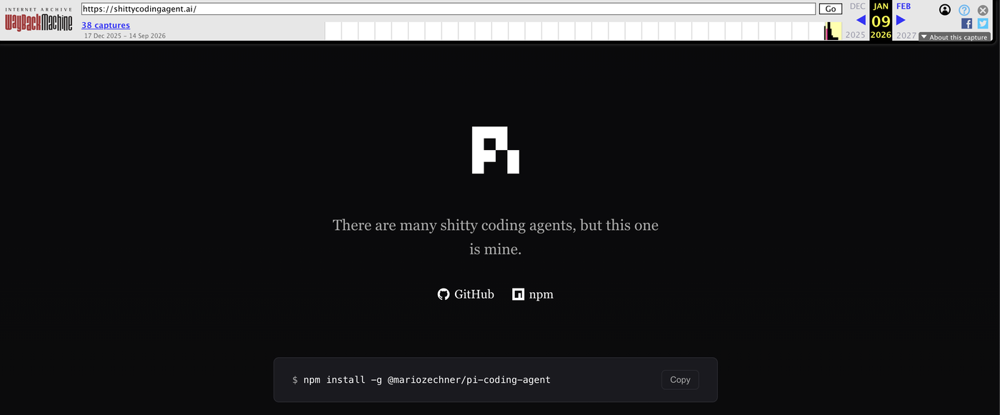

上一篇文章《给大脑配一副好鞍具》里，Pi 交出的成绩单是这样的：**9 秒修完 3 个 bug，6 次工具调用，3375 个 token，成本 0.00007 美元**。五款 agent harness 里最快，也最便宜。

这篇文章想把它拆开看看，但不打算按目录一层一层介绍。我想回答两个问题：它是怎么长成今天这样的，以及你敲下一行命令之后，它内部究竟发生了什么。

第一个问题的答案不在文档里，在 git 历史里。所以先去翻它的提交记录。

<!--more-->

## 一、它一开始只有三个包

### 1.1 首提交里的三件套

翻到 2025-08-09 的第一个 commit，里面只有三个包：pi-tui（差分渲染的终端 UI 库）、pi-agent（带会话持久化的 agent 库），以及一个叫 pi 的 CLI。第三个 pi 跟 coding agent 毫无关系，它的 README 第一句是：

> Deploy and manage LLMs on GPU pods with automatic vLLM configuration for agentic workloads.

用法是 `pi start Qwen/Qwen2.5-Coder-32B-Instruct`。“Pi” 这个名字最早属于一个在 GPU 机器上部署模型的工具。后来编码 agent 越长越大，反过来继承了这个名字。所以别问它是不是圆周率，它更像“某台跑模型的机器”的昵称（官方从没解释过，这是我的考古推测）。

一周之后，pi-ai 被抽了出来。2025-08-17 的 commit 写着：`feat(ai): Create unified AI package with OpenAI, Anthropic, and Gemini support`。这是 Pi 的第一次分层，把“模型怎么接”从 agent 里剥出去，单独成了一个包。

两个月后，2025-10-17，coding-agent 出现。产品层有了。

### 1.2 一年之后，十一个包

把每个包第一次出现的日子排一排：

| 日期 | 包 | 起因 |
|---|---|---|
| 2025-08-09 | pi-tui / pi-agent / pi(pods) | 首提交，三件套 |
| 2025-08-17 | pi-ai | 统一 OpenAI / Anthropic / Gemini |
| 2025-10-17 | coding-agent | 把 agent 做成产品 |
| 2026-07-21 | server | 会话要能被远程接进来 |
| 2026-07-25 | evals | 要能跑评测 |
| 2026-07-30 | protocol | 远程会话的线协议 |
| 2026-07-31 | client | 运行时无关的会话客户端 |
| 2026-08-05 | telemetry | 遥测抽包 |
| 2026-08-28 | chord | 应用组装运行时 |

一年时间，三个包长到十一个。**这条时间线里没有一个“架构设计”的节点。** 每一层都是被具体需求逼出来的：模型要统一，就抽 pi-ai。要有产品，就长出 coding-agent。会话要能被别人接进来，就有了 server 和 protocol。

同样被逼出来的还有那些机制：

| 日期 | 机制 |
|---|---|
| 2025-12-04 | 上下文压缩 |
| 2026-01-02 | 会话树（原地分支） |
| 2026-03-29 | faux provider，用来在没有模型的情况下测整个循环 |

连“Pi 是什么”也是长出来的。它对自己的称呼改过好几轮：2025 年 11 月中旬叫 “a radically simple and opinionated coding agent”，2026 年 1 月底换成 “minimal terminal coding harness”，2026 年 5 月才第一次把 “Pi Agent Harness” 写进标题（当时还多一个尾巴，写作 “# Pi Agent Harness Mono Repo”），2026 年 6 月才精简成今天这句。

最终长成的样子是这样。箭头从使用方指向被使用方，被依赖的那一方对上面一无所知。

```
pi-coding-agent（CLI：interactive / print · json / rpc / SDK）
   │
   ├─ pi-agent-core（agent 循环、会话树、压缩、状态机）
   │    └─ pi-ai（统一多 provider LLM API）
   │         └─ OpenAI / Anthropic / Google / DeepSeek 等
   │
   └─ pi-tui（自研终端 UI：差分渲染）
```

pi-tui 是这张图里唯一的旁支：它不依赖任何其他内部包，只是被产品层拿去渲染界面。

这条演进线解释了一件后面会反复出现的事：**每一层都是为了被别人拿走才切出来的。** 想要 agent 循环就拿 pi-agent-core，想要终端渲染再带上 pi-tui，产品层自己写就行。这也是它敢管自己叫“库”的底气。

说完它是怎么长成的，回到第二个问题：敲下一行命令之后，里面究竟发生了什么。

## 二、一次请求的旅程

还是上一篇那条命令：

```bash
pi -p "修复这个仓库里的 bug，让 npm test 全部通过" \
   --provider deepseek --model deepseek/deepseek-v4-flash
```

`-p` 是非交互模式，跑完就退出。按下回车之后，我们跟着这行字走一趟，看它每一步变成了什么。

### 2.1 它把 prompt 变成了什么

第一件事，是把上面那行字变成一份发给模型的东西。我把这一份抓出来看了，实际内容如下。它是用 pi 自己的 prompt 构造函数和工具定义生成的，不是我照着文档手抄的：

```
You are an expert coding assistant operating inside pi, a coding agent
  harness. You help users by reading files, executing commands, editing
  code, and writing new files.

Available tools:
- read: Read file contents
- bash: Execute bash commands (ls, grep, find, etc.)
- edit: Make precise file edits with exact text replacement, including
  multiple disjoint edits in one call
- write: Create or overwrite files

In addition to the tools above, you may have access to other custom tools
  depending on the project.

Guidelines:
- Use bash for file operations like ls, rg, find
- Be concise in your responses
- Show file paths clearly when working with files

Pi documentation (read only when the user asks about pi itself, its SDK,
  extensions, themes, skills, or TUI):
- Main documentation: <安装目录>/pi-coding-agent/README.md
- Additional docs: <安装目录>/pi-coding-agent/docs
- Examples: <安装目录>/pi-coding-agent/examples
  (extensions, custom tools, SDK)
- When reading pi docs or examples, resolve docs/... under Additional docs and
  examples/... under Examples, not the current working directory
- When asked about: extensions (docs/extensions.md, examples/extensions/),
  themes (docs/themes.md), skills (docs/skills.md), prompt templates
  (docs/prompt-templates.md), TUI components (docs/tui.md), keybindings
  (docs/keybindings.md), SDK integrations (docs/sdk.md), custom providers
  (docs/custom-provider.md), adding models (docs/models.md), pi packages
  (docs/packages.md), environment variables (docs/environment-variables.md)
- When working on pi topics, read the docs and examples, and follow .md
  cross-references before implementing
- Always read pi .md files completely and follow links to related docs
  (e.g., tui.md for TUI API details)
Current working directory: /tmp/demo-repo
```

就这么短。真实的提示词是 24 行、1900 个字符，其中工具清单占 4 行，行为准则占 3 行。剩下的绝大部分是一串路径，指向**已安装包里的文档**。这一点到 4.2 还会再提一次，它是 Pi 最有趣的设计之一。

（上面这块为了页面上不横向滚动，长行按 76 列折过行，安装路径也替换成了 `<安装目录>`，所以它显示成 38 行。内容一字未改，在你机器上那些路径指向你自己 node_modules 里的那个包。）

一份请求在 pi-ai 里叫 `Context`，只有三样东西：上面这段 system prompt、一份消息列表、一份工具 schema。此刻消息列表里只有一条：

```json
[
  {
    "role": "user",
    "content": "修复这个仓库里的 bug，让 npm test 全部通过",
    "timestamp": 1789795481937
  }
]
```

模型能看到的除了历史，还有一份工具清单。coding-agent 内置的工具一共 8 个：read、bash、edit、write、grep、find、ls，外加一个可选、文档标注为 Windows 用的 powershell。**默认激活的只有 read、bash、edit、write 四个。**

工具 schema 也一样朴素。四个默认工具里，bash 就两个字段：

```json
{
  "type": "object",
  "required": ["command"],
  "properties": {
    "command": {
      "type": "string",
      "description": "Shell command to execute"
    },
    "timeout": {
      "type": "number",
      "description": "Timeout in seconds (optional, no default timeout)"
    }
  }
}
```

任意命令，没有白名单。这个“吓人”的细节先记下，4.3 会解释它为什么是故意的。

这里有两个设计选择值得单独说。一是没有 system 消息类型，系统提示是 `Context` 的一个独立字段，不混进历史，所以历史可以原样存下来、原样续跑。二是这段提示词是代码里写死的，本地拼装，不依赖任何远程下发。

### 2.2 它怎么发出去

同一份东西，到了 Anthropic 那边长这样。下面这份是这一趟里的第二次请求（第一次只带前面那条 user 消息），我用一个假的 fetch 把它拦了下来，没有真的发网络请求：

```json
POST https://api.anthropic.com/v1/messages?beta=true

{
  "model": "claude-sonnet-4-5",
  "system": [
    {
      "type": "text",
      "text": "You are an expert coding assistant operating inside pi, ...",
      "cache_control": { "type": "ephemeral" }
    }
  ],
  "tools": [
    {
      "name": "bash",
      "description": "Execute a bash command ...",
      "input_schema": {
        "type": "object", "required": ["command"], "properties": { ... }
      },
      "cache_control": { "type": "ephemeral" }
    }
  ],
  "messages": [
    {
      "role": "user",
      "content": "修复这个仓库里的 bug，让 npm test 全部通过"
    },
    {
      "role": "assistant",
      "content": [
        {
          "type": "tool_use", "id": "call_1", "name": "bash",
          "input": { "command": "npm test" }
        }
      ]
    },
    {
      "role": "user",
      "content": [
        {
          "type": "tool_result", "tool_use_id": "call_1",
          "content": "3 failing", "is_error": false,
          "cache_control": { "type": "ephemeral" }
        }
      ]
    }
  ],
  "max_tokens": 8192,
  "stream": true
}
```

这一层干了两件事。

一是翻译。 pi 的 `toolCall` 变成了 Anthropic 的 `tool_use`，工具结果变成了一条 `role: "user"` 消息里的 `tool_result` 块。各家协议不一样，但差异全部在这里消化掉，上一层的循环对此一无所知。第 2.1 节那份 `Context` 对各家 provider 都一样，这层之后就各说各话了。

二是打缓存断点。注意那三处 `cache_control` 的位置：system 块、工具列表的最后一项、最后一条 user 消息的末块。它们不是随便挑的，第三章会算这笔账。

请求发出去之后，回来的是一条统一的事件流：

```
start
 ├── text      → text_start / delta / end
 ├── thinking  → thinking_start / delta / end
 ├── toolcall  → toolcall_start / delta / end
 ├── done
 └── error
```

把 text、thinking、toolcall 这三条各自展开成三个，加上 start、done、error，一共 12 个变体。中间三条各自单独成流，思考、正文、每个工具调用都有自己的增量。这个流容器既是 AsyncIterable，又承诺一个 `result()`，所以同一段流既可以逐字渲染，也可以等它给出最终消息。

### 2.3 模型开口要工具

流里出现了 `toolcall` 事件，意思是“我要执行 `npm test`”。控制权交回给 harness。

Pi 里一个回合（turn）的定义很干净：一次 assistant 响应，加上它引发的所有工具调用与结果。驱动它的 `runLoop` 是“双层 while”。要说明的是，`runLoop` 是模块私有函数，对外入口是 `agentLoop` / `runAgentLoop` / `runAgentLoopContinue`。形状大致是这样：

```ts
// 双层循环的形状（示意，省去错误处理与截断保护）
while (true) {                                    // 外层：follow-up
  let hasMoreToolCalls = true;
  while (hasMoreToolCalls) {                      // 内层
    const msg = await streamAssistantResponse(ctx, config); // think
    const calls = msg.content.filter((c) => c.type === "toolCall");

    if (calls.length === 0) break;                // 没有工具要调，内层结束

    const batch = await executeToolCalls(ctx, msg, config);  // act
    ctx.messages.push(...batch.messages);         // observe

    hasMoreToolCalls = !batch.terminate;          // 全员喊停才停
  }

  const followUps = await config.getFollowUpMessages?.() ?? [];
  if (followUps.length === 0) break;
}
```

内层那一圈就是 think、act、observe：让模型说一段，取出它想调的工具，执行完把结果写回上下文，再回到开头。外层则负责一件事，这一圈走完之后，如果还有排队中的 follow-up，就带着新上下文再来一圈。

真实的 `runLoop` 有 118 行（`packages/agent/src/agent-loop.ts:156-273`），比上面这个形状多出来的几乎全是边界处理。这些分支平时不显眼，但每一处都对应一个真实会踩到的坑：

1. **模型一直要工具，谁来踩刹车？** 循环里没有“跑到第 N 轮就停”这种保险丝，刹车被分散到三个地方：工具自己可以返回 `terminate: true` 说“我干完了”，宿主可以随时用 `AbortSignal` 打断它，扩展（第 4 章会谈）也可以在一个回合结束时喊停。什么时候该停，只有正在干活的工具和最了解语境的宿主知道，循环不该替它们做主。
2. **一批工具里只有一个说“停”，算不算停？** 不算。要这一批**全部**返回 `terminate: true`，循环才跳过紧接着的那次模型调用，混着来的一批照常继续。否则一个多嘴的工具就能把整批活掐掉一半。
3. **输出被截断，参数只剩半截，还执行吗？** 不执行。模型这次响应如果撞上了输出上限（`stopReason` 是 `length`），它吐出来的工具参数很可能是被腰斩的，Pi 把这批工具调用全部判错，让模型把参数重发一遍。宁可这一轮什么都不干，也不能拿着半截参数去改文件。

### 2.4 结果回到树上

`npm test` 的输出被写回上下文，成为一条工具结果消息。模型接着想，接着调工具。上一篇文章那次任务里，这个过程重复了 6 次，每次都在会话文件里留下痕迹。

我让 Pi 真的写了一个会话文件。真实的文件是每行一条记录的 JSONL，我在下面把其中一个回合的四条记录缩进展开了一遍，内容一字未改，只是为了让你不用横向滚动。完整文件里记录更多，这一趟那 6 次工具调用就散在十来个回合里：

```jsonc
// 第 1 行：header
{ "type": "session", "version": 3,
  "id": "01a0b81f-b94f-7559-bfee-67609da12709",
  "timestamp": "2026-09-19T05:24:41.936Z", "cwd": "/tmp/demo-repo" }

// 第 2 行：用户消息
{ "type": "message", "id": "a5c1c471", "parentId": null,
  "timestamp": "2026-09-19T05:24:41.937Z",
  "message": { "role": "user",
               "content": "修复这个仓库里的 bug，让 npm test 全部通过",
               "timestamp": 1789795481937 } }

// 第 3 行：assistant，带工具调用与 usage
{ "type": "message", "id": "678f354f", "parentId": "a5c1c471",
  "timestamp": "2026-09-19T05:24:41.937Z",
  "message": {
    "role": "assistant", "api": "anthropic-messages",
    "provider": "anthropic", "model": "claude-sonnet-4-5",
    "usage": { "input": 3375, "output": 120,
               "cacheRead": 3000, "cacheWrite": 0,
               "totalTokens": 3495,
               "cost": { "input": 0, "output": 0, "cacheRead": 0,
                         "cacheWrite": 0, "total": 0 } },
    "stopReason": "toolUse",
    "content": [ { "type": "toolCall", "id": "call_1",
                   "name": "bash",
                   "arguments": { "command": "npm test" } } ],
    "timestamp": 1789795481937 } }

// 第 4 行：工具结果
{ "type": "message", "id": "423c01c8", "parentId": "678f354f",
  "timestamp": "2026-09-19T05:24:41.937Z",
  "message": { "role": "toolResult", "toolCallId": "call_1",
               "toolName": "bash",
               "content": [ { "type": "text", "text": "3 failing" } ],
               "isError": false, "timestamp": 1789795481937 } }
```

四行里能看出三件事。

第一行是 header，之后每一行是一个 entry，每个 entry 都指向自己的 parentId，`null` 表示它是根。所以一个文件里天然长着一棵树，而不是一条线：

```
m1 ─ m2 ─ m3 ─┬─ m4 ─ m5   ← 叶子 A
              │
              └─ m6 ─ m7   ← 叶子 B
```

id 是 8 位 hex，比如 `a5c1c471`，只用来定位，不参与语义。上面 `cost` 全是 0 是因为这份文件是我本地拿假模型写的，没接各家 provider 的计价表，真实的会话里这里会填上真金白银。而 assistant 那条消息上挂着 `usage`，里面 `cacheRead: 3000` 是一个独立字段。这一趟花了多少缓存，会话文件里就记着多少。

当前对话位置就是树的某片叶子，我们刚才那 6 次工具调用，是在这棵树上走出的一条路径。想回到历史里的某个岔路口，那就是一次“切分支”。对应的命令有三个：

- `/tree`：查看整棵树，在文件内跳转、切换分支。
- `/fork`：选中某条 user 消息，把它之前的路径复制成一个新的会话文件，并把那条 prompt 放回输入框供我们改写。
- `/clone`：把当前分支复制到新文件。

这些文件就躺在 `~/.pi/agent/sessions/` 下，按工作目录分文件夹，而且是只追加的：entry 一旦写下就不能改也不能删。所以“重写历史”在 Pi 里不是修改，而是开新枝，就像 git 一样，历史不可变，想走另一条路就 branch。对 agent 来说这太重要了：我们 fork 出去让模型试一个激进方案，不满意，切回原来的叶子继续，两边的记忆都还在。

### 2.5 出错、插话、太长

真实的请求不会一路顺风。模型调用会遇到超时、报错和上下文溢出。

出错时的恢复原语叫 `agent.continue()`，注释写得很直白：

> Continue an agent loop from the current context without adding a new message.
> Used for retries - context already has user message or tool results.

不加新消息，从当前上下文接着跑。产品层在它之上套了一层自动恢复：

```
可重试错误（过载 / 限流 / 5xx）
  → 指数退避重试：2s → 4s → 8s，至多 3 次

上下文溢出，且这一步的响应是失败的
  → 从 agent state 摘掉末尾那条失败的 assistant
  → 自动压缩，把历史折成摘要
  → continue() 接着跑，只给一次机会

上下文溢出，但响应本身正常结束了
  → 只压缩，不重试
```

除了出错，还有两件事是往循环里追加输入，Pi 把它们建模成了两个队列：

- **steering（转向）**：循环正在跑的时候想插一句话，投进 steer 队列，它会在当前工具执行完、模型下一次思考之前注入。
- **follow-up（续尾）**：循环已经决定要停了，补一句“顺便把测试也跑了”，投进 follow-up 队列，它会再多跑一轮。

一个插在“还在干活时”，一个插在“正要收工时”。这两种时机对应完全不同的体验，所以是两个队列，不是一个。

最后是太长的时候。当上下文快装不下，大多数工具的做法是截断最旧的几条消息。Pi 不这么干：

```
会话文件（档案：一行都不删）
 m1  m2  m3  m4  m5  m6  m7  m8
 └───────┬───────┘  └────┬───┘
         │                │
    compaction          保留的原文
     摘要 entry        （keepRecent）
         │                │
         ▼                ▼
模型输入 [ 摘要 ][ m6 m7 ][ 新消息 ]
```

触发条件是一行公式：上下文估算的 token 超过“窗口减去预留量”。两个默认值分别是 16384 和 20000，前者是留给模型回复的余量，后者是压缩后至少要保留的近期内容预算。切点有一个硬规矩，绝不允许切在工具结果上，否则模型会看到“调了工具却没结果”。

至于那批被摘要覆盖掉的旧消息，一条都没有删。它们只是不再进模型窗口，永远留在文件里，用 `/tree` 跳回去还能看到原文。

### 2.6 这一趟的证据

上面这一路讲下来，你可能会问：这些机制我怎么确认它们真的在跑？

Pi 自己给了一个办法。它内置了一个 faux provider（`packages/ai/src/providers/faux.ts`，实测 708 行），一个零网络的假模型：把调用方排队的响应脚本，按真实的 delta 事件流吐出来。它能限速来模拟慢模型，也能模拟 abort 和 deferred 异步响应，甚至能按 sessionId 前缀命中来仿真 prompt cache 的读写。

```bash
npm i @earendil-works/pi-ai@0.85.1
node faux-demo.mjs
```

```js
// faux-demo.mjs
import {
  fauxAssistantMessage, fauxText, fauxThinking, fauxToolCall,
} from "@earendil-works/pi-ai";
import { registerFauxProvider, streamSimple }
  from "@earendil-works/pi-ai/compat";

const faux = registerFauxProvider({
  models: [{ id: "faux-1", contextWindow: 100000 }],
});
faux.setResponses([fauxAssistantMessage([
  fauxThinking("先看看工作目录里有什么，再决定改哪个文件。"),
  fauxText("我先列一下目录。"),
  fauxToolCall("bash", { command: "ls -la" }, { id: "call_1" }),
], { stopReason: "toolUse" })]);

const stream = streamSimple(faux.getModel(), {
  systemPrompt: "You are an expert coding assistant operating inside pi.",
  messages: [
    { role: "user", content: "帮我看看这个目录", timestamp: Date.now() },
  ],
  tools: [
    { name: "bash", description: "Run a shell command", parameters: {} },
  ],
});

const seen = [];
for await (const ev of stream) {
  seen.push(ev.type);
  const payload = ev.type.endsWith("_delta") ? JSON.stringify(ev.delta) : "";
  console.log(ev.type, payload);
}
console.log(`共 ${seen.length} 个事件，事件类型种类 ${new Set(seen).size}`);
const final = await stream.result();
console.log(final.stopReason, final.content.map((c) => c.type).join(", "));
```

跑起来是这样（GIF 是真实终端输出录的，不是手绘）：


控制台里的原始输出（Node 24，2026-09-19）：

```
event  start
event  thinking_start
event  thinking_delta   "先看看工作目录里有什么，再决定改"
event  thinking_delta   "哪个文件。"
event  thinking_end
event  text_start
event  text_delta       "我先列一下目录。"
event  text_end
event  toolcall_start
event  toolcall_delta   "{\"command\":\"ls -"
event  toolcall_delta   "la\"}"
event  toolcall_end
event  done             stopReason=toolUse

共 13 个事件，事件类型种类 11
toolUse  thinking, text, toolCall
```

delta 是按 token 块切的，所以一句话会被切成几段，逐字渲染靠的就是这个。另外注意最后那行：一共 12 种事件类型，这一趟没出现 `error`，所以只数到 11 种。

这件事看着小，其实是工程上的分水岭：**当“模型”可以被一个确定性脚本替代，整个循环的测试就从碰运气变成了可复现。** 上一篇文章里那个 9 秒的成绩是真实 API 跑出来的，但同样的路径可以拿 faux 反复走，不必再花钱。仓库的开发守则里写得很硬：`packages/coding-agent/test/suite/` 这套回归测试只准用 faux，不许用真实 API key 和付费 token。

## 三、为什么它快

现在回到开头那张成绩单：9 秒，3375 个 token，0.00007 美元。便宜和快是两回事，背后的机制也不一样，分开看。

### 3.1 缓存这本账

先说便宜。那 0.00007 美元。

很多模型 API 对上下文缓存计费。如果这次请求的前缀和之前某次完全相同，命中的那部分就按远低于正常输入的价格算。按 DeepSeek 官方价目，缓存命中的输入价约为未命中的 1/50，Flash 档 0.02 对 1 元每百万 token。

所以 harness 的功课很像前端压榨 HTTP 缓存：让请求前缀尽量稳定，并且正确地打缓存标记。

```
Anthropic 的顺序：tools → system → messages

两次请求的前缀：
[tools][sys][u1][call][result1]
[tools][sys][u1][call][result1][u2]
└─────── 前缀一字不差 ───────┘
```

Pi 在这件事上做得比大多数工具细：

- usage 里 `cacheRead` 和 `cacheWrite` 是独立计量字段，成本按每家 provider 的缓存价单独算，连 Anthropic 一小时缓存写入按输入 2 倍计费这种细节都建模了。
- 请求级的 `cacheRetention` 默认就是 `"short"`，缓存默认开启。
- 打点位置按协议分别适配，Anthropic、OpenAI、Fireworks 三家各有一套。Anthropic 在 system、最后一个工具、最后一条 user 消息的末块打 `cache_control`。OpenAI Responses 侧发 `prompt_cache_key`，把 sessionId 截到 64 字符。Fireworks 这类靠副本路由命中的，得加一个 session-affinity 头。
- system prompt 是请求级顶层字段，每轮原样重发，工具集和插件不变时逐字节一致。对话中间怎么变，最贵的头部始终能命中。

这三套机制的差别很大：Anthropic 靠请求体里填标记，OpenAI 靠一个缓存键，Fireworks 靠让请求落到同一个缓存副本上。harness 要做的不是挑一种，而是三家都照顾到。

上一篇文章实测里，Pi 的缓存命中率是 91% 到 93%。算一下：九成多的输入按 1/50 计价，剩下不到一成按原价，两项加起来约为完全未命中时的十分之一。**输入成本被压到十分之一，这就是 0.00007 美元的来历。** 那不是魔法，是前缀稳定工程叠加缓存计费模型的结果。

缓存还有一个反直觉的配套规则：压缩和摘要请求强制关闭缓存。

理由很简单。摘要是一次性内容，读完就扔，让它进缓存前缀纯属浪费，还会把真正的会话前缀挤掉。所以这类请求不仅 `cacheRetention` 是 `"none"`，默认路径下连 sessionId 都不传，每次现生成一个一次性 ID。

一句话说，昂贵的那个主动给便宜的那个让路。毕竟压缩要额外叫一次模型来写摘要，它没理由再去污染缓存前缀。

### 3.2 不添乱

再说快。9 秒里有很大一部分是模型自己思考、以及那 6 次命令执行花掉的时间，harness 没法替模型提速。它能做的是别往上加东西，而 Pi 在这一点上克制得有点反常：

- 整个 system prompt 只有 1900 个字符，默认只挂 4 个工具，也就是 4 段 schema。这些东西每一轮都要原样重发，短一点，请求就轻一点。
- 一批工具默认并行执行。同一次模型响应里要调的几个工具，互不依赖的同时发出去，而不是排队一个个来。这一趟那 6 次调用（3 次 bash、2 次 read、1 次 edit）就分在几批里。
- 没有权限弹窗要等。交互模式下工具该跑就跑，不会停下来等人点确认。

这几条都不是什么发明，说到底只是没有被加上去。而忍住不加，本身也是一个设计决定。

### 3.3 只重画变化的行

界面这一层也是同一路数。Pi 没有用现成的终端 UI 框架，自己写了一个 pi-tui：

```
重绘派：整块重写       Pi：只更新变化的行
┌────────────┐        ┌────────────┐
│  aaaaa     │        │  aaaaa     │
│  bbbbb     │        │  bbbbb     │  ← 没变
│  ccccc     │        │  CCCCC     │  ← 只发这行
│  dddddd    │        │  dddddd    │
└────────────┘        └────────────┘
```

严格说它是区间语义：每帧先全量重算出整个行数组，再求出第一处和最后一处变化的行，中间没变的也跟着这一段一起写出去。只变一行时，才是图里画的最省情形。配合 CSI 2026 同步输出，终端先把一整帧攒齐再一次渲染，杜绝半帧闪烁。

这和 3.1 那笔账是同一件事的两面：**把会变的部分和不会变的部分分开处理**。缓存盯的是请求前缀，尽量让它不变。渲染盯的是屏幕，只把变了的行发出去。

作者是游戏圈出身（libGDX 的作者），这套对“快”的执念全是游戏渲染管线的老手艺：主循环驱动刷新，每帧只画脏区域，双缓冲避免撕裂。仓库里甚至有用它跑 DOOM 的示例，在 overlay 里以 35 FPS 实时渲染。一个终端 UI 引擎能当游戏引擎用，大概是这套渲染哲学最好的注脚。

## 四、它到底做对了什么

拆到这里，可以说结论了。三件事，一件比一件反直觉。

### 4.1 循环是个函数

前端的发展史告诉我们：**“框架”替我们决定控制流，“库”把控制流还给我们。** jQuery 是库，Angular 是框架，React 一度被争论到底算哪个。

Pi 把这条审美写进了 README：

> Pi is a minimal terminal coding harness. Adapt pi to your workflows, not the other way around, without having to fork and modify pi internals.

翻译过来是：让 Pi 适应你的工作流，而不是让你去适应它，而且你不需要 fork 它的源码就能做到。

大多数 coding agent 是“框架”，我们必须活在它的 TUI 里。Pi 是“库”，agent 循环是一个可以 `import` 进自己程序的 async 函数。CLI、批处理、RPC、SDK，都只是这个函数的不同宿主。

看完第二章那一趟旅程，你会发现这有多实在：那套 `runLoop` 不认终端，不认 stdin，也不认任何界面。它只认一个 `Context` 和一份配置。所以它今天能跑在 CLI 里，明天就能跑在别人的 IDE 里。

同一个内核对外有四种出口：交互式 TUI，一次性的 print 模式（可以选 JSON 事件流），跑在 stdin/stdout 上的 RPC 协议（给非 Node 的编辑器集成用），以及 SDK。同一个循环，四个出口，无数种驾驶舱。

### 4.2 把一切做成数据

会话是数据，所以可以 fork。压缩记录是数据，所以旧消息一条不丢。token 和缓存是消息上的一等字段，所以成本全程透明。

这条审美前端工程师很熟。这跟不可变状态加时间旅行调试是同一套东西：把状态的变化存成数据，把回到过去变成一次指针操作。

Pi 把这个思路推到了一个小极端：它把自己的说明书也数据化了。系统提示词里给了三个指向已安装包内 README、docs、examples 的路径，并写明只在用户问起 Pi 本身时才读。意思是你可以直接问它“你自己是怎么工作的”，它会翻开自己的说明书作答。

仓库 README 里有一句自我介绍：

> This is the home of the Pi agent harness project including our self extensible coding agent.

“self extensible” 是它给自己贴的标签，而且贴得住。仓库根目录的 `.pi/` 里就是它自己用的扩展、提示词和技能，它拿自己开发自己。

### 4.3 敢不做

Pi 的产品 README 里有一节叫 Philosophy，通篇是一个接一个的“No”，而且一个比一个反直觉：不做 MCP（不接外部工具与数据源那套协议），不做子代理（不派生分身去干活），不做权限弹窗，不做计划模式（不先出方案再动手），不做内置待办清单，不做后台 bash（不把命令丢到后台慢慢跑）。

第 2.1 节那个没有白名单的 bash，就是这条清单最直接的样子。它不替你判断哪条命令危险，只负责把命令原样交给 shell。

官网首页给这套减法起了个名字，叫 “Primitives, not features”。直译是“原语，而非功能”，也就是这篇文章标题里“积木，而非成品”的出处。

最容易被误解的是“不做权限”。它的理由写得很清楚：

> Pi does not include a built-in permission system for restricting filesystem, process, network, or credential access. By default, it runs with the permissions of the user and process that launched it.

安全文档里说得更绝：

> A partial in-process sandbox would be easy to misunderstand as a security boundary while still depending on the host shell, filesystem, package managers, credentials, and extension code. Real isolation needs to come from the operating system or a virtualization/container boundary.

它的论证是：一个进程内的半吊子沙箱，容易被误当成真正的安全边界，因为它自己还得依赖宿主 shell、文件系统、包管理器和凭证。所以与其给一个让人误以为安全的假边界，不如明说没有边界，边界请到操作系统或容器层面去画。

它给出的安全方案在进程外面：

```
┌─────────────────────────────────────────┐
│  pi-ai / pi-agent-core / pi-coding-agent │
└────────────────────┬────────────────────┘
                     │ Pi 核心以你的用户权限运行
                     │ 想要更强的边界？套一层壳
       ┌─────────────┼─────────────┐
       ▼             ▼             ▼
   Gondolin       纯 Docker    OpenShell
```

这三者都是社区给的壳，隔离范围不一样：

| 壳 | 隔离什么 |
|---|---|
| Gondolin 扩展 | pi 与 provider 凭证留在宿主，内置工具与 `!` 命令路由进本地 Linux 微 VM |
| 纯 Docker | 整个 pi 进程装进容器 |
| NVIDIA OpenShell | 整个 pi 进程进策略沙箱（文件、进程、网络、凭证、推理都可控），需要 gateway |

这条“不做”的清单也不是一成不变的。2025 年 11 月它的 README 里，这一节标题是 “Security (YOLO by default)”，理由是“权限系统只会增加摩擦，还很容易被绕过”。一个月后改名 “No Permission System (YOLO Mode)”。再一个月后整节被删，压成一行更戏谑的 “No permission popups. Security theater.”。今天那段严肃表述是 2026 年 6 月才写进根 README 的。立场没变过，说法一直在调。

不做权限弹窗，那想要权限系统的人怎么办？自己拼一个。扩展系统里有现成的样板：`permission-gate.ts` 拦危险命令并弹确认，`protected-paths.ts` 保护 `.env` 和 `.git`。**“要权限系统？自己拼一个，20 分钟。”** 这句话就是“积木，而非成品”的注脚。

这些“不做”后来大多变成了社区货源。官方说不做 MCP，社区就补了个适配器，把 MCP server 映射成 Pi 的原生工具。说不做子代理，社区就补了异步子代理委派。官方只负责把积木和图鉴做精，剩下的由我们自己拼。

扩展点本身也给得足。`ExtensionAPI` 提供 36 个事件钩子，从输入、每轮模型调用前的上下文，到工具调用前后、回合起止、压缩之前，都有挂载点。日常用得上的其实就四个：拦个工具、加个命令、改改提示词、压缩前插一手。

3.3 里那个自研的 pi-tui 也是这条清单的产物。现成的终端框架不是没有，但要按自己的方式渲染，就只能自己写。

## 结语

先把拆开的东西收进一张表，方便和上一篇那套“五件套”对照：

| 五件套 | Pi 的配法 |
|---|---|
| 循环 | 可 import 的函数，无轮次硬上限，工具可喊停 |
| 工具 | 内置 8 个默认开 4 个，无 allowlist，并行执行 |
| 记忆 | 会话是一棵 entry 树，压缩写摘要而不删历史 |
| 权限 | 没有内置权限系统，边界交给容器 |
| 界面 | 自研差分渲染 TUI。四种出口（interactive / print·json / rpc / SDK）共享同一个循环 |

一年时间从三个包长到十一个包，每一层都是被需求逼出来的，所以每一层都能被单独拿走。会话、分支、压缩、缓存全是数据，所以历史可以被 fork、被摘要、被续跑。别人标配的那些功能它一个不做，把决定权留给我们自己拼。

这三句话的落点是同一个：**这个项目没打算替你做决定。** 官网首页那句 “Primitives, not features”，还有那个曾经叫 shittycodingagent.ai 的域名，说的都是这件事。

它当然不是给所有人准备的。如果你要的是开箱即用的安全与周全，Claude Code 们更合适。但如果你想亲手掌控自己那副鞍具的每一颗螺丝，Pi 是这个品类里把选择权还回来还得最彻底的一个。上一篇文章结尾我说“马是谁不重要了，重要的是鞍具合不合手”，这篇的结尾想补一句：**最好的鞍具，是你随时能拆开、能续上、还能请马自己讲讲它怎么跑的那一副。**

还有一件正文没展开的事。第一章那张表里的 server、protocol、client、chord 四个包，是正在成型的另一套运行时：它把 agent 循环从进程内的函数，改造成可以落盘、可以跨进程恢复的服务，目标是一个会话能被多个客户端同时接进来。这套东西目前只在 coding-agent 的 `experimental/` 路线里，要 `PI_EXPERIMENTAL=1` 才启用，默认 CLI 走的仍是经典架构。写这篇文章时它的定位是演进方向，不是当前行为。

想亲自上手验证这篇里的论断，最快的一条路是：装上 Pi，把官方 `examples/extensions/` 目录翻一遍，照着抄一个自己的扩展，再跑一次 2.6 节那段 faux demo。这比读十篇解剖文章都管用。别忘了上篇的提醒：给工具用独立的目录副本，别让它们互相剧透。

## 该警惕的地方

1. 没有内置权限就是安全自负。这是设计，但也是风险：让 Pi 在我们不完全信任的目录上裸奔，等于让任意提示词驱动我们的 shell。GitLab Advisory Database 收录过它本地执行面的问题，最高一条是 HIGH（CVE-2026-54328，7.3 分，影响 0.78.1 之前的版本，本文这个 0.85.1 已经修掉）。在共享机器、CI、处理敏感数据时，先套壳。
2. 版本与文档有代差。经典 API 和新 harness 并存，教学材料往往只讲其一。写代码、看文档前先确认自己在哪一代上。
3. “不做 MCP、不做子代理、不做计划模式”的取舍不是免费的。这些能力要么靠社区包补，要么得自己写。对开箱即用党来说，它比 Claude Code 这类工具糙不少。
4. 仓库默认自动关闭新贡献者的 issue 和 PR，维护者每日人工复查。项目红火但门槛不低，别被拒了一次就以为是在针对自己。

## 彩蛋

2026 年 1 月，Pi 的官网长这样：


*Wayback Machine 对 shittycodingagent.ai 的存档，抓取时间 2026-01-09*

那句 “There are many shitty coding agents, but this one is mine” 是冲着美国海军陆战队的步枪手誓词（Rifleman's Creed）来的。原话是 “This is my rifle. There are many like it, but this one is mine”，《全金属外壳》里新兵齐声念的就是它。翻译过来大概是：烂编码 agent 有很多，但这一个是我的。

安装命令里还留着当时的 scope，`@mariozechner/pi-coding-agent`，包名后来才挪到 `@earendil-works` 下。

三个月后，README 顶上那个指向 shittycodingagent.ai 的 logo 链接被换成了 pi.dev。动手的那次提交，message 写的是 “feat(branding): corporate said we're professionals”，意思是公司说我们得专业一点，提交人是 Armin Ronacher。pi.dev 这个域名是 exe.dev 友情捐赠的，致谢至今还写在 README 页脚里。

顺手一提，那个老域名今天还活着，访问它会 301 跳到 pi.dev。存档页显示这段历史一共有 38 次抓取，跨度从 2025 年 12 月 17 日到 2026 年 9 月 14 日。

一个敢把自己官网叫“烂编码 agent”的项目，大概也配得上“克制”这两个字。

## 参考

- 仓库：[earendil-works/pi](https://github.com/earendil-works/pi)（[pi.dev](https://pi.dev) 官网与文档）
- 作者博客：[《What I learned building an opinionated and minimal coding agent》](https://mariozechner.at/posts/2025-11-30-pi-coding-agent/)、[《What if you don't need MCP at all?》](https://mariozechner.at/posts/2025-11-02-what-if-you-dont-need-mcp/)
- 我上一篇的横评：《[给大脑配一副好鞍具：五款 Agent Harness 的解剖与实测](https://springuper.github.io/blog/agent-harness-comparison/)》（复现实测用同一提示词即可，命令见其附录）
- 中文教学仓库：[cellinlab/how-pi-agent-works](https://github.com/cellinlab/how-pi-agent-works)
- 第三方解读：[walkinglabs 的 harness 工程设计系列（Pi 篇）](https://walkinglabs.github.io/learn-harness-engineering/zh-TW/harness-designs/pi/)
- 真实会话数据集：[badlogicgames/pi-mono on Hugging Face](https://huggingface.co/datasets/badlogicgames/pi-mono)

> 版本与核实说明：本文基于仓库 HEAD `9767ba2`（各包版本 0.85.1，2026-09-06 抓取）撰写，演进时间线里的日期与 commit 均取自仓库 git 历史，可按 commit 复核。版本号与生态数据随时间变化，引用请以当时为准。文中实跑的证据（faux 输出、会话文件）产生于 2026-09-19，比基于 HEAD `9767ba2` 的源码核对晚两周，是为了让它们和这一版正文对齐才重新跑的。文中的 faux 事件流 demo 是实跑输出（Node 24 + `@earendil-works/pi-ai@0.85.1`），不是手写示意。掌故类内容（名字来历、YOLO Mode、域名变更）同样按 git 历史核验，其中域名那条重定向在浏览器里可以直接复现。
