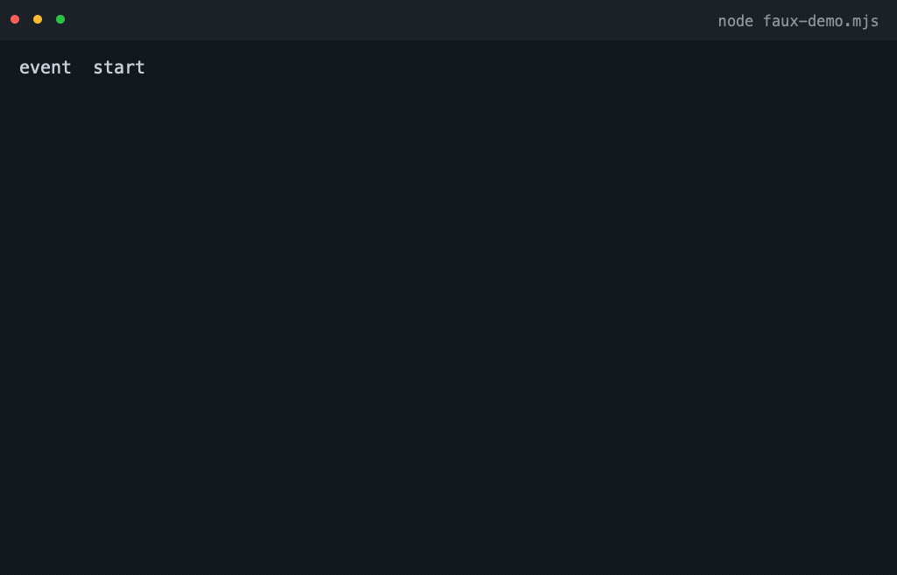

上一篇文章《给大脑配一副好鞍具》里，Pi 交出的成绩单是这样的：**9 秒修完 3 个 bug，6 次工具调用，3375 个 token，成本 0.00007 美元**。五款 agent harness 里最快，也最便宜。

一个开源项目凭什么跑出这种成绩？先说三件看起来毫不相干的事。

它的官网首页，最大的标题是 **“Primitives, not features”**，直译是“原语，而非功能”。它的官网域名曾经叫 shittycodingagent.ai。它的作者是游戏引擎 libGDX 的作者，不是做 AI 的。

这三件事指向同一个答案。这篇文章想讲两件事：它是怎么长成现在这样的，以及你敲下一行命令之后，它内部到底发生了什么。

<!--more-->

## 一、它一开始只有三个包

### 1.1 首提交里的三件套

翻到 2025-08-09 的第一个 commit，里面只有三个包：pi-tui（差分渲染的终端 UI 库）、pi-agent（带会话持久化的 agent 库），以及一个叫 pi 的 CLI。第三个 pi 跟 coding agent 毫无关系，它的 README 第一句是：

> Deploy and manage LLMs on GPU pods with automatic vLLM configuration for agentic workloads.

用法是 `pi start Qwen/Qwen2.5-Coder-32B-Instruct`。“Pi” 这个名字最早属于一个在 GPU 机器上部署模型的工具。 后来编码 agent 越长越大，反过来继承了这个名字。所以别问它是不是圆周率，它更像“某台跑模型的机器”的昵称（官方从没解释过，这是我的考古推测）。

一周之后，第二个包被抽了出来。2025-08-17 的 commit 写着：`feat(ai): Create unified AI package with OpenAI, Anthropic, and Gemini support`。这是 Pi 的第一次分层，把“模型怎么接”从 agent 里剥出去，单独成了一个包。

两个月后，2025-10-17，第三个包出现，coding-agent。产品层有了。

### 1.2 一年之后，十一个包

把每个包第一次出现的日子排一排：

| 日期 | 包 | 起因 |
|---|---|---|
| 2025-08-09 | pi-tui / pi-agent / pi(pods) | 首提交，三件套 |
| 2025-08-17 | pi-ai | 统一 OpenAI / Anthropic / Gemini |
| 2025-10-17 | coding-agent | 把 agent 做成产品 |
| 2026-07-21 | server | 会话要能被远程接进来（目录由更早的 orchestrator 改名而来） |
| 2026-07-25 | evals | 要能跑评测 |
| 2026-07-30 | protocol | 远程会话的线协议 |
| 2026-07-31 | client | 运行时无关的会话客户端 |
| 2026-08-05 | telemetry | 遥测抽包 |
| 2026-08-28 | chord | 应用组装运行时 |

一年时间，三个包长到十一个。**这条时间线里没有一个“架构设计”的节点。** 每一层都是被具体需求逼出来的：模型要统一，就抽 pi-ai。要有产品，就长出 coding-agent。会话要能被别人接进来，就有了 server 和 protocol。

同样被逼出来的还有那些机制：

| 日期 | 机制 |
|---|---|
| 2025-12-04 | 上下文压缩 |
| 2026-01-02 | 会话树（原地分支） |
| 2026-03-29 | faux provider，用来在没有模型的情况下测整个循环 |

连“Pi 是什么”也是长出来的。它对自己的称呼改过好几轮：2025 年 11 月中旬叫 “a radically simple and opinionated coding agent”，2026 年 1 月底换成 “minimal terminal coding harness”，2026 年 5 月才第一次把 “Pi Agent Harness” 写进标题（当时还多一个尾巴，写作 “# Pi Agent Harness Mono Repo”），2026 年 6 月才精简成今天这句。

最终长成的样子是这样，依赖严格单向，上层 import 下层：

```
   pi-tui（自研终端 UI：差分渲染）
       ▲
   pi-coding-agent（CLI：interactive / print / json / rpc / SDK）
       ▲
   pi-agent-core（agent 循环、会话树、压缩、状态机）
       ▲
   pi-ai（统一多 provider LLM API）
       ▲
   OpenAI / Anthropic / Google / DeepSeek / 各家订阅 OAuth / 本地模型……
```

这条演进线解释了一件后面会反复出现的事：**每一层都是为了被别人拿走才切出来的。** 所以你可以只拿走底下三层，自己写第四层。这也是它敢管自己叫“库”的底气。

## 二、一次请求的旅程

### 2.1 这行 prompt 变成了什么

上一篇实测用的是这条命令：

```bash
pi -p "修复这个仓库里的 bug，让 npm test 全部通过" --provider deepseek --model deepseek/deepseek-v4-flash
```

`-p` 是非交互模式，跑完就退出。按下回车之后，第一件事是把这行字变成一份发给模型的请求。pi-ai 里这份请求叫 `Context`，只有三样东西：system prompt、消息列表、工具 schema。

消息不是字符串，是一组结构化的内容块：用户的输入可以是文本或图片，assistant 的正文可以是普通文本、思考、或一次工具调用，工具结果单独占一个角色。

这里有一个不太起眼但很重要的设计：**没有 system 消息类型**。系统提示是 `Context` 的一个独立字段，不混进历史。好处是历史可以原样存下来、原样续跑，换一份 system prompt 也不会污染会话文件。

模型看到的除了历史，还有一份工具清单。coding-agent 内置的工具只有 8 个：read、bash、edit、write、grep、find、ls，外加一个可选、文档标注为 Windows 用的 powershell。默认激活的只有 read、bash、edit、write 四个。

每个工具的说明在系统提示词里占一行，这个字段叫 `promptSnippet`，和执行函数、给模型看的 description 并列放在同一份工具定义里。所以模型拿到的不是一份 API 文档，而是四句话：你现在有什么手脚，大概能干什么。

bash 的 schema 朴素到只有两个字段，命令字符串和一个可选的超时。任意命令，没有 allowlist。这个“吓人”的细节先记下，4.3 会解释它为什么是故意的。

### 2.2 请求怎么发出去

接下来要把这份统一的 `Context` 翻译成某一家的方言，再把对方吐回来的流译成统一事件。pi-ai 一共认十种方言，对外只承诺两个函数 `stream` 和 `streamSimple`，各家差异全部关在方言模块内部。

举几个例子。DeepSeek 走 openai-completions，只是 baseUrl 不同。xAI 走 openai-responses。Anthropic 走 anthropic-messages。同一家厂商还可能按模型分流，OpenRouter 就以 `anthropic/` 前缀为准，开头走 anthropic-messages，其余走 openai-completions。

统一模型不等于抹平差异。pi-ai 为每个模型留了一份兼容开关，记录这个模型支不支持长缓存保留、思考参数该叫什么名字、哪些参数发过去会报错。抽象抹掉的是方言，不是能力。

思考是最好的例子。Pi 把思考做成了一等公民：它有独立的等级，minimal 到 max 一共六档，再由模型上的 `thinkingLevelMap` 翻译成各家协议里不同的字段。这样 harness 才能把“模型的推理过程”和“对外说的话”分开处理，压缩时可以只保留结论，渲染时可以折叠，计费也能单独算。

读回来的东西被规约成一条类型化事件流，一共 12 个变体：

```
start
 ├── text      → text_start / delta / end
 ├── thinking  → thinking_start / delta / end
 ├── toolcall  → toolcall_start / delta / end
 ├── done
 └── error
```

中间三条各自单独成流，思考、正文、每个工具调用都有自己的增量。

这个流容器有个好处：它既是 AsyncIterable，又承诺一个 `result()`。同一段流，既可以逐字渲染，也可以等它给出最终消息。

```ts
// 同一件事的两种吃法
const stream = models.stream(model, context, { cacheRetention: "short" });

// 吃法一：当流，逐字渲染（顺便把 thinking 和正文分开显示）
for await (const ev of stream) {
  if (ev.type === "text_delta")      ui.appendText(ev.delta);
  if (ev.type === "thinking_delta")  ui.appendThinking(ev.delta);
}

// 吃法二：当 Promise，等最终消息（usage、stopReason 都在上面）
const message = await stream.result();
console.log(message.usage.cost.total); // token 花了多少、缓存命中多少，全程透明
```

这段代码里有个参数先记一下：`cacheRetention: "short"`，它默认开着。第三章会说它值多少钱。

### 2.3 模型开口要工具

模型说的话里出现了一段 `toolcall` 事件，意思是“我要执行 `npm test`”。这一下把控制权交回给了 harness。

Pi 里一个回合（turn）的定义很干净：一次 assistant 响应，加上它引发的所有工具调用与结果。驱动它的 `runLoop` 是“双层 while”。要说明的是，`runLoop` 是模块私有函数，对外入口是 `agentLoop` / `runAgentLoop` / `runAgentLoopContinue`。骨架大致是这样（依据 `packages/agent/src/agent-loop.ts:156-273` 精简，省去了事件投递）：

```ts
// packages/agent/src/agent-loop.ts:156-273 精简（省略 emit 事件与 turn_end）
async function runLoop(ctx, config) {
  let pending = (await config.getSteeringMessages?.()) ?? [];        // :168
  while (true) {                                                    // :171 外层：follow-up
    let hasMoreToolCalls = true;
    while (hasMoreToolCalls || pending.length > 0) {                 // :175 内层
      ctx.messages.push(...pending); pending = [];                   // :201 steering 在这里注入
      const msg = await streamAssistantResponse(ctx, config);        // :212（真名，:279 定义）
      if (msg.stopReason === "error" || msg.stopReason === "aborted") return; // :215 不执行任何工具
      const calls = msg.content.filter((c) => c.type === "toolCall");       // :222
      const batch = calls.length === 0 ? null : msg.stopReason === "length" // :231
        ? await failToolCallsFromTruncatedMessage(calls)             // :232 全部判错，让模型重发
        : await executeToolCalls(ctx, msg, config);                  // :233 默认并行执行
      if (batch) ctx.messages.push(...batch.messages);               // :237
      hasMoreToolCalls = batch ? !batch.terminate : false;           // :235 全员 terminate 才停
      pending = (await config.getSteeringMessages?.()) ?? [];        // :257
    }
    const followUps = (await config.getFollowUpMessages?.()) ?? [];  // :261 内层退出后才看 follow-up
    if (followUps.length === 0) break;                               // :264
    pending = followUps;
  }
}
```

还有三件事，骨架里看不出来。

工具执行默认并行。一批里有三个互不依赖的命令，Pi 会同时发出去，而不是排队一个个来，只有显式声明要顺序执行的工具才串行。

assistant 消息是先占位入栈、再按 delta 原位更新的。模型刚开始吐字时，一条只有骨架的 assistant 消息就已经进了上下文，之后每个 delta 到达就更新最后那一条，所以下游能看到“这句话正在被写出来”。

工具执行本身分三段，prepare、execute、finalize。参数校验发生在 prepare 里，用的还是 pi-ai 那套 schema，也就是说给模型的契约和运行时校验是同一份定义，不会两边跑偏。

骨架之外，真正见功夫的是它在几个边界条件上的处理。

一批工具全员喊停才算停。一个工具执行完可以返回 `terminate: true`。但只有当这一批工具全部返回 terminate，循环才跳过紧接着的那次模型调用。混着来的一批照常继续。这是给“干完就收工”这类工具留的通道。

**截断的参数一个都不执行。** 如果模型这次响应是被输出上限截断的（`stopReason === "length"`），那它吐出来的工具调用参数很可能是半截的。Pi 的做法是把这批工具调用全部判错，让模型把参数重发一遍，而不是半执行。宁可什么都不干，也不能干一半。

它没有最大轮次。循环里没有一个“跑到第 N 轮就停”的保险丝。刹车分散在三个地方：工具可以返回 terminate，宿主可以随时用 `AbortSignal` 打断，钩子可以在回合结束后喊停。什么时候该停，只有正在干活的工具和最了解语境的宿主知道，循环自己不该替它们做主。

### 2.4 结果回到树上

`npm test` 的输出被写回上下文，成为一条工具结果消息。模型接着想，接着调工具。上一篇文章那次任务里，这个过程重复了 6 次。

这里就撞上一个大多数工具都会撞到的问题：历史一直在长，长到最后装不下，怎么办？

Pi 的答案是把会话做成一棵树。每个会话是一个 JSONL 文件，第一行是 header，之后每一行是一个 entry，每个 entry 都指向自己的 parentId：

```
m1 ─ m2 ─ m3 ─┬─ m4 ─ m5   ← 叶子 A
              │
              └─ m6 ─ m7   ← 叶子 B
```

当前对话位置就是树的某片叶子。所以我们刚才那 6 次工具调用，其实是在这棵树上走出了一条路径。想回到历史里的某个岔路口，那就是一次“切分支”。UI 上对应的命令有三个：

- `/tree`：查看整棵树，在文件内跳转、切换分支。
- `/fork`：选中某条 user 消息，把它之前的路径复制成一个新的会话文件，并把那条 prompt 放回输入框供我们改写。
- `/clone`：把当前分支复制到新文件。

这些文件就躺在 `~/.pi/agent/sessions/` 下，按工作目录分文件夹。它是只追加的，entry 一旦写下就不能改也不能删，所以“回到过去”永远是移动指针，而不是回滚文件。

构建“模型看到的上下文”时，SessionManager 会从当前叶子沿着 parentId 一路走回根，取路径上最后一个压缩条目，再把它当初刻意保留下来的那段尾巴接回去。规则很朴素，但细节很妙：被摘要覆盖掉的那批旧消息，一条都没有删。 它们只是不再进模型窗口，永远留在文件里，用 `/tree` 跳回去还能看到原文。

这个设计说明：**“重写历史”在 Pi 里不是修改，而是开新枝。** 就像 git 一样，历史不可变，想走另一条路就 branch。对 agent 来说这太重要了：我们 fork 出去让模型试一个激进方案，不满意，切回原来的叶子继续，两边的记忆都还在，互不污染。

### 2.5 出错、插话、太长

真实的请求不会一路顺风。模型调用会超时、会报错，上下文也会被顶爆。

出错时的恢复原语叫 `agent.continue()`，注释写得很直白：

> Continue an agent loop from the current context without adding a new message.
> Used for retries - context already has user message or tool results.

不加新消息，从当前上下文接着跑。产品层在它之上套了一层自动恢复：

```
可重试错误（过载 / 限流 / 5xx）
  → 指数退避重试：2s → 4s → 8s，至多 3 次

上下文溢出，且这一步的响应是失败的
  → 从 agent state 摘掉末尾那条失败的 assistant
  → 自动压缩，把历史折成摘要
  → continue() 接着跑；只给一次机会

上下文溢出，但响应本身正常结束了
  → 只压缩，不重试
```

除了出错，还有两件“运行中追加输入”的事，Pi 把它们建模成了两个队列：

- **steering（转向）**：循环正在跑的时候想插一句话，投进 steer 队列，它会在当前工具执行完、模型下一次思考之前注入。
- **follow-up（续尾）**：循环已经决定要停了，补一句“顺便把测试也跑了”，投进 follow-up 队列，它会再多跑一轮。

一个插在“还在干活时”，一个插在“正要收工时”。这两种时机对应完全不同的体验，所以是两个队列，不是一个。

最后是太长的时候。当上下文快装不下，大多数工具的做法是截断最旧的几条消息。Pi 不这么干：

```
会话文件（档案：一行都不删）
 m1  m2  m3  m4  m5  m6  m7  m8
 └───────┬───────┘  └────┬───┘
         │                │
    compaction          保留的原文
     摘要 entry        （keepRecent）
         │                │
         ▼                ▼
模型输入 [ 摘要 ][ m6 m7 ][ 新消息 ]
```

触发条件是一行公式：上下文估算的 token 超过“窗口减去预留量”。两个默认值分别是 16384 和 20000，前者是留给模型回复的余量，后者是压缩后至少要保留的近期内容预算。触发时机永远在两次模型调用之间的间隙里，所以压缩不会打断正在生成的回复。

会话文件是档案，一行都不删。进模型窗口的只有“摘要 + 被刻意保留的那段近期原文 + 压缩之后的新消息”。切点有一个硬规矩：**绝不允许切在工具结果上**，否则模型会看到“调了工具却没结果”。摘要本身也不是随便写的，它按固定结构生成，Goal、Constraints、Progress、Key Decisions、Next Steps、Critical Context，本质上是一份交接班记录。

### 2.6 这一趟的证据

上面这一路讲下来，你可能想问：这些机制我怎么确认它们是真的在跑？

Pi 自己给了一个办法。它内置了一个 faux provider（`packages/ai/src/providers/faux.ts`，实测 708 行），一个零网络的假模型：把调用方排队的响应脚本，按真实的 delta 事件流吐出来。它能限速来模拟慢模型，也能模拟 abort 和 deferred 异步响应，甚至能按 sessionId 前缀命中来仿真 prompt cache 的读写。

```bash
npm i @earendil-works/pi-ai@0.85.1
node faux-demo.mjs
```

```js
// faux-demo.mjs
import { fauxAssistantMessage, fauxText, fauxThinking, fauxToolCall } from "@earendil-works/pi-ai";
import { registerFauxProvider, streamSimple } from "@earendil-works/pi-ai/compat";

const faux = registerFauxProvider({ models: [{ id: "faux-1", contextWindow: 100000 }] });
faux.setResponses([fauxAssistantMessage([
  fauxThinking("先看看工作目录里有什么，再决定改哪个文件。"),
  fauxText("我先列一下目录。"),
  fauxToolCall("bash", { command: "ls -la" }, { id: "call_1" }),
], { stopReason: "toolUse" })]);

const stream = streamSimple(faux.getModel(), {
  systemPrompt: "You are an expert coding assistant operating inside pi.",
  messages: [{ role: "user", content: "帮我看看这个目录", timestamp: Date.now() }],
  tools: [{ name: "bash", description: "Run a shell command", parameters: {} }],
});

for await (const ev of stream) {
  console.log(ev.type, ev.type.endsWith("_delta") ? JSON.stringify(ev.delta) : "");
}
const final = await stream.result();
console.log(final.stopReason, final.content.map((c) => c.type).join(", "));
```

跑起来是这样（GIF 是真实终端输出录的，不是手绘）：



控制台里的原始输出（Node 24，2026-09-19）：

```
event  thinking_delta   "先看看工作目录里有什么，再决定改"
event  thinking_delta   "哪个文件。"
event  text_delta       "我先列一下目录。"
event  toolcall_delta   "{\"command\":\"ls -"
event  toolcall_delta   "la\"}"
event  done             stopReason=toolUse

共 13 个事件；事件类型种类 11
toolUse  thinking, text, toolCall
```

delta 是按 token 块切的，所以一句话会被切成几段，逐字渲染靠的就是这个。

这件事看着小，其实是工程上的分水岭：**当“模型”可以被一个确定性脚本替代，整个循环的测试就从碰运气变成了可复现。** 上一篇文章里那个 9 秒的成绩，之所以敢拿出来讲，也是因为同样的路径可以拿 faux 反复走。 仓库的开发守则里写得很硬：`packages/coding-agent/test/suite/` 这套回归测试只准用 faux，不许用真实 API key 和付费 token。

## 三、为什么它快

### 3.1 缓存这本账

现在回到开头那个 0.00007 美元。

很多模型 API 对上下文缓存计费。如果这次请求的前缀和之前某次完全相同，命中的那部分就按远低于正常输入的价格算。按 DeepSeek 官方价目，缓存命中的输入价约为未命中的 1/50，Flash 档 0.02 对 1 元每百万 token。

所以 harness 的功课很像前端压榨 HTTP 缓存：让请求前缀尽量稳定，并且正确地打缓存标记。

```
Anthropic 的顺序：tools → system → messages
第 1 次  [工具][sys][u1][调用][结果1]
第 2 次  [工具][sys][u1][调用][结果1][u2]
         └───── 前缀一字不差 ─────┘
```

Pi 在这件事上做得比大多数工具细：

- usage 里 `cacheRead` 和 `cacheWrite` 是独立计量字段，成本按每家 provider 的缓存价单独算，连 Anthropic 一小时缓存写入按输入 2 倍计费这种细节都建模了。
- 请求级的 `cacheRetention` 默认就是 `"short"`，缓存默认开启。
- 打点位置按协议分别适配。Anthropic 在 system、最后一个工具、最后一条 user 消息的末块打 `cache_control`。OpenAI Responses 侧发 `prompt_cache_key`，把 sessionId 截到 64 字符。
- system prompt 是请求级顶层字段，每轮原样重发，工具集和插件不变时逐字节一致。对话中间怎么变，最贵的头部始终能命中。

这三家的打点方式完全不一样。Anthropic 靠请求体里的 `cache_control` 标记，OpenAI 靠一个缓存键，Fireworks 这类靠副本路由命中的，得加一个 session-affinity 头，让请求尽量落到同一个缓存副本上。harness 要做的不是挑一种，而是三家都照顾到。

上一篇文章实测里，Pi 的缓存命中率是 91% 到 93%。**91% 以上的缓存命中，乘上 DeepSeek 量级的缓存读价，每轮的增量成本就趋近于零。** 那不是魔法，是前缀稳定工程叠加缓存计费模型的结果。

### 3.2 压缩不污染缓存

缓存还有一个反直觉的配套规则：压缩和摘要请求强制关闭缓存。

理由很简单。摘要是一次性内容，读完就扔，让它进缓存前缀纯属浪费，还会把真正的会话前缀挤掉。所以这类请求不仅 `cacheRetention` 是 `"none"`，默认路径下连 sessionId 都不传，每次现生成一个一次性 ID。

一个便宜的机制（缓存）和一个昂贵的机制（压缩），在实现上是互相照顾的。

## 四、它到底做对了什么

拆到这里，可以说结论了。三件事，一件比一件反直觉。

### 4.1 循环是个函数

前端的发展史告诉我们：**“框架”替我们决定控制流，“库”把控制流还给我们。** jQuery 是库，Angular 是框架，React 一度被争论到底算哪个。

大多数 coding agent 是“框架”，我们必须活在它的 TUI 里。Pi 是“库”，agent 循环是一个可以 `import` 进自己程序的 async 函数。CLI、批处理、RPC、SDK，都只是这个函数的不同宿主。

看完第二章那一趟旅程，你会发现这有多实在：那套 `runLoop` 不认终端，不认 stdin，也不认任何界面。它只认一个 `Context` 和一份配置。所以它今天能跑在 CLI 里，明天就能跑在别人的 IDE 里。

同一个内核对外有四种出口：交互式 TUI，一次性的 print 模式（可以选 JSON 事件流），跑在 stdin/stdout 上的 RPC 协议（给非 Node 的编辑器集成用），以及 SDK。同一个循环，四个出口，无数种驾驶舱。

### 4.2 把一切做成数据

会话是数据，所以可以 fork。压缩记录是数据，所以旧消息一条不丢。token 和缓存是消息上的一等字段，所以成本全程透明。

这条审美前端工程师很熟。这跟不可变状态加时间旅行调试是同一套东西：把状态的变化存成数据，把回到过去变成一次指针操作。

Pi 把这个思路推到了一个小极端：它把自己的说明书也数据化了。 系统提示词里给了三个指向已安装包内 README、docs、examples 的路径，并写明只在用户问起 Pi 本身时才读。意思是你可以直接问它“你自己是怎么工作的”，它会翻开自己的说明书作答。

### 4.3 敢不做

Pi 的产品 README 里有一节叫 Philosophy，通篇是一个接一个的“No”：不做 MCP，不做子代理，不做权限弹窗，不做计划模式，不做内置待办，不做后台 bash。

最容易被误解的是“不做权限”。它的理由写得很清楚：

> Pi does not include a built-in permission system for restricting filesystem, process, network, or credential access. By default, it runs with the permissions of the user and process that launched it.

安全文档里说得更绝：

> A partial in-process sandbox would be easy to misunderstand as a security boundary while still depending on the host shell, filesystem, package managers, credentials, and extension code. Real isolation needs to come from the operating system or a virtualization/container boundary.

它的论证是：一个进程内的半吊子沙箱，容易被误当成真正的安全边界，因为它自己还得依赖宿主 shell、文件系统、包管理器和凭证。所以与其给一个让人误以为安全的假边界，不如明说没有边界，边界请到操作系统或容器层面去画。

它给出的安全方案在进程外面：

```
┌─ Pi 核心（以你的用户权限运行）─────────────┐
│  pi-ai / pi-agent-core / pi-coding-agent   │
└───────────────────┬────────────────────────┘
                    │ 想要更强的边界？套一层壳
        ┌───────────┼───────────┐
        ▼           ▼           ▼
    Gondolin      纯 Docker     OpenShell
```

这条“不做”的清单也不是一成不变的。2025 年 11 月它的 README 里，这一节标题是 “Security (YOLO by default)”，理由是“权限系统只会增加摩擦，还很容易被绕过”。一个月后改名 “No Permission System (YOLO Mode)”。再一个月后整节被删，压成一行更戏谑的 “No permission popups. Security theater.”。今天那段严肃表述是 2026 年 6 月才写进根 README 的。立场没变过，说法一直在调。

不做权限弹窗，那想要权限系统的人怎么办？自己拼一个。扩展系统里有现成的样板：`permission-gate.ts` 拦危险命令并弹确认，`protected-paths.ts` 保护 `.env` 和 `.git`。**“要权限系统？自己拼一个，20 分钟。”** 这句话就是“积木，而非成品”的注脚。

这些“不做”后来大多变成了社区货源。官方说不做 MCP，社区就补了个适配器，把 MCP server 映射成 Pi 的原生工具。说不做子代理，社区就补了异步子代理委派。官方只负责把积木和图鉴做精，剩下的由我们自己拼。

扩展点本身也给得足。`ExtensionAPI` 提供 36 个事件钩子，从输入、每轮模型调用前的上下文，到工具调用前后、回合起止、压缩之前，都有挂载点。日常用得上的其实不超过五个：拦个工具、加个命令、改改提示词、压缩前插一手。

同样用“敢不做”换来的还有界面。Pi 没有用现成的终端 UI 框架，自己写了一个 pi-tui：

```
重绘派：整块重写       Pi：只更新变化的行
┌────────────┐        ┌────────────┐
│  aaaaa     │        │  aaaaa     │
│  bbbbb     │        │  bbbbb     │  ← 没变
│  ccccc     │        │  CCCCC     │  ← 只发这行
│  dddddd    │        │  dddddd    │
└────────────┘        └────────────┘
```

严格说它是区间语义：每帧先全量重算出整个行数组，再求出第一处和最后一处变化的行，中间没变的也跟着这一段一起写出去。只变一行时，才是图里画的最省情形。配合 CSI 2026 同步输出，终端先把一整帧攒齐再一次渲染，杜绝半帧闪烁。

作者是游戏圈出身，这套对“快”的执念全是游戏渲染管线的老手艺：主循环驱动刷新，每帧只画脏区域，双缓冲避免撕裂。仓库里甚至有用它跑 DOOM 的示例，在 overlay 里以 35 FPS 实时渲染。一个终端 UI 引擎能当游戏引擎用，大概是这套渲染哲学最好的注脚。

## 结语

先把拆开的东西收进一张表，方便和上一篇那套“五件套”对照：

| 五件套 | Pi 的配法 |
|---|---|
| 循环 | 可 import 的函数，无轮次硬上限，工具可喊停 |
| 工具 | 内置 8 个默认开 4 个，无 allowlist，并行执行 |
| 记忆 | 会话是一棵 entry 树，压缩写摘要而不删历史 |
| 权限 | 没有内置权限系统，边界交给容器 |
| 界面 | 自研差分渲染 TUI，print / json / rpc / SDK 共享同一个循环 |

回到开头那三件事。

官网标题写“原语，而非功能”，域名曾经叫“烂编码 agent”，作者是写游戏引擎的。三件事说的是同一个立场：**这个项目没打算替你做决定。**

一年时间从三个包长到十一个包，每一层都是被需求逼出来的，所以每一层都能被单独拿走。会话、分支、压缩、缓存全是数据，所以历史可以被 fork、被摘要、被续跑。该有的功能一个不做，把决定权留给我们自己拼。

它当然不是给所有人准备的。如果你要的是开箱即用的安全与周全，Claude Code 们更合适。但如果你想亲手掌控自己那副鞍具的每一颗螺丝，Pi 是这个品类里把选择权还回来还得最彻底的一个。上一篇文章结尾我说“马是谁不重要了，重要的是鞍具合不合手”，这篇的结尾想补一句：**最好的鞍具，是你随时能拆开、能续上、还能请马自己讲讲它怎么跑的那一副。**

有一点要交代：那套“把循环搬上网络”的新运行时，目前还只在 coding-agent 的 `experimental/` 路线里，要 `PI_EXPERIMENTAL=1` 才启用，默认 CLI 走的仍是经典 API。写这篇文章时它的定位是演进方向，不是当前行为。但方向说明的问题已经够清楚了，它正在把 agent 循环从进程内的一个函数，变成能跨进程恢复、还允许多个客户端同时接进来的服务。

想亲自上手验证这篇里的论断，最快的一条路是：装上 Pi，把官方 `examples/extensions/` 目录翻一遍，照着抄一个自己的扩展，再跑一次 2.6 节那段 faux demo。这比读十篇解剖文章都管用。别忘了上篇的提醒：给工具用独立的目录副本，别让它们互相剧透。

## 该警惕的地方

1. 没有内置权限就是安全自负。这是设计，但也是风险：让 Pi 在我们不完全信任的目录上裸奔，等于让任意提示词驱动我们的 shell。GitLab Advisory Database 收录过它本地执行面的问题，最高一条是 HIGH（CVE-2026-54328，7.3 分，影响 0.78.1 之前的版本，本文这个 0.85.1 已经修掉）。在共享机器、CI、处理敏感数据时，先套壳。
2. 版本与文档有代差。经典 API 和新 harness 并存，教学材料往往只讲其一。写代码、看文档前先确认自己在哪一代上。
3. “不做 MCP、不做子代理、不做计划模式”的取舍不是免费的。这些能力要么靠社区包补，要么得自己写。对开箱即用党来说，它比 Claude Code 这类工具糙不少。
4. 仓库默认自动关闭新贡献者的 issue 和 PR，维护者每日人工复查。项目红火但门槛不低，别被拒了一次就以为是在针对自己。

## 彩蛋

2026 年 1 月，Pi 官网的 logo 还链在一个叫 shittycodingagent.ai 的域名上。作者的自嘲：功能不多，全靠自己拼。后来域名换成了现在的 pi.dev，这个域名是 exe.dev 友情捐赠的，致谢至今还写在 README 页脚里。

一个敢把自己官网叫“烂编码 agent”的项目，大概也配得上“克制”这两个字。

## 参考

- 仓库：[earendil-works/pi](https://github.com/earendil-works/pi)（[pi.dev](https://pi.dev) 官网与文档）
- 作者博客：[《What I learned building an opinionated and minimal coding agent》](https://mariozechner.at/posts/2025-11-30-pi-coding-agent/)、[《What if you don't need MCP at all?》](https://mariozechner.at/posts/2025-11-02-what-if-you-dont-need-mcp/)
- 我上一篇的横评：《[给大脑配一副好鞍具：五款 Agent Harness 的解剖与实测](https://springuper.github.io/blog/agent-harness-comparison/)》（复现实测用同一提示词即可，命令见其附录）
- 中文教学仓库：[cellinlab/how-pi-agent-works](https://github.com/cellinlab/how-pi-agent-works)
- 第三方解读：[walkinglabs 的 harness 工程设计系列（Pi 篇）](https://walkinglabs.github.io/learn-harness-engineering/zh-TW/harness-designs/pi/)
- 真实会话数据集：[badlogicgames/pi-mono on Hugging Face](https://huggingface.co/datasets/badlogicgames/pi-mono)

> 版本与核实说明：本文基于仓库 HEAD `9767ba2`（各包版本 0.85.1，2026-09-06 抓取）撰写，演进时间线里的日期与 commit 均取自仓库 git 历史，可按 commit 复核。star 数、版本号、生态数据随时间变化，引用请以当时为准。文中的 faux 事件流 demo 是实跑输出（Node 24 + `@earendil-works/pi-ai@0.85.1`），不是手写示意。
