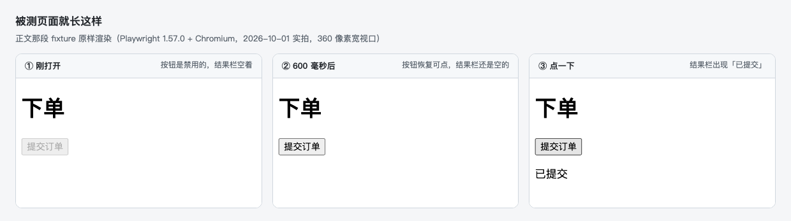
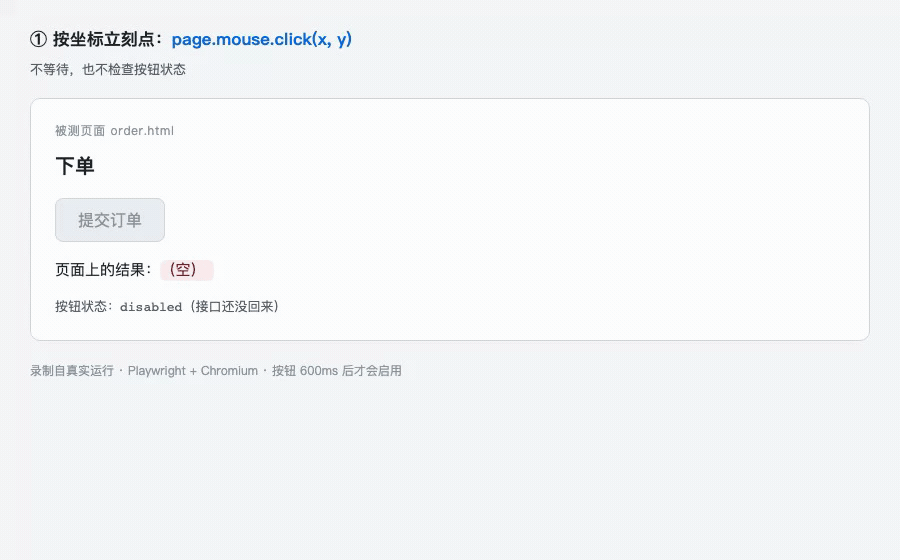
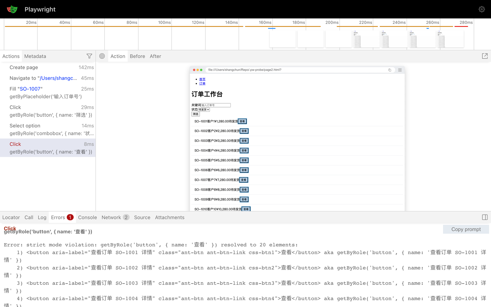
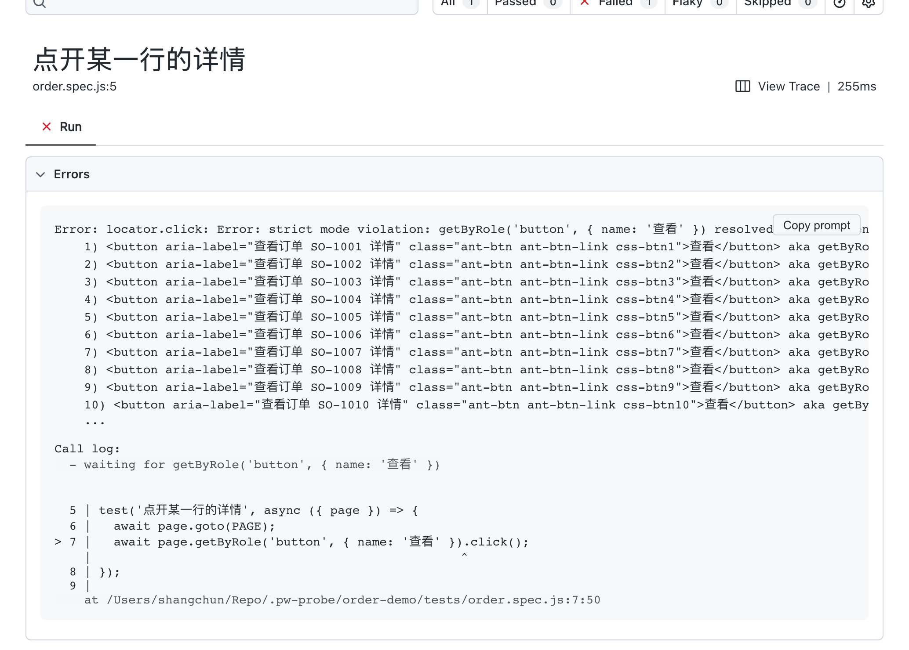
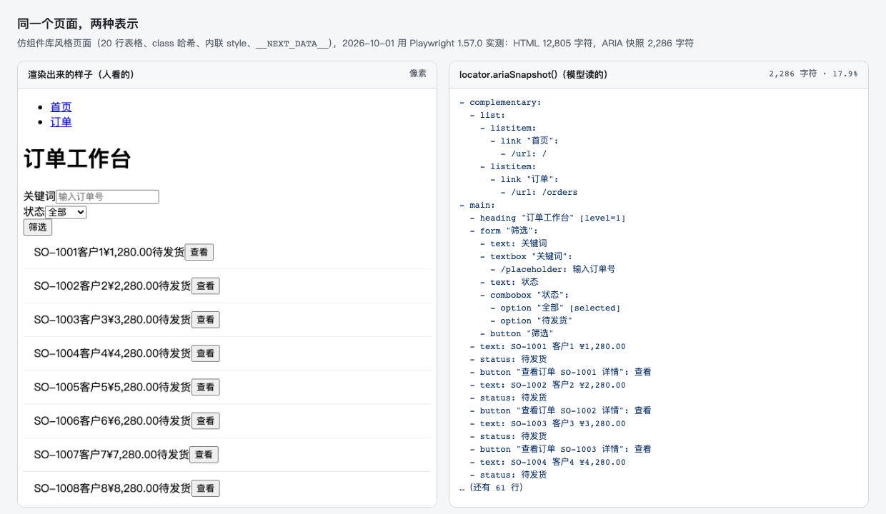

如果你这两年留意过前端测试圈，大概会注意到一件事：新项目的端到端测试，默认都写成 Playwright 了。可这件事有点说不通：Cypress 也会自动等待，它的检查项甚至比 Playwright 还多，代码读起来也更舒服。2025 年的行业调查里，Playwright 的使用率第一次超过它（50% 对 47%），同一周的 npm 下载量是它的 14 倍。

所以我想搞清楚一个问题：**这一轮换代，为什么是 Playwright？**

功能表回答不了这个问题。得往下一层看：那一行 `click()` 在真的落下之前，究竟检查了什么。我拿一颗 600 毫秒之后才可点的按钮当尺子，把它拆成四道关：怎么找到元素、怎么判断能点、怎么把动作送进浏览器、失败之后留下什么。四道关看完，再回头说这两年的事。

<!--more-->

被测的页面很小，存成 HTML 双击就能打开：一个标题、一颗 600 毫秒之后才可点的按钮、一行结果。

```html
<!doctype html>
<html lang="zh">
<body>
  <h1>下单</h1>
  <button id="submit" disabled>提交订单</button>
  <p id="result"></p>

  <script>
    // 模拟一个 600 毫秒才回来的接口：这期间按钮是禁用的
    setTimeout(() => { document.getElementById('submit').disabled = false; }, 600);

    document.getElementById('submit').addEventListener('click', () => {
      document.getElementById('result').textContent = '已提交';
    });
  </script>
</body>
</html>
```

判断成没成功只看一件事：最后那行 `<p id="result">` 里有没有出现「已提交」。


*被测页面就长这样（Playwright 1.57.0 + Chromium，2026-10-01 实拍，360 像素宽视口）：同一个脚本的三种状态，下面四道关对着的都是这一张页面*

同一颗按钮，三种点法，结果却各不相同：

```js
await page.mouse.click(320, 210);                             // ① 按坐标点
await page.locator('#submit').dispatchEvent('click');         // ② 直接派发事件
await page.getByRole('button', { name: '提交订单' }).click();   // ③ 正常点
```

只有 ③ 会等。① 什么也没发生：按钮还禁用着，浏览器把那次鼠标事件吞了。② 结果栏变绿了，可那其实是假的，按钮当时根本点不动。这篇文章里的四道关，拆的就是 ③ 的那一行。

## 一、第一关：它怎么知道“找到了”

我们习惯说“拿到一个元素”，但在 Playwright 里，`page.getByRole('button', { name: '提交订单' })` 拿到的不是一个元素，而是一句描述。官方管它叫 locator，定义是“一种在任何时刻都能找到元素的方式”（见 [Locators](https://playwright.dev/docs/locators)）。

这句话听着像修辞，其实有个很实在的后果：每次要动手之前，它会拿这句描述重新解析一遍。所以我那个实验才有意义。把 class 从构建哈希 `btn-primary-9f2c1a` 改成 `btn-primary-4b8e77`，模拟一次重新构建，`page.click('.btn-primary-9f2c1a')` 当场超时，报 `Timeout 1200ms exceeded`；那句按角色和名字写的描述照样命中。

解析出来之后其实还有一道更严的检查：必须恰好命中一个。这就是“找到”在这套实现里的定义。一句描述如果同时匹配到 20 个元素，它不会随便挑一个，而是停下来告诉你匹配到了 20 个。（这个决定的好处，第四关会看到。）

那“角色是 button、名字是提交订单”这些词从哪儿来？来自浏览器的可访问性树：浏览器会把页面另外解析成一棵树，每个节点带三样东西，角色（role）、名字（name）和状态（state）。屏幕阅读器读的就是它，`getByRole` 读的也是它，第六节那个 ARIA 快照还是它。

原生标签自带隐式的 role（`<button>`、`<a href>`、`<input type="checkbox">` 都有），自定义组件就得自己补上：`aria-label`、`aria-labelledby`，或者 `<label for>`。我拿一个只用 `<div onclick>` 拼的按钮试过：`getByRole('button').count()` 是 0，它在快照里降级成了一行普通文本；补上 `role="button"` 之后才是 1。

所以第一关交出来的东西，其实是一句“此刻唯一命中的描述”。反过来，那种“真的抓到一个元素”的用法（`ElementHandle`）被官方[标上了 Discouraged](https://playwright.dev/docs/handles)。

## 二、第二关：它怎么判断“能点了”

找到了不等于能点。这一关是 Playwright 最出名的地方，官方叫 [actionability](https://playwright.dev/docs/actionability)，原话是：

> It auto-waits for all the relevant checks to pass and only then performs the requested action.

翻成人话：动手之前，它会把下面四条逐个等到成立。

| 条件 | 官方定义（人话版） |
|---|---|
| Visible | 有非空 bounding box，且不是 `visibility: hidden`；`opacity: 0` 算可见 |
| Stable | 连续两帧 bounding box 不变（还在动的元素不点） |
| Receives Events | 命中测试时这个点上真的是它，不是被别的元素盖住 |
| Enabled | 没 `disabled`，祖先也没有 `aria-disabled` |

四条里我最喜欢第二条。“连续两帧不变”这种抠到帧的定义，等于把老工程师嘴里那句“等它别动了再点”直接写成了代码。这一关干的就是这件事：**把人的经验变成可判定的条件。**

回到那颗按钮，这一关跑完是 858 毫秒。它倒不是睡得久，是一直在等条件成立。

这里得补一句公道话，不然容易被读成 Playwright 的独家本事：自动等待其实不是它发明的。Cypress 早就有，检查项比这四个还多（多出 detached、readonly、covering 三项），它也会盯着 DOM 不断重跑查询（[官方原文](https://docs.cypress.io/app/core-concepts/interacting-with-elements)：*"Cypress will watch the DOM - re-running the queries that yielded the current subject…"*）。我实测过，一条完全不带等待的 Cypress 用例照样通过，耗时 846 毫秒，和 Playwright 的 858 毫秒几乎一样。

真正没有它的是上一代那两家。[Selenium 的文档](https://www.selenium.dev/documentation/webdriver/waits/)把话说得很直白：显式等待是“loops added to the code that poll the application for a specific condition”，说白了就是一段写在代码里、反复轮询到条件成立的循环；它那一页自己还摆了个 `sleep()` 的例子，里面写的是 `Thread.sleep(1000)`。[Puppeteer](https://pptr.dev/faq) 也一样，判据得自己写：

```js
await page.waitForFunction(() => {          // 判据得自己写
  const btn = document.querySelector('#submit');
  return btn && !btn.disabled;
});
await page.click('#submit');
```

把中间这三行删掉会怎样？我倒是真跑了一遍：脚本不报错，输出是空的。按钮还禁用着，浏览器把那次点击吞了。

所以第一关和第二关合起来说的是一件事：**“什么时候能动”这件判断，从使用者的代码里搬进了工具里。** 这也是为什么 846 和 858 毫秒几乎一样，差别不在“等不等”，而在那一行 `click()` 里到底有没有检查。

## 三、回头说开篇那个“假成功”

开篇那三种点法里，② 为什么能“成功”？因为 actionability 有四条检查，但也留了后门。官方文档写得倒是很直白：给 `click()` 传 `force: true`，就会跳过“非必要”的检查，比如“这个点上真的能收到点击事件吗”这一条。`dispatchEvent('click')` 更彻底，它连点击都不模拟，直接把事件塞给元素。

三种点法摆在一起是这样：

| 点法 | 页面结果 | 说明 |
|---|---|---|
| 按坐标立刻点 `page.mouse.click(x, y)` | `（未提交）` | 按钮还禁用着，真实鼠标事件被吞掉 |
| `locator.dispatchEvent('click')` | `（已提交）` | 事件绕过了检查，看着成功，其实是假成功 |
| `getByRole('button').click()` | `（已提交）`，等了 858 毫秒 | 条件成立才动手 |


*录制自真实运行（Playwright 1.57 + Chromium）：① 按坐标点，按钮还在禁用态，什么也没发生；② `dispatchEvent` 把事件直接发进去，结果栏变绿，其实是假成功；③ `click()` 等到按钮可用才动手*

我把这三条路都跑了一遍。按钮还禁用时，按坐标点没反应，用 DOM 自己的 `element.click()` 也没反应，唯独 `dispatchEvent('click')` 让结果栏变成了「已提交」。

原因是浏览器的“禁用”只拦两样东西：真实的指针事件，和元素自己的 `click()`。它拦不住直接用事件接口投递的那一下。所以这个“假成功”不是“什么都没发生”：监听器执行了，DOM 也变了（这个页面里没有表单，“已提交”就是结果栏那行字被改了），只不过**它走的是一条真实用户走不到的路**。真实用户那一刻点不动这颗按钮，你的用例却认为点成功了。

**不做检查的自动化，最危险的地方不是失败，而是它能给你一个假成功。** 一条“禁用状态也照样点进去”的用例会在 CI 里一直绿着，直到上线被真实用户教做人。

## 四、第三关：动作怎么送进浏览器

判断完了，动作得真的送出去。这一段路平时看不见，但它决定了这个工具最后能长成什么样。这里有两件事要交代：动作经由什么送出去，以及它最后落在哪个浏览器上。

先说 Cypress，它走的是另一条路。Cypress 的 npm 包只有 7.3 MB，可真正的执行体是它下载到缓存里的 641 MB 应用：测试是被这个应用带着跑的，而不是被一行 `require` 拉起来的库。官方文档把原因说得很清楚：*"Cypress is executed in the same run loop as your application."*（见 [Why Cypress](https://docs.cypress.io/app/get-started/why-cypress)）

```
Cypress 应用（一个自带浏览器）
├── 测试代码 + Cypress 驱动
└── iframe：被测应用
    （两者共用一个事件循环）
```

一个浏览器里同时住着测试代码和被测应用，两者共用一个事件循环。这个设计的确换来了很好的调试体验（后面会替它说话），代价是它只能以“一个应用”的形式存在：模块 API 文档里一共只有三个函数，`cypress.run()`、`cypress.open()`、`cypress.cli.parseRunArguments()`（见 [Module API](https://docs.cypress.io/app/references/module-api)）。你能用 Node 启动一次测试运行，但拿不到一个页面：没有 `page`，没有 `browser`，没有任何能在自己进程里操作的对象。

Playwright 反过来。`@playwright/test` 是一个测试 runner，但它建在 `playwright-core` 这个库上，`chromium.launch()` 在任何 Node 进程里都能跑起来：你可以在自己的脚本里开一个浏览器，做三件事，关掉，全程不进任何 runner。

```
你的进程（测试，或任意脚本）
   └── browser / page 对象
        │  Playwright 自有协议
        ▼
   浏览器进程（三选一）
   ├── Chromium
   ├── Firefox
   └── WebKit
```

（这里画的是 JS 的情形；用 Python、Java 这类绑定，中间还会多一个 Node 写的 driver 进程。）

图里“三选一”的那三个内核，可以只装一个，也可以一起用。我本机上装着的的确就是三个：

```
~/Library/Caches/ms-playwright/
├── chromium-1200
├── firefox-1497
└── webkit-2227     # 真 WebKit，不是换皮
```

这里的“一视同仁”指三个内核都由同一套 API 一等公民地支持，而不是“能不能跑起来”：Cypress 的 WebKit 至今标着 experimental，Puppeteer 干脆没有 WebKit。

三个内核共用一套 API 这件事，看着像开个 flag 就行，其实翻一遍是三层叠起来的。

第一层，语言绑定和浏览器之间隔了一层协议。JS、Python、Java 里调的是同一份实现，通过 Playwright 自有协议（仓库里的 `packages/protocol/spec/*.yml`）跟浏览器说话。所以它和“WebDriver 的又一家绑定”“CDP 的封装”都不是一回事。

第二层，三个内核走三条通道，要的东西却不一样。这张表是整件事的关键：

| 内核 | 要不要打补丁 | 依据 |
|---|---|---|
| Chromium | 不要 | 它原生就说 CDP。Playwright 用开源 Chromium 构建，甚至领先品牌版一个大版本 |
| Firefox | 要 | 走 `-juggler-pipe`；Juggler 就是当年 Firefox 为 Puppeteer 做的那套自动化协议，官方文档也明说用不了品牌版 Firefox |
| WebKit | 要，而且不是 Safari | 走 `--inspector-pipe`，补丁在仓库 `browser_patches/` 下。官方原话：*"Playwright's WebKit is derived from the latest WebKit main branch sources, often before these updates are incorporated into Apple Safari"*，它测的是引擎，不是 Safari 那个 App |

第三层，也是最关键的一层：它自己编译并维护内核。上面那两个 flag 不是“开关”，而是**只有打过补丁的构建里才存在的通道**。Playwright 每次发版同步更新三个内核的版本，`npx playwright install` 下载的就是这些自定义构建，我本机这份缓存已经 1.0 GB：chromium 324 MB、webkit 275 MB、firefox 253 MB，另有 headless shell 与 ffmpeg。

只跑一个内核其实不必这么重。`npx playwright install chromium` 的下载量约 250 MB，CI 上加个 `--only-shell` 能压到 90 MB；一个字节都不下也行：配上 `channel: 'chrome'`，直接用机器上现成的 Chrome。

那为什么别人做不到？其实不是开不了 flag，是改不了内核。

- Cypress 把驱动注入浏览器、与测试同处一个事件循环，这条路要求内核允许注入，而它无法自带打了补丁的 WebKit。反过来说，同一个原因也让它的 devtools 联动调试更顺手，断点能把测试和应用一起停住。这条是 Gleb Bahmutov 的[个人观点](https://glebbahmutov.com/blog/cy-vs-pw-browser/)，不是官方结论。
- Puppeteer 是 CDP 的参考实现，不需要改内核，也就不会去改。这里还有段前情：Firefox 那边当年就有一条专门为 Puppeteer 做的自动化协议（[`puppeteer/juggler`](https://github.com/puppeteer/juggler)，2020 年 3 月之后就停了），Puppeteer 还据此发过一个[自带 Firefox 构建的原型包](https://github.com/puppeteer/puppeteer/blob/7f7887ed11930f96cb64bb086fad5c29086b8ef2/experimental/puppeteer-firefox/README.md)，后来标注废弃；正经的 Firefox 支持等到 2024 年的 v23，用的还是 W3C 标准的 WebDriver BiDi。能不能做是一回事，要不要长年养两个内核的分支是另一回事。
- Selenium 走的是完全相反的路线：2004 年它从一段跑在浏览器里的 JavaScript 起家（[官方 History](https://www.selenium.dev/history/)），出不了同源策略那道墙，于是有人提出“driven 模式”，把浏览器当成远端，中间放一台代理 server，这就是 Selenium RC。它把这条路走成了公共契约（WebDriver，[Level 1 在 2018 年成了 W3C Recommendation](https://www.w3.org/TR/webdriver1/)），好处是覆盖面不由任何一家供给，代价是契约不替你管会话和等待。

代价倒也说清楚：这套“连内核一起维护”的赌注，换来了三内核一致和额外的自动化能力，付出的是每次升级都要重下几百 MB 的自定义浏览器，外加内核补丁的长年维护。官方在 `connectOverCDP` 的文档里留下一句很能说明态度的话：直连 CDP 的保真度 *"significantly lower fidelity than the Playwright protocol connection"*。

**能当零件用，还是只能当整机用，这是 Cypress 和 Playwright 的分界线。** 也是这一关最要紧的产出：动作经由一条自有通道送出去，这条通道可以被任何进程调用，所以它既是测试框架，也是一层能力。

> 口径：架构部分来自官方文档与仓库源码。“Juggler”这个词官方文档从不使用，只出现在源码与补丁目录里，属于源码级证据，别当成官方术语引用。

## 五、第四关：失败留下了什么

前三关讲的是动作怎么成功。可在 CI 上，你更常面对的是失败。

测试失败时，Playwright 会给你一个 `trace.zip`，里面装着每一步的动作与耗时、动作前后的全量 DOM 快照、截图、源码、日志和网络记录（见 [Trace Viewer](https://playwright.dev/docs/trace-viewer)）。它把“一次性现象”变成了一个文件：能塞进 CI 产物，能在别人机器上打开，从 1.59 起还能直接用命令读（`npx playwright trace`）。

这里不妨先说人的收益，因为它跟 AI 没关系：以前 CI 挂了，你得把那台机器复现出来；现在工件跟着失败一起被存下来。至于模型也能读它，那是顺带的。


*Trace Viewer 实拍：失败的那步 Click 被标红选中，右边是它当时的页面快照，底部 Errors 面板给出报错正文（连 20 个候选都列出来了）和一个 Copy prompt 按钮。这份 trace 跑于 2026-09-19，Playwright 1.57.0*

然后是我最喜欢的那段报错原文。我构造了一个 20 行订单列表，故意用模糊定位去点它：

```
locator.click: Error: strict mode violation: getByRole('button', { name: '查看' }) resolved to 20 elements:
    1) <button aria-label="查看订单 SO-1001 详情" ...> aka getByRole('button', { name: '查看订单 SO-1001 详情' })
    2) <button aria-label="查看订单 SO-1002 详情" ...> aka getByRole('button', { name: '查看订单 SO-1002 详情' })
    3) <button aria-label="查看订单 SO-1003 详情" ...> aka getByRole('button', { name: '查看订单 SO-1003 详情' })
    ...
```

第一关那道“必须恰好命中一个”的检查，在这里的确显出价值了。它不只是说“你错了”：它说明了为什么错（匹配到 20 个），给出了每个候选的真实身份，最关键的是那句 `aka`，把改正后的 locator 写法一条条列给你了。这不是给人看的礼貌提示，这是一份写好的补丁。而且这大概不是巧合：从 1.51 起，Playwright 在 HTML 报告、Trace Viewer 和 UI Mode 的报错旁都放了一个按钮，叫 Copy prompt（见[发布说明](https://playwright.dev/docs/release-notes)）。


*同一个用例在 HTML 报告里的样子（Playwright 1.57.0，2026-10-01 实跑）：报错正文、候选列表和那个 Copy prompt 按钮挤在同一块面板里*

修复的前提是复现：一个失败如果只活在那台机器上，换个人（或者换个 agent）就只能靠猜。好在它现在有了载体，现场在 `trace.zip` 里，该点哪儿写在 locator 里。于是同一个失败能在 CI 上产生，在本地打开，也能被另一个程序读。

**可序列化不是“能被自动修复”的保证，但它是前提。**

## 六、为什么是这两年

四道关讲完了。但这四道关其实 2020 年就修好了，那时 Playwright 已经能跑三个内核，为什么直到这两年才被推到台前？

先把官方自己的动作排一排（来源：[发布说明](https://playwright.dev/docs/release-notes)，日期取自 npm registry 的发布时间）：

| 版本 | 时间 | 与“给模型用”有关的动作 |
|---|---|---|
| 1.49 | 2024-11-18 | `toMatchAriaSnapshot` 断言落地 |
| 1.51 | 2025-03-06 | 报错旁出现 Copy prompt 按钮 |
| 1.56 | 2025-10-06 | [Test Agents](https://playwright.dev/docs/test-agents)（planner / generator / healer） |
| 1.57 | 2025-11-25 | 移除 `page.accessibility`，把能力收拢到结构化快照上 |
| 1.59 | 2026-04-01 | `npx playwright trace`：命令行里分析 trace，给 agent 用 |
| 1.60 | 2026-05-11 | 给快照加 `boxes` 选项，官方措辞：*"useful for AI consumption"* |
| 1.62 | 2026-07-24 | 把 MCP server 与 playwright-cli 打包进来（`npx playwright mcp`） |
| 1.63 | 2026-09-04 | trace 里记录 aria 快照，Trace Viewer 新增 Display Aria 模式 |

2025 年 3 月，微软把 Playwright 包成了一个 MCP server（[playwright-mcp](https://github.com/microsoft/playwright-mcp)，建仓到 2026-09-19 已 37,727 star）。它的 README 第一段就把立场说透了：

> *"enables LLMs to interact with web pages through structured accessibility snapshots, bypassing the need for screenshots or visually-tuned models."*

再看它给模型的工具描述：`browser_snapshot` 的说明是 *"this is better than screenshot"*，而 `browser_take_screenshot` 是 *"You can't perform actions based on the screenshot"*。（视觉能力要显式开：`--caps=vision`。）

那“结构化”到底省了多少？官方其实没有给过量化声明，所以我自己量了一次：同一张组件库风格的页面（20 行表格、class 哈希、内联 style、`__NEXT_DATA__`），`page.content()` 出来是 12,805 个字符，`locator.ariaSnapshot()`（[ARIA snapshots](https://playwright.dev/docs/aria-snapshots)）出来是 2,286 个，17.9%。

但体积其实只是副产品，形态才是重点。不妨看一眼 ARIA 快照长什么样：

```
- heading "订单工作台" [level=1]
- form "筛选":
  - textbox "关键词":
    - /placeholder: 输入订单号
  - combobox "状态":
    - option "全部" [selected]
- row "SO-1001 张三 ¥1,280.00 待发货"
```

没有 `css-1x1q7`，没有 `ant-table-cell`，没有构建产物留下的哈希。模型拿到的是词汇表（role、name、state），而不是渲染残渣，这恰好就是 `getByRole` 需要的输入：同一个抽象层，人和模型都能读。


*同一个页面、同一时刻的两种表示：左边是人看到的像素，右边是模型读到的结构（Playwright 1.57.0，2026-10-01 复现并截图；左图是 620 像素宽视口的页面顶部 8 行）*

不过这里有个反转得说。同样是官方 README，在 2026 年给出了一个降温的说法：playwright-mcp 现在推荐 coding agent 改用 CLI + Skills（[microsoft/playwright-cli](https://github.com/microsoft/playwright-cli)），理由是 *"…avoid loading large tool schemas and verbose accessibility trees into the model context."*。连 accessibility tree 都会被嫌啰嗦。

这句话其实反而让整篇文章的论点更稳，但得说清楚它稳在哪：前面我量出 ARIA 快照比 HTML 小 5.6 倍，官方现在又说它依然太占地方。两件事不矛盾，因为被时代选中的从来不是“小”，而是可裁剪：2,286 个字符照样塞不进上下文，但它可以被切片、按需取一部分，HTML 那 12,805 个字符不行。

**当“给模型消费”这几个字开始出现在发布说明里，剩下的就不用我多说了。**

## 七、什么时候我不换

第六节说的是 Playwright 拿到了什么。但“一层能力”这个说法有个副作用：容易被读成“应用的形态过时了”。所以这里得把边界补上。

**组件测试，我仍然会先看 Cypress。** 它有官方的 mounting library 和 bundler 集成（React、Vue、Angular、Svelte 都有）。Playwright 的组件测试到 1.62 才换成 `mount()` fixture 加自建 dev server 的 stories 模型，1.63 又宣布三个 `experimental-ct-*` 包不再更新。对以组件为主的团队来说，迁移成本是实打实的。

**调试联动性，是 Playwright 的真实短板。** Cypress 的测试和应用跑在同一个 JS 事件循环里，在 devtools 里下一个断点，两边会一起停住；Playwright 的 runner 和应用则是两个进程，联动调试要麻烦得多。（口径：这是 Gleb Bahmutov 的[个人观点](https://glebbahmutov.com/blog/cy-vs-pw-browser/)，不是官方结论，但的确是内行话。）

**另外两类场景也别硬换**：Selenium 的六种语言绑定加 Grid 编排，是多语言或企业遗留团队的结构性优势；纯抓取和轻量脚本，谁也不想先装一个测试运行器，Puppeteer 在这条路上仍然稳。

还有一件得坦白说：Playwright 不会自动消灭 flaky 测试。我手头那个用 `@playwright/test` 的项目里就留着反面教材：

```ts
const firstHistoryItem = page.locator('.home-history-item').first();
await page.waitForTimeout(1000);
```

`waitForTimeout(1000)` 和开头那个 `sleep(800)` 是同一种东西，只是换了个更时髦的名字。**换工具不会消灭 flake，它只是把 flake 从“语言层面”挪到了“用法层面”。** 换一副鞍具也不会自动让马跑得更快（“鞍具”这个说法来自上一篇横评《[给大脑配一副好鞍具](https://springuper.github.io/agent-harness-comparison/)》，再往前那篇《[积木，而非成品](https://springuper.github.io/pi-harness-anatomy/)》拆的是同一个问题的另一个样本）。

所以这一节的结论是：**Cypress 不是被打败的，是被“换了用法”绕过去的。** 你如果只写给人看的组件测试，它仍然是好选择；你要的如果是一层能被别的程序消费的能力，那现在只有 Playwright 够用。这两件事不是同一个问题的两个答案，是两个问题。

## 八、把数字摆齐

坦白说，机制讲完了还得看采用。以下数据都是 2026-09-19 抓的。

[State of JS 2025](https://2025.stateofjs.com/en-US/libraries/testing/)（13,002 人，调查期 2025-09-24 到 11-11）：

| | 使用率 | 留存率 | 备注 |
|---|---|---|---|
| Playwright | 50% | 94% | 2024 年是 36%，+14pp，官方称与 Vitest 并列最大涨幅 |
| Cypress | 47% | 57% | 2022 年留存是 84% |
| Puppeteer | 42% | 70% | |
| Selenium | 37% | 24% | 2022 年留存是 42% |

比使用率更值得看的倒是留存：94% 对 57%。同一周（2026-09-10 到 09-16，取自 [npm registry API](https://api.npmjs.org/downloads/point/2026-09-10:2026-09-16/playwright)），playwright 的下载量是 8,670 万，Puppeteer 1,060 万，Cypress 612 万，Selenium 的 JS 绑定 182 万，也就是 8 倍、14 倍和 47 倍。按 star 看，playwright 96,334 颗，puppeteer 95,593 颗，几乎打平。**star 数是“多少人觉得它值得收藏”，不是“多少人在用”**，星标打平、下载量差 8 倍，这个剪刀差就是“工具定位不同”最直观的证据：Puppeteer 还是抓取和脚本的第一选择，只是那条赛道上没有测试。

说“Cypress 完了”，其实既不准确也不厚道。它在下滑，但没停：2024 年[裁员 11 人](https://www.cypress.io/blog/update-on-cypresss-workforce)，2026-09-01 照常发布 [Cypress 16](https://www.cypress.io/blog/cypress-16-faster-tests-starting-with-http2-support)；这两年它一直在 AI 上押注，甚至出了一份《[Playwright → Cypress 迁移指南](https://docs.cypress.io/app/guides/migration/playwright-to-cypress)》。守势是真的，停更不是。

还有一条数字倒是反过来的，得摆在这儿：按 [ecosyste.ms](https://packages.ecosyste.ms/api/v1/registries/npmjs.org/packages/playwright) 统计，cypress 被 6,559 个包反向依赖，playwright 只有 1,947 个。下载量赢了 14 倍，但“嵌进别人项目里”这件事 Cypress 仍然更多，这是存量与增量的差别，不写出来就是选择性取证。

Selenium 其实也一样还在跑（4.49，2026-09-09 发布），只是它 24% 的留存率把痛点写在了脸上，而那些痛点正是“等待和会话”这两件它当年留给用户的事。

有几条流传很广的说法，我顺手核了一遍：

| 常见说法 | 实际情况 |
|---|---|
| “Puppeteer 只支持 Chrome” | v23.0.0（2024-08）起同时支持 Chrome 与 Firefox（Firefox 走 BiDi） |
| “WebDriver 是 W3C 标准” | 只有 Level 1 是 2018 Recommendation；[Level 2](https://www.w3.org/TR/webdriver2/) 与 [WebDriver BiDi](https://www.w3.org/TR/webdriver-bidi/) 至今仍是 Working Draft |
| “Browser Use / Stagehand 都是基于 Playwright 的” | 均未见直接依赖：Browser Use 用自研 `cdp-use`，发布出来的 `@browserbasehq/stagehand` 依赖 `@browserbasehq/sdk`（同一个 monorepo 里的 integrations、evals 包倒是把 playwright 列成了 devDependency）；Skyvern 才是直接依赖 `playwright` |
| “Claude Code / Codex / Cursor 官方默认推荐 Playwright” | 未验证。能确认的只有 Playwright 侧提供了这几家的接入命令，反向的官方表态我没找到 |

> 口径与免责：npm 下载量含 CI 里的重复安装、镜像同步和间接依赖，它是量级指标而不是用户数，`playwright` 这个包还被大量用于抓取，不全是测试。正文里的耗时、报错、ARIA 比例都是我自己在本机量的；版本号与下载量都只是 2026-09-19 的快照，引用请以当时为准。

## 结语

把全文收进一张表，方便你直接贴到团队文档里：

| | 形态 | 抽象画在哪 | 读者 | 2026 年的处境 |
|---|---|---|---|---|
| Selenium | 协议 + 各家 driver | 协议层，等待交给人 | 人 | 仍在维护，留存率下滑 |
| Puppeteer | 库 | 浏览器控制层 | 脚本作者 | 抓取场景稳固，测试场景不参与 |
| Cypress | 应用（测试在它里面跑） | 链式 DSL + 浏览器内运行 | 人 | 转入守势，组件测试仍有优势 |
| Playwright | 库（runner 建在库上） | 语义定位 + 可序列化 + 可回放 | 人，以及模型 | 使用率与留存双第一 |

一句话总结这篇长文：**浏览器自动化从“一个应用”变成了一层“可以被调用的能力”。Playwright 赢的不是测试，它赢的是这一层。** 至于 AI，它不是这场换代的原因，它是把这件事的价值放大了一档的那阵风。

这篇里的数据我其实核了两遍，但开源世界变化快，难免有疏漏；我对 Playwright 的用法也还在摸索，谈不上什么最佳实践。如果你在迁移路上踩到了不一样的坑，或者发现文中哪里写错了，欢迎指出、欢迎交流。也不妨拿自己项目里最 flaky 的那条用例试一遍，再回来说说体会。权当这篇是一次公开的读书笔记，能对你有点用，就算是额外的收益了。

### 彩蛋

文章里我最喜欢的一处证据，其实是那段报错原文。它把 20 个候选元素的“正确答案”一条条列出来，再配上一个叫 Copy prompt 的按钮，**它等于在明说：我知道你要把我这段话粘给谁看。** 一个工具用了六年时间，终于把自己的错误信息写成了一份 prompt。

其实还有个更小的彩蛋。Playwright 判定元素“可点”的四个条件里，`opacity: 0` 被算作可见，也就是说一个完全透明的按钮，工具认为你可以点。这条定义来自官方文档，我第一次读到时，大概盯着看了三遍。人类的直觉说“看不见就是没有”，协议的直觉说“它有框、能命中，那就是存在”：抽象层的分歧，往往就在这种一行的细节里。

---

## 参考

官方文档与发布说明：

- [Playwright - Actionability（可操作性判定）](https://playwright.dev/docs/actionability)
- [Playwright - Locators](https://playwright.dev/docs/locators) / [ElementHandle（已标注不推荐）](https://playwright.dev/docs/handles)
- [Playwright - ARIA snapshots](https://playwright.dev/docs/aria-snapshots) / [Trace Viewer](https://playwright.dev/docs/trace-viewer)
- [Playwright - Test Agents（planner / generator / healer）](https://playwright.dev/docs/test-agents) / [Release notes](https://playwright.dev/docs/release-notes)
- [microsoft/playwright-mcp（README）](https://github.com/microsoft/playwright-mcp) / [microsoft/playwright-cli（CLI + Skills）](https://github.com/microsoft/playwright-cli)
- [Puppeteer - FAQ（定位与浏览器支持）](https://pptr.dev/faq)
- [puppeteer/juggler（已归档：Firefox 为 Puppeteer 写的自动化协议）](https://github.com/puppeteer/juggler) / [puppeteer-firefox（已废弃的原型，自带 Firefox 构建）](https://github.com/puppeteer/puppeteer/blob/7f7887ed11930f96cb64bb086fad5c29086b8ef2/experimental/puppeteer-firefox/README.md)
- [Cypress - Module API（只有 run / open / parseRunArguments）](https://docs.cypress.io/app/references/module-api) / [Why Cypress（同一事件循环）](https://docs.cypress.io/app/get-started/why-cypress)
- [Cypress - Interacting with elements（七项检查）](https://docs.cypress.io/app/core-concepts/interacting-with-elements)
- [Cypress 16 发布](https://www.cypress.io/blog/cypress-16-faster-tests-starting-with-http2-support) / [Update on Cypress's Workforce](https://www.cypress.io/blog/update-on-cypresss-workforce)
- [Selenium - History（同源策略与 driven 模式）](https://www.selenium.dev/history/) / [Waits（显式等待即轮询循环）](https://www.selenium.dev/documentation/webdriver/waits/)
- [W3C WebDriver Level 1（2018 Recommendation）](https://www.w3.org/TR/webdriver1/) / [Level 2（Working Draft）](https://www.w3.org/TR/webdriver2/) / [WebDriver BiDi（Working Draft）](https://www.w3.org/TR/webdriver-bidi/)

数据与观点来源：

- [State of JavaScript 2025 - Testing](https://2025.stateofjs.com/en-US/libraries/testing/)
- [npm registry downloads API](https://api.npmjs.org/downloads/point/2026-09-10:2026-09-16/playwright)（对比 [cypress](https://api.npmjs.org/downloads/point/2026-09-10:2026-09-16/cypress)、[puppeteer](https://api.npmjs.org/downloads/point/2026-09-10:2026-09-16/puppeteer)）
- [ecosyste.ms（反向依赖统计）](https://packages.ecosyste.ms/api/v1/registries/npmjs.org/packages/playwright)
- [Cypress vs Playwright; Browser Included — Gleb Bahmutov（个人观点）](https://glebbahmutov.com/blog/cy-vs-pw-browser/)

延伸阅读（我自己的前几篇）：

- 《[给大脑配一副好鞍具：五款 Agent Harness 的解剖与实测](https://springuper.github.io/agent-harness-comparison/)》：同一个“形态决定上限”的问题，看的是模型外面那层壳
- 《[积木，而非成品：Pi Agent Harness 的克制与精妙](https://springuper.github.io/pi-harness-anatomy/)》：同一套拆解方法的另一个样本

> 版本与核实说明：数据（下载量、调查、star、反向依赖）抓取于 2026-09-19；文中代码都在本机实跑过，用的是撰写期的最新版：Playwright 1.57.0 + Node 24.13.0、Puppeteer 25.12.0 + Chrome for Testing 154、Cypress 16.1.1，输出是当时的终端原文，不是手写示意。Selenium 那段沿革来自官方 History 页，没有实跑（跑它要另装 JDK、Maven 和 ChromeDriver）。ARIA 对比图、按钮三态图与 HTML 报告截图都是 2026-10-01 在本机实拍的，字符数与 9 月 19 日那次一致。凡官方没有量化声明的地方，文中都写明了那是我自己量的。
