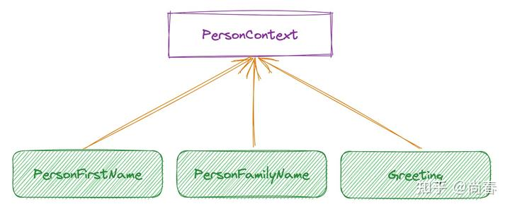
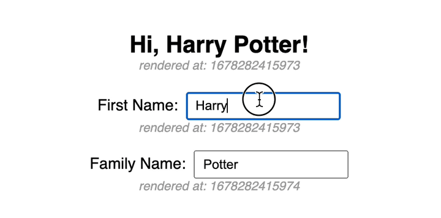
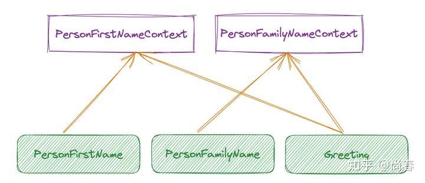
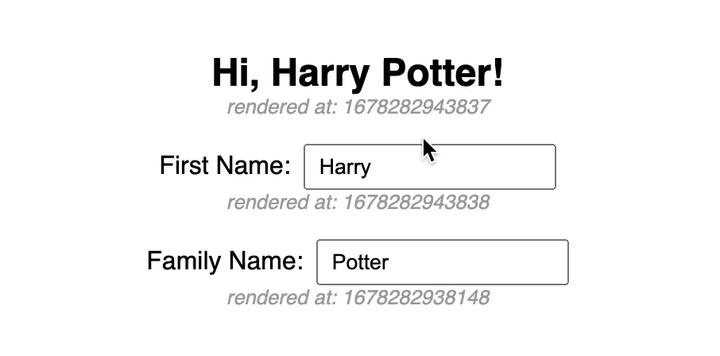
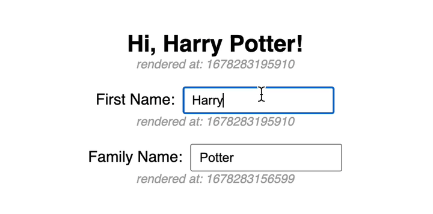
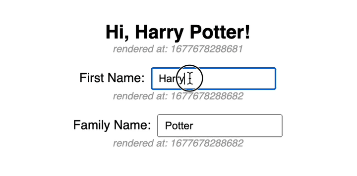
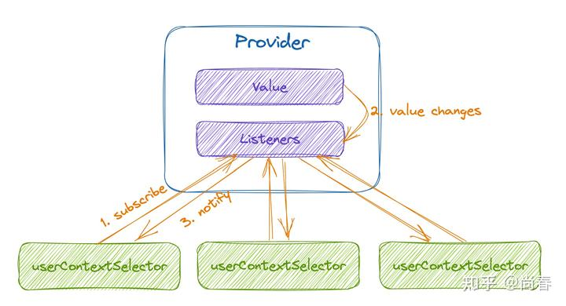
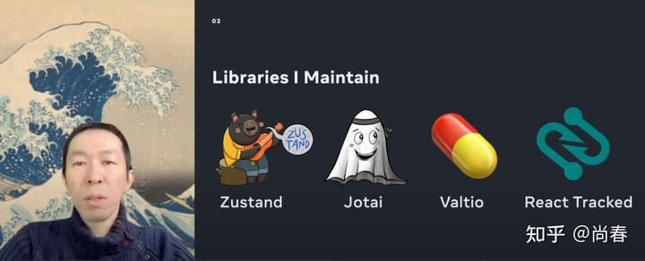
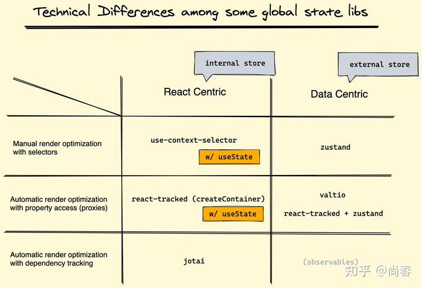
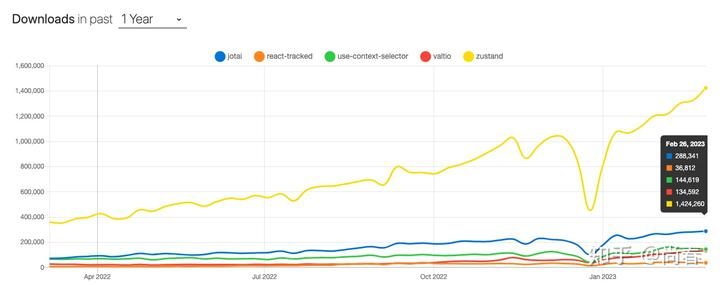

React Context 在一些弱交互的 Web 应用中被很多人用来作为全局状态管理的利器，理由非常简单：开箱即用，无需额外引入第三方工具，而且毕竟是“亲儿子”，对将来的 concurrent mode 等新特性支持良好。然而在略微复杂些的场景继续使用 context 有时会面临一定的性能问题，目前官方和社区都在探索可能的解决方案。期望通过本文的介绍，能让大家在这方面有一定概要性的理解。

## 痛点

官方文档中有这样一句话：

> Context lets you “broadcast” such data, and changes to it, to all components below.

简单来说，一个 context 中的数据发生变化后，所有下层使用这一 context 的组件都会被更新。当 context 数据越来越多的时候，就会出现一些根本不必要的重复更新。

让我们用一个例子来简单阐释下。假设我们有一个这样的应用：

- 有一个名字的输入框以及一个姓氏的输入框，使用两个组件实现
- 在另一个组件中展示欢迎信息，需要用到上面输入的名字和姓氏

界面效果如下：


因为涉及到跨组件数据调用，我们使用 context 进行名字和姓氏数据的管理。简要代码如下：

```js
// Context & Components
const PersonContext = createContext();
const PersonFirstName = () => {
  const [state, dispatch] = useContext(PersonContext);
  return (
    <div>
      First Name:
      <input
        value={state.firstName}
        onChange={event => dispatch({ type: "setFirstName", firstName: event.target.value })}
      />
    </div>
  );
};
const PersonFamilyName = () => { /* similar to PersonFirstName */ };
const Greeting = () => {
  const [state] = useContext(PersonContext);
  return (
    <h2>Hi, {state.firstName} {state.familyName}!</h2>
  );
};

// Main App
export default function App() {
  return (
    <PersonContext.Provider value={useReducer(reducer, initialState)}>
      <Greeting />
      <PersonFirstName />
      <PersonFamilyName />
    </PersonContext.Provider>
  );
}
```

*完整代码见 [Codesandbox](https://codesandbox.io/s/naive-context-2gw55c?file=/src/App.js)。*

在该应用中，通过使用`useContext`， `Greeting、PersonFirstName`、`PersonFamilyName`三个组件都订阅了`PersonContext`的更新：


一旦`PersonContext`的数据有变化，譬如在名字输入框中输入了新的字符，那么不止`Greeting`和 `PersonFirstName`组件会被重新渲染，`PersonFamilyName`组件也会被重新渲染，尽管它并没有任何内容需要变更。


从上图中的时间戳变化可以注意到，输入 first name 时 family name 所在组件也有更新。

这种**广播机制**导致 context 无法应用在复杂的状态管理场景。目前官方推荐将其用在主题、国际化等变更稀疏的少数场景：

> Common examples where using context might be simpler than the alternatives include managing the current locale, theme, or a data cache.

## 改进一：Split Contexts

一个直观的改进是：既然一个不行，那能不能再加一个？在上面的例子中，我们将`PersonContext`拆分为`PersonFirstNameContext`和`PersonFamilyNameContext`两个 contexts，新的订阅关系如图：


可以看出，`PersonFirstNameContext` 变更时仅需要更新`PersonFirstName`与`Greeting`组件，而不影响`PersonFamilyName`。

代码改动较多，但思路非常简单，把 reducer 等都拆分为两份，核心部分如下：

```js
export default function App() { 
  return (
    <div className="App">
      <PersonFirstNameContextWrapper>
        <PersonFamilyNameContextWrapper>
          <Greeting />
          <PersonFirstName />
          <PersonFamilyName />
        </PersonFamilyNameContextWrapper>
      </PersonFirstNameContextWrapper>
    </div>
  );
} 
```

*完整代码见 [Codesandbox](https://codesandbox.io/s/naive-context-splitted-qfzio0?file=/src/App.js)。*

改进后的效果如下图所示：


容易观察到，在输入 first name 时，family name 所在组件并没有更新，反之亦然。因此我们可以确定将耦合性强的全局状态分拆到独立 context 的办法行之有效。

然而，维护多个 context 的成本显而易见，如何将状态进行合理分拆也注定会有一些争议。因此这种方案仅适用于全局状态有限的少数场景中。

## 改进二：useMemo

另外一个思路是利用 React 提供的`useMemo`hook 来避免无意义的重复渲染。以 `PersonFirstName`组件为例，可以将其改造如下：

```js
const PersonFirstName = () => {
  const [{ firstName }, dispatch] = useContext(PersonContext);
  return useMemo(
    () => (
      <div className="container">
        First Name:
        <input
          value={firstName}
          onChange={(event) => dispatch({ type: "setFirstName", firstName: event.target.value })}
        />
      </div>
    ),
    [firstName, dispatch]
  );
}; 
```

完整代码见 *[Codesandbox](https://codesandbox.io/s/context-usememo-no4f8x?file=/src/App.js)*。

实际效果如下：


可以看出改进效果与分拆 context 的效果基本一致，可以避免重复渲染。更具体的讲，在姓氏输入框中输入新的字符后，代码执行过程大致为：

1. 在`PersonFamilyName`事件回调中执行`dispatch`
2. `PersonContext`的`state`更新
3. React 根据之前的`useContext`调用定位到`PersonFirstName`需要重新渲染（暂时忽略`PersonFamilyName`与`Greeting`）
4. 执行`PersonFirstName`函数组件，调用`useMemo`方法获得渲染内容
5. `useMemo`发现`firstName`和`dispatch`均没有较前值发生变化，直接返回之前缓存的结果，从而避免了无意义的重新渲染

如果对于`useMemo`等 hooks 不太了解，可以看下本栏之前的[React Hooks 原理剖析](https://zhuanlan.zhihu.com/p/372790745)一文。

这种改进方式理论上是可行的，但在实践中，这一方案需要额外的心智负担和维护成本，一旦涉及到的地方比较多，就会变得异常脆弱。

## 改进三：useContextSelector

为了解决 context 这种广播机制带来的弊端，除了以上两种渐进改良方案以外，官方和社区也在积极探索更加彻底的方案，目的很明确：可以实现**选择性更新**。

### **官方 RFC**

早在 18 年，React 团队还聚焦在 hooks 的时候就有这样一个 [Issue: Provide more ways to bail out inside Hooks](https://github.com/facebook/react/issues/14110) 讨论 context 的可能改进，后来 React core team 的 Josh Story 写了一份 [Context Selector RFC](https://github.com/gnoff/rfcs/blob/context-selectors/text/0000-context-selectors.md) 来具体阐释 context 选择更新的设计和实现方案，下面是 RFC 文档中列举的一个示例：

```js
let Context = React.createContext(‘’)

let App = ({ index, string }) => {
  return (
    <Context.Provider value={string}>
      <Foo index={index} />
    </Context.Provider>
  )
}

let Foo = React.memo(({ index }) => {
  let selector = React.useCallback(s => s.substring(0, index), [index])
  let selection = React.useContextSelector(Context, selector)
  return <span>{selection}</span>
})

// Foo renders (mount) and selector is called during Foo’s render: “abcd”
ReactRenderer.render(<App index={4} string=”abcdefg” />)

// Foo renders (props update) and selector is called during Foo’s render: “abcde”
ReactRenderer.render(<App index={5} string=”abcdefg” />)

// Foo does not render (memo props same), selector is called before Foo bails out (selection same): “abcde”
ReactRenderer.render(<App index={5} string=”abcdef*” />)

// Foo renders (selection update), selector is called before Foo’s render and the result is memoized and returned again during that render: “a*cde”
ReactRenderer.render(<App index={5} string=”a*cdef*” />)

// Foo renders (props update), selector is only called during Foo’s render even though the context value also changed: “a**d”
ReactRenderer.render(<App index={4} string=”a**def*” />)
```

RFC 的核心内容在于新提议的`useContextSelector`hook，类型为`(ReactContext<T>, T => S) => S`。它在`useContext`基础上支持第二个参数`selector`，从而支持仅依赖部分 context 数据的场景，并能做到只有这部分数据更新的时候才触发 hook 宿主组件的更新。 第二个参数省略时，其行为退化为与`useContext`一致。

目前这个 RFC 还处于 open 状态，但是目前 React 团队还集中在一些 React 18 相关的功能开发上，这个功能还不在他们的确切日程上：

> We ran an experiment of the lazy propagation mechanism that showed mildly positive performance results, but we haven't run an experiment for context selectors yet.  
> We're not really blocked by anything, it just hasn't been a priority while we work on other 18-related projects.  
> [Context selector status and plans? · Discussion #73 · reactwg/react-18](https://github.com/reactwg/react-18/discussions/73#discussioncomment-1201850)

### **社区版本**

虽然官方进度缓慢，但好在 React 社区非常活跃，有一些开发者通过各种黑科技实现了类似官方提议的`useContextSelector` hook，其中主流的版本为在 React 状态管理工具方面颇有建树的 [Daishi Kato](https://github.com/dai-shi) 开发的 [use-context-selector](https://github.com/dai-shi/use-context-selector)。

使用 use-context-selector 修改之前的基础示例，核心的变化如下：

```js
const PersonFirstName = () => {
  const firstName = useContextSelector(
    PersonContext,
    value => value[0].firstName
  );
  const dispatch = useContextSelector(PersonContext, value => value[1]);
  return (
    <div className="container">
      First Name:
      <input
        value={firstName}
        onChange={event => dispatch({ type: "setFirstName", firstName: event.target.value })}
      />
    </div>
  );
};
```

*完整代码见 [Codesandbox](https://codesandbox.io/s/use-context-selector-lyp88j?file=/src/App.js)。*

在上面的`PersonFirstName`组件中，我们有两处调用`useContextSelector`，分别获取了`PersonContext`中保存的`firstName`和`dispatch`，用于实现名字的输入框。

具体效果如下图所示：


容易观察到，在输入 first name 时，family name 所在组件并没有更新，反之亦然。这说明了 use-context-selector 在避免重复渲染方面非常有效，且相较之前的改进版本更容易理解和掌握。

### **useContextSelector 实现原理**

有些同学可能对`useContextSelector`的具体实现感兴趣，而且这也是一个不错的 React Hooks 活学活用的机会，那我们接下来就简要介绍一个极简版本的实现方案。

本质上讲，这其实是一个简单的发布/订阅模式，大体思路如下：

1. 实现一个自定义的 Provider
2. 自定义 Provider 内部维护一个监听函数队列，并在数据发生变化时执行所有的监听函数
3. 每个`useContextSelector`会在 Provider 中添加监听函数，当其在数据发生变化被调用时，使用 selector 和最新的 context 数据进行计算，并在且仅在计算结果发生变更时更新组件


**自定义 Provider**

自定义 Provider 的主要功能是保存当前 context 的数据，并维护一个监听函数队列，在数据发生变化时执行这些监听函数。简要实现如下：

```js
function createProvider(ProviderOriginal) {
  return ({ value, children }) => {
    const valueRef = useRef(value);
    const listenersRef = useRef(new Set());
    const contextValue = useRef({
      value: valueRef,
      registerListener: (listener) => {
        listenersRef.current.add(listener);
        // Return a callback to remove the listener
        return () => listenersRef.current.delete(listener);
      },
    });

    useEffect(() => {
      // Whenever the value changes, we need
      // - change the valueRef so it stores the latest value
      // - notify all listeners of the new value
      valueRef.current = value;
      listenersRef.current.forEach((listener) => {
        listener(value);
      });
    }, [value]);

    return (
      <ProviderOriginal value={contextValue.current}>
        {children}
      </ProviderOriginal>
    );
  };
}
```

该实现有如下要点：

- 基于原生 Provider，从而可以在后续的 `useContextSelector`实现中通过原生`useContext`获取 context 数据
- 将传递给原 Provider 的`value`进行包装，加入`registerListener`方法，方便后续在`useContextSelector`中添加监听函数
- 为了避免`value`发生变更时引起所有`useContext`所在宿主组件重新渲染，使用`useRef`来保存该值，完全依赖调用监听函数来通知相关组件

**创建 Context**

基于自定义 Provider，我们下面实现自定义的 context 创建方法：

```js
import { createContext as createContextOriginal } from "react";

function createContext(defaultValue) {
  const context = createContextOriginal();
  context.Provider = createProvider(context.Provider);
  return context;
}
```

逻辑非常简单，使用原生`createContext`方法创建 context 后，将其`Provider`修改为前面的自定义版本。

**实现 useContextSelector Hook**

该 hook 的实现思路为：

1. 读取 context 中的`registerListener`和`value`
2. 调用`registerListener`，添加监听函数
3. 监听函数主要的逻辑为：使用最新 context 数据执行 selector，如果计算结果有变化则触发组件更新

实现代码如下：

```js
import { useContext, useEffect, useState } from "react";

export default function useContextSelector(context, selector) {
  const { value, registerListener } = useContext(context);
  // Pass a function to `useState` to make sure the `value.current` can be a function,
  // otherwise `useState` will run it immediately whenever it's a function
  const [selectedValue, setSelectedValue] = useState(() =>
    selector(value.current);
  );

  useEffect(() => {
    return registerListener((newValue) => {
      // React only re-renders if the new compuated state changes
      setSelectedValue(() => selector(newValue));
    });
  }, [registerListener, value, selector]);

  return selectedValue;
}
```

可以看到，这里我们应用`useState`来保存经过`selector`计算后的值，每次监听函数执行时，直接将新的 `selector`计算后的新值作为`setSelectedValue` 参数进行调用，接下来 React 会对比是否和之前的状态一致，如果有变化则触发更新。

至此，我们已经有一个可用版本的 useContextSelector hook 实现了。完整代码见 *[Codesandbox](https://codesandbox.io/s/use-context-selector-simple-version-7mkuud?file=/src/App.js)*。

真实的实现方案复杂得多，use-context-selector 最新 1.4.1 版本的主文件有 300 余行，会考虑服务端渲染、版本控制、批量更新、concurrent renderring 等等。此外，尽管做了诸多努力，但目前仍然有一些诸如 stale props 的[兼容性问题](https://github.com/dai-shi/use-context-selector#limitations)尚待解决。

## 总结

Context 有着非常简单的概念和 API，是轻量应用管理全局状态的上佳选择。但囿于广播机制带来的性能问题尚未被大范围使用。本文的三个改进逐层深入，分拆多个 contexts、使用`useMemo`、新的`useContextSelector` hook 均能解决重复渲染问题。最后的`useContextSelector`无论是从概念还是用法方面都与`useContext`非常接近，毫无疑问是上上之选。我们非常期待官方的版本能够加速推出，这样不仅一般的小型应用可以变得更加轻量和简单，之前在 v6 版本中尝试使用 context 进行内部状态管理但遇到性能问题的 Redux 也可以重拾旧爱，更多的工具也可能会应运而生。

## 参考资料

1. [Context - React documentation](https://reactjs.org/docs/context.html)
2. [4 options to prevent extra rerenders with React context](https://blog.axlight.com/posts/4-options-to-prevent-extra-rerenders-with-react-context/)
3. [Mastering React Context: Do you NEED a state manager?](https://www.youtube.com/watch?v=MpdFj8MEuJA)
4. [use-context-selector demystified](https://dev.to/romaintrotard/use-context-selector-demystified-4f8e)
5. [Everything You Need to Know about React Context in 2022](https://freecontent.manning.com/everything-you-need-to-know-about-react-context-in-2022-part1/)
6. [React 18 for External Store Libraries](https://www.youtube.com/watch?v=oPfSC5bQPR8)

## 彩蛋

[Daishi Kato](https://github.com/dai-shi) 除了开发出 use-context-selector 外，还有 Zustand、Jotai、Valtio、React Tracked 等状态管理工具，可谓是既十分专注又特别高产！


等等，你可能好奇他为啥搞出这么多状态管理工具来？？？很多人都有这个问题，而且真的搞不清楚它们之间的差异，后来 Daishi 贴了这样一张表格回应了下：


这些工具可以按照是否由 React 自身的 useContext/useState/useSelector 进行 store 数据管理分为 interal store 和 external store 两大类：

- use-context-selector、Jotai 都是基于 context 的方案，Jotai 的不同之处在于可以进行状态依赖关系的自动追踪。React Tracked 主要配合`useState`进行使用，通过 Proxy 实现了 state usage tracking 进而可以自动避免重复渲染
- Zustand、Valtio 更加类似 Redux，在一个独立于 React 的地方进行集中式数据管理


从 NPM Trends 数据来看，目前这几个工具最流行的是 Zustand，其次是 Jotai，第三是 use-context-selector。希望 Daishi 再接再厉，为社区打造更多精品！
