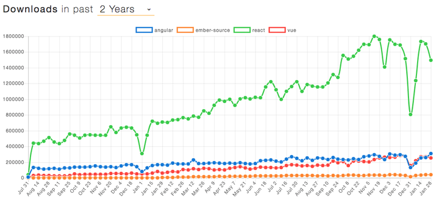
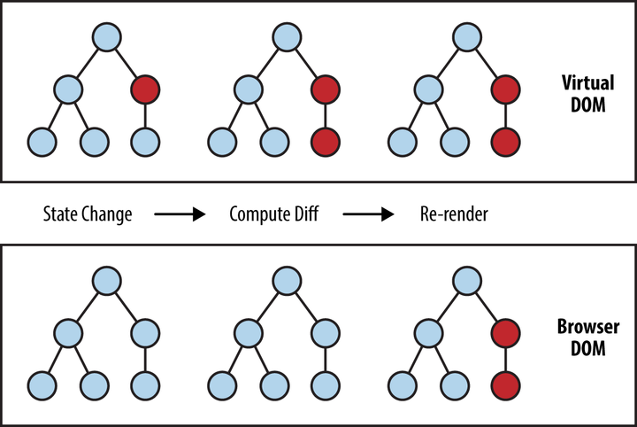
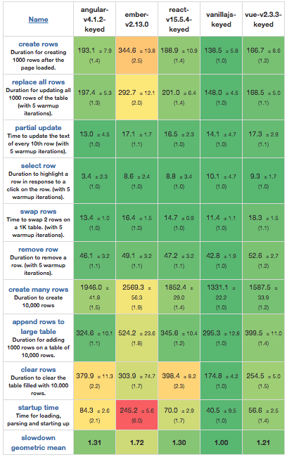
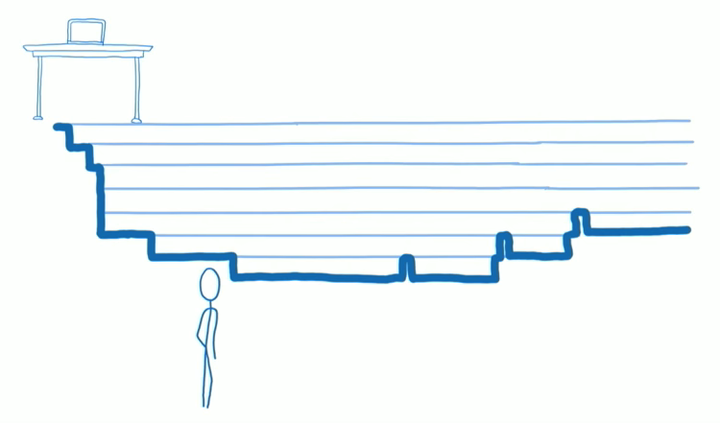
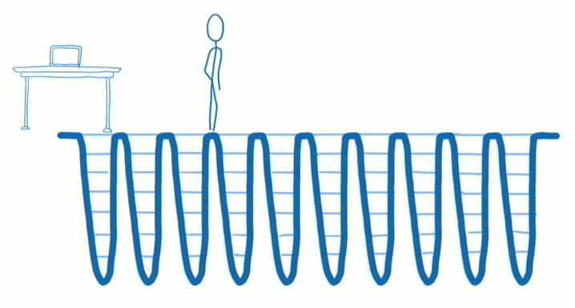

React 自从 2013 年开源以来，凭借先进的理念、简洁的 API 和优秀的性能迅猛发展起来。如今已经构建起一个完整庞大的生态圈。从 NPM Trend 的统计结果来看，React 显著领先于其它前端框架：

*近两年 NPM 下载量对比情况*

为什么 React 如此流行？它有哪些精妙之处值得我们深究？本文着重从 React 的核心设计理念方面进行探索。

## 单向数据流

在 React 问世之前，已经有很多框架为日趋复杂的前端开发提供了解决方案。那么为什么还要创造 React 呢？从 React 早期的灵魂人物 Pete Hunt 的 [Why did we build React?](https://reactjs.org/blog/2013/06/05/why-react.html) 一文和 [The Secrets of React‘s Virtual DOM](https://www.youtube.com/watch?v=-DX3vJiqxm4) 演讲中，我们似乎可以得到一些启示。

**Data Binding**

为了解决 UI 和数据同步复杂性的问题，Data Binding 被提出并得到了广泛应用。其中两个主要的流派是：

- Key Value Observable (KVO)，以 Ember、Meteor 和 Knockout 为代表
- Dirty Check，主要以 AngularJS 为代表

让我们尝试用 TodoMVC 为例来看下各个方案的不同。

下面是 Ember TodoMVC 的核心代码：

```js
// Template
<script type="text/x-handlebars" data-template-name="todo-list">
  <ul id="todo-list">
    {{#each}}
      <li {{bind-attr class="isCompleted:completed isEditing:editing"}}>
        {{input type="checkbox" class="toggle" checked=isCompleted}}
        <label {{action "editTodo" on="doubleClick"}}>{{title}}</label>
        <button {{action "removeTodo"}} class="destroy"></button>
      </li>
    {{/each}}
  </ul>
</script>

// Todos List Controller
Todos.TodosListController = Ember.ArrayController.extend({
  needs: ['todos'],
  allTodos: Ember.computed.alias('controllers.todos'),
  itemController: 'todo',
  canToggle: function () {
    var anyTodos = this.get('allTodos.length');
    var isEditing = this.isAny('isEditing');

    return anyTodos && !isEditing;
  }.property('allTodos.length', '@each.isEditing')
});
```

*注：完整可执行代码见 [TodoMVC 1.3.0 - EmberJS](https://github.com/tastejs/todomvc/tree/1.3.0/architecture-examples/emberjs)。*

这种实现存在以下几个问题：

- Computed properties，即那些依赖其它 property 的 property，不但需要手动指定依赖，而且往往需要了解 Ember 的内部机制，例如 `@each.isEditing`
- 模板和 View 分离，这样的确能够让 HTML 和 JS 各司其职，但它们之间的紧密程度是如此之大，同时代的 [Polymer](https://github.com/tastejs/todomvc/blob/1.2.0/architecture-examples/polymer/elements/td-item.html) 将它们统一封装为 Element 显然更加合理

接下来让我们看一下 AngularJS TodoMVC 的核心代码：

```js
// template
<script type="text/ng-template" id="todomvc-index.html">
  <ul id="todo-list">
    <li ng-repeat="todo in todos | filter:statusFilter track by $index" ng-class="{completed: todo.completed, editing: todo == editedTodo}">
      <div class="view">
        <input class="toggle" type="checkbox" ng-model="todo.completed">
        <label ng-dblclick="editTodo(todo)">{{todo.title}}</label>
        <button class="destroy" ng-click="removeTodo(todo)"></button>
      </div>
    </li>
  </ul>
</script>

// todoFocus directive
angular.module('todomvc')
  .directive('todoFocus', function todoFocus($timeout) {
    return function (scope, elem, attrs) {
      scope.$watch(attrs.todoFocus, function (newVal) {
        if (newVal) {
          $timeout(function () {
            elem[0].focus();
          }, 0, false);
        }
      });
    };
  });

// Todo Controller
angular.module('todomvc')
  .controller('TodoCtrl', function TodoCtrl($scope, $routeParams, $filter, todoStorage) {
    var todos = $scope.todos = todoStorage.get();

    $scope.newTodo = '';
    $scope.editedTodo = null;

    $scope.$watch('todos', function (newValue, oldValue) {
      $scope.remainingCount = $filter('filter')(todos, { completed: false }).length;
      $scope.completedCount = todos.length - $scope.remainingCount;
      $scope.allChecked = !$scope.remainingCount;
      if (newValue !== oldValue) { // This prevents unneeded calls to the local storage
        todoStorage.put(todos);
      }
    }, true);
    ...
  });
```

*注：完整可执行代码见 *[TodoMVC 1.3.0 - AngularJS](https://github.com/tastejs/todomvc/tree/1.3.0/architecture-examples/angularjs)*。*

AngularJS 的实现存在一些类似的问题：

- Controller 围绕 `$scope` 来组织和更新数据、方法、事件，对于那些依赖其它数据的数据（类似 KVO 中的 computed properties），需要通过 `$scope.watch`解决
- Dirty Check 需要开发者了解其内部原理，不然很可能就会出现有些更新没有识别到的问题，例如 $timeout

另外，观察仔细或者有过亲身实践的同学或许能够注意到，Ember 和 AngularJS 在整体代码风格上与原本的 JS 相去甚远，它们引入了很多新的概念和 API。当按照这些范式写代码的时候，离 JS 本身却越来越远。他们更像是一门方言，一名出色的前端工程师需要重新学习它们的设计和文档，并不能很好地将之前的积累转化为生产力。

究其原因，套用 Frederick 著名的没有银弹中的概念，UI 和数据同步这一问题存在本质复杂度和偶然复杂度，Data Binding 这种解决途径带来了很多偶然的复杂度，需要开发者花费额外的精力去了解和克服，而非专注在本质问题上。

**数据决定 UI**

面对这些问题，React 的先驱们决定另辟蹊径，寻找一种更加可预测、可依赖的前端 UI 实现方案。一个简单的想法出现了：能不能用 JS 来构建 UI，在需要更新时，简单地全部更新就可以？

```js
function renderTodoItem(todo) {
  return DOM.li({ className: todo.completed ? 'completed' : '' }, [
    DOM.input({ type: 'checkbox', className: 'toggle', checked: todo.completed }),
    DOM.label({ onDoubleClick: function () { editTodo(todo); } }, todo.title),
    DOM.button({ onClick: function () { destroy(todo); } })
  ]);
}

function renderTodoList(todoList, filterFlag) {
  return DOM.ul({ className: 'todo-list' },
    todoList.filter(function (item) {
        if (filterFlag === ACTIVE) return !item.completed;
        if (filterFlag === COMPLETED) return item.completed;
        return true;
      })
      .map(renderTodoItem)
  );
}

DOM.render(renderTodoList(todoList, filterFlag));
```

传统的 Data Binding 实现在渲染 DOM 之后，需要不断从数据侧和 DOM 本身检测变化从而完成 UI 和数据的双向同步。React 则选择了另外一条完全不同的路：单向渲染，或者更加本质地来说：


这种方式简单易懂：React 就像是一个没有副作用的函数，忠实地根据输入的数据构建符合预期的 UI。有很多人认为这是 One Way Data Binding，因为只有数据到 UI 的绑定，而不是像其它 Data Binding 方案还有 UI 到数据的绑定。同时，React 也更像 JS 本身，而不是一种面向某个领域的方言。前端工程师只需要学习其少量的 API，可以借助之前积累的 JS 经验来优化开发效率。

后来的事实也证明，正是这个简单的想法改变了一切，React 后续所有的功能都是以此为起点，很多周边的库如 Redux 更是蒙此恩泽。

## 虚拟 DOM

如果说单向渲染是 React 的内核，那么虚拟 DOM 就是能够让这个内核得以接地气的关键技术。因为每次都采用完全更新的方式是不可接受的，当前浏览器的性能并不足以在这种情况下提供可以容忍的使用体验。这也正是之前没有类似技术得以流行的根本原因。

这里不得不佩服 React 先驱们的智慧。他们大概从 Git Snapshot 或者 Docker 的 AUFS 中得到了一些灵感，通过在 JS 和 DOM 之间增加一个新的抽象表示层，从而在需要更新时，对比这一表示层的 diff，最终差量更新 DOM。

举个?，假设我们渲染如下 Component：

```js
const SimpleList = ({ list }) => (
  <ul className="list">
  {
    list.map((item) => (
      <li key={item.id} className="item">{item.text}</li>
    ))
  }
  </ul>
);

const list = [
  { id: 1, text: 'Item 1' },
  { id: 2, text: 'Item 2' },
  { id: 3, text: 'Item 3' },
];
ReactDOM.render(<SimpleList list={list}>, document.body);
```

这些节点在 Virtual DOM 中的表示为：

```js
const element = {
  type: 'ul',
  props: { className: 'list' },
  children: [
    { type: 'li', props: { key: 1, className: 'item', children: ["Item 1"] } },
    { type: 'li', props: { key: 2, className: 'item', children: ["Item 2"] } },
    { type: 'li', props: { key: 3, className: 'item', children: ["Item 3"] } },
  ],
};
```

当有数据变化时，例如 list 变为了 [ { id: 1, text: 'Item 1' } ]，React 会执行如下三个步骤：

1. 接收到变更数据，整个 UI 被重新渲染为新的 Virtual DOM 表示
2. 对比新旧 Virtual DOM 表示的区别，得到差量更新内容。React 称这一过程为调和（Reconciliation）过程。在这个例子中，差量更新的内容为：删除后面两个 li
3. 对 DOM 应用上一步中计算的差量更新

*调和（Reconciliation）过程*

进一步地，在增加了 DOM 结构特有的[一些规则](https://reactjs.org/docs/reconciliation.html)后，React 可以将调和过程的时间复杂度控制在 O(n) 内。

*Web Frameworks Benchmark（slowdown 值越小越好）*

可以这样评价虚拟 DOM：正是这一技术使得 React 在保持单向渲染理念的同时，在性能上和 Data Binding 方案保持在同一水准。

然而这并不是 Virtual DOM 的全部价值，在增加这一抽象层之后，React 其实脱离了 DOM 这样单一的应用场景，它的解决问题的思路可以普世地应用在所有 UI 场景中。前面三个步骤中的前两个属于 React 核心部分，第三个步骤可以由特定的 Renderer 来完成。目前单就官方目前支持的就有 DOM Renderer（浏览器）、Server Renderer（服务器）、Native Renderer（iOS 和 Android）、ART Renderer（Canvas，SVG 或者 VML），以及测试使用的 Test Renderer。比较知名的第三方 Renderer 有 Flipboard 的 [react-canvas](https://github.com/Flipboard/react-canvas)，更多 Renderer 可以看这个 [Awesome list](https://github.com/chentsulin/awesome-react-renderer)。

## Fiber

React 在每次收到数据更新之后，会进行一次调和过程并一次性更新 DOM，这在一般情况下不存在显著的性能瓶颈。但在一些需要 UI 快速响应的场景中，例如动画、手势等，当 DOM 的更新量较多或者 JS 逻辑较为复杂时，就会引起卡顿等有损体验的情况。针对这一问题，从 2015 年起，React 团队就开始研究 Fiber（纤程），在最新的 v16 中，Fiber 已经成为了作为新一代调和过程的基础。

Fiber 的主要特性是支持增量渲染：能够将渲染工作分割为小块，并且将它们分散到多个帧中。

Lin Clark 用下面两幅图非常形象地展示了新旧调和过程的区别。

*原调和过程调用栈*

原调和过程会沿组件树递归遍历，遇到需要更新的情况时直接更新 DOM。由于 JS 和样式计算、布局（Layout）以及许多情况下的绘制共享浏览器主线程，如果有的组件执行时间较长，就会导致一些需要快速响应的更新被阻塞，进而导致卡顿等有损用户体验的现象。

*基于 Fiber 的调和过程调用栈*

新的基于 Fiber 的调和过程将原来的递归遍历打散，可以每次只计算部分节点的更新内容后回到主逻辑查看是否有需要立即更新的高优先级内容，从而能够实现快速响应。

那么怎么区分更新内容的优先级呢？既然总体更新操作是一定的，那么就需要根据响应速度的要求来划分优先级：

1. 对于动画或者用户手势这类场景来说，需要以最快速度进行响应，一般要在 16ms 左右才能保证 60 帧的平滑效果
2. 对于点击、触摸这类用户主动的操作，控制在 80~150ms 左右即可保证无迟滞感
3. 对于网络请求这类高延迟、被动触发的场景来说，UI 更新可以适当排在后面
4. 对于一些在一段时间内用户没有明显察觉的内容来说，例如不在视口范围内的元素，可以等待用户即将看到他们时再进行更新

为了能够将原调和过程的递归调用打散，React 团队基于 Fiber 开发了一套新的调度（Scheduling）算法，其核心思路是：

- 构建和组件树对应的 Fiber Tree，每个 fiber 节点保存更新信息，并增加 sibling 和 return 分别指向下一同级节点和父节点，以方便暂停遍历、恢复遍历、提交待更新内容等需求
- 在检查到更新时，并不立即更新到 DOM，而是分为调和和提交两个阶段，调和阶段会收集待更新列表，可以被打断，后者会真正更新 DOM，不可以打断
- 加入时间片的概念，在时间片用光时检查待更新列表，并将其通过 `requestAnimationFrame`或者 `requestIdleCallback`让浏览器在合适的时间点进行更新
- 支持抢占，有高优先级更新内容时会优先对其进行处理

据笔者所知，这似乎是 Scheduling 这一概念第一次应用在前端领域中，恰好迷思专栏最近刚刚更新了一篇详细介绍它的文章：“[当我谈 scheduling 时我在谈什么？](https://zhuanlan.zhihu.com/p/33389178)”，有兴趣的话可以详细了解下这一技术在操作系统、编程语言中的应用。

fiber 本质上可以认为是一个虚拟的堆栈帧（[Stack Frame](http://www.cs.uwm.edu/classes/cs315/Bacon/Lecture/HTML/ch10s07.html)），它保留着每个组件实例的更新信息以及对其它 fiber 的指向，新的 Scheduling 具备对它们的所有控制权，可以按照任意方式对它们进行调度，就像操作系统可以对应用程序随意进行调度一样。这为 React 的未来提供了更多可能性，例如在浏览器支持多线程渲染时，React 的 Scheduling 可以同时为每个线程安排一些工作量，借助并行处理能力大幅提高渲染性能。

## 结语

单向数据流让 React 具备简单优雅的内核，Virtual DOM 使 React 得以落地生根，新近的 Fiber 令 React 适应越来越复杂严苛的应用场景，这三个设计上的闪光点应该可以解释 React 如此流行的原因。透过表象看本质，我们可以注意到它们无不是从实际问题出发，去探究正确的解决之道，不断打磨并做到极致的。我们也很欣喜地看到 React 将很多其它工程领域中的优秀实践引进到前端当中来，例如 Functional Programming、Double Buffering、Scheduling 等等。诚然，React 仍然带给了我们一些新的问题和挑战，例如如何减少无效重渲染等，但只要具备这种探究问题本源、追寻至上之道的精神，相信 React 会走得更好、更远。

## 彩蛋

React 最初是由 Facebook 工程师 Jordan Walke 受 [XHP](http://hhvm.github.io/xhp-lib/) 启发创造的。简单来说，XHP 是 Facebook 开发的一个 PHP 扩展，使其能够高效率地创建可复用、可定制页面元素。

下面是一个 XHP 的例子，看起来 React 还真的是它的近亲呢~

```php
class :ui:blog extends :x:element {
  attribute
    Blog blog @required,
    enum {'public', 'private'} privacy = 'public';

  children empty;

  protected function render() {
    if ($this->getAttribute('privacy') == 'private') {
      return null;
    }
    $blog = $this->getAttribute('blog');
    return
      <div class="blogPost">
        <h3>{$blog->getTitle()}</h3>
        <ui:blog-meta-data blog={$blog} />
        <div class="content">{$blog->getContent()}</div>
      </div>;
  }
}
```

有趣的是，XHP 又是受了 [ECMAScript for XML](https://en.wikipedia.org/wiki/ECMAScript_for_XML) 的启示，冥冥中有种天道轮回的味道。

## 参考

1. [React (JavaScript library) - Wikipedia](https://en.wikipedia.org/wiki/React_(JavaScript_library))
2. [Why did we build React? - React Blog](https://reactjs.org/blog/2013/06/05/why-react.html)
3. [Yes, React is taking over front-end development. The question is why](https://medium.freecodecamp.org/yes-react-is-taking-over-front-end-development-the-question-is-why-40837af8ab76)
4. [Lin Clark - A Cartoon Intro to Fiber - React Conf 2017](https://www.youtube.com/watch?v=ZCuYPiUIONs)
5. [An Introduction to XHP](http://codebeforethehorse.tumblr.com/post/3096387855/an-introduction-to-xhp)
