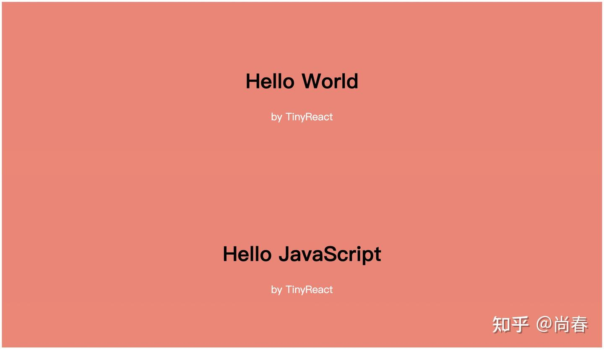
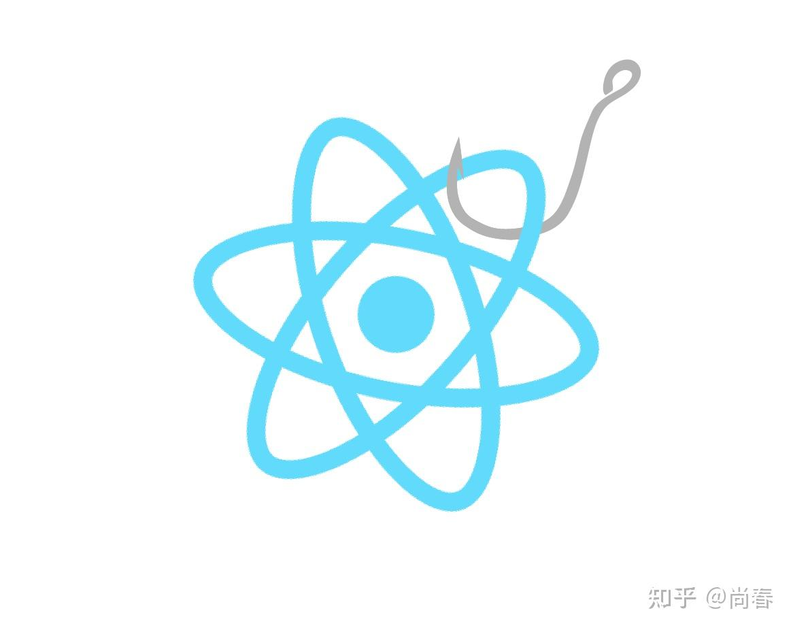
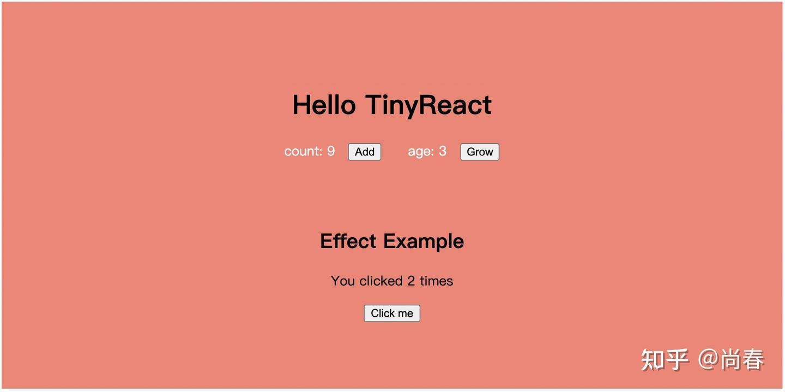
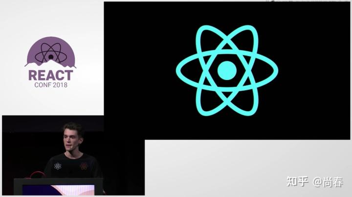

自 19 年 [React 16.8](https://reactjs.org/blog/2019/02/06/react-v16.8.0.html) 正式发布 Hooks 以来，已然在社区中形成了席卷之势，甚至也影响到了很多其它前端库以及框架。目前介绍如何使用 Hooks 的文章汗牛充栋，本文着重从原理层面，从零开始构建一个简化版 Hooks 实现，期望能够让你知其然也知其所以然，更好地把握和运用 Hooks。

## 为什么要引入 Hooks？

React 团队的解释是目前以 React.Component 类为主的组件实现方式下，存在如下[三方面问题](https://reactjs.org/docs/hooks-intro.html#motivation)：

1. **组件之间一些包含状态的逻辑很难拆分复用** 因为函数式组件不能处理状态，且之前 Mixin 模式已被证伪，目前社区主流的 HoC 和 render props  模式也被诟病导致 wrapper hell
2. **复杂的大型组件越发难以理解和维护** 关联紧密的逻辑被迫分散在各个 lifecycle 方法中，非常容易出现疏漏
3. **组件类的方式对开发者和机器都不友好** 难以理解的 this，回调函数需要手动绑定，还有很多诸如此类的组件类模式的认知成本，导致新手入门难度高。同样地，组件类因为有内部状态、继承逻辑等特征，对编译器的各种优化也非常不友好

Dan 在 React Conf 2018 大会上介绍完这几个问题后，也再进一步地说明其实这三个问题本质是一个问题的三种体现而已。而这个本质的问题就是：

> React does not provide a simpler, smaller, lightweight primitive to add state and lifecycle than a class component.

换言之，React 本身非常函数式的设计哲学，  ，并没有被当前组件类模式很好地表达。

为了彻底解决这一问题，在 React 团队的 Sebastian 等人的带领下，经过参考和探索诸如 [Stateful Functions](https://github.com/reactjs/react-future/blob/master/07%20-%20Returning%20State/01%20-%20Stateful%20Functions.js)、[DisplayScript](http://displayscript.org/introduction.html)、[Algebraic effects in Multicore OCaml](https://github.com/ocamllabs/ocaml-effects-tutorial#2-effectful-computations-in-a-pure-setting) 等方案后，给出了 React Hooks 方案。

## Hooks 实现的准备工作

在这个小节中，让我们一起从零开始实现一个极简版本的 React，一方面为接下来的 Hooks 实现做准备，另一方面，也更深入地理解 React 的基本原理。

**虚拟 DOM**

React 是一个声明式 UI library，读入 data 和组件，处理后输出 UI。为了实现差量更新以降低 DOM 操作成本，React 引入了虚拟 DOM，让 UI 以一种”虚拟“的表现形式被保存于内存中，并通过如 ReactDOM 等类库使之与“真实的” DOM 同步。

例如有如下组件：

```js
const Greet = ({ name }) => (
  <div>
    <h2>Hello, {name}</h2>
  </div>
);
```

在 React 中，Greet 在虚拟 DOM 中的表示类似为如下形式：

```js
{
  // element 对应的 DOM node
  dom: divNode,
  // element 数据
  element: {
    type: 'div',
    props: {}
  },
  // 子节点列表
  children: [
    {
      dom: h2Node,
      element: {
        type: 'h2',
        props: {}
      },
      children: [
        {
          dom: textNode,
          element: { 
            type: 'text', 
            props: { nodeValue: 'Hello, xxx' } 
          }
        }
      ]
    }
  ]
}
```

可见，虚拟 DOM 和真实 DOM 类似，也是树形结构，每个节点有真实 DOM 节点引用、组件元素数据以及子节点等信息。更多内容可以参考本专栏之前的一篇文章：
[尚春：React 设计中的闪光点](https://zhuanlan.zhihu.com/p/28562066)

**TinyReact v1**

基于虚拟 DOM，我们接下来实现一个极简版 React，不妨称之为 TinyReact。

作为第一步，我们实现 `createElement` 和 `createTextElement` 两个工厂函数，用以表达组件渲染所需的 element 信息：

```js
function createElement(type, props, ...children) {
  return {
    type,
    props,
    children: children.map((child) =>
      typeof child === "object" ? child : createTextElement(child)
    )
  };
}

function createTextElement(text) {
  return {
    type: "TEXT_ELEMENT",
    props: {
      nodeValue: text
    }
  };
}
```

接下来，实现第一版 `render` 方法：

```js
function render(element, parentDom) {
  const { type, props, children = [] } = element;

  // Create DOM element
  const dom = type === "TEXT_ELEMENT"
    ? document.createTextNode("")
    : document.createElement(type);

  // Set properties
  Object.keys(props).forEach((name) => {
    dom[name] = props[name];
  });

  // Render children
  children.forEach((childElement) => render(childElement, dom));

  // Append to parent
  parentDom.appendChild(dom);
}
```

如上短短三十余行代码，我们就完成了 TinyReact 的第一版！下面试试下它的威力吧：

```js
const TinyReact = {
  createElement,
  render
};

const App = ({ name = 'World' } = {}) => TinyReact.createElement(
  "div",
  { style: "background: salmon; padding: 5rem; text-align: center" },
  TinyReact.createElement("h1", {}, "Hello " + name),
  TinyReact.createElement("div", { style: "color: white" }, "by TinyReact")
);
TinyReact.render(App(), document.getElementById("app"));

// 上述代码太过啰嗦，借助 JSX 语法糖 ，可以被重写为
/** @jsx TinyReact.createElement */
const App = ({ name = 'World' } = {}) => (
  <div style="background: salmon; padding: 5rem; text-align: center">
    <h1>Hello {name}</h1>
    <div style="color: white">by TinyReact</div>
  </div>
);
TinyReact.render(App(), document.getElementById("app"));
```

该示例中，App 组件通过调用 `createElement` 方法创建了一个包含一个父节点和两个子节点的 element 树，经过 `render` 方法递归处理后渲染到 DOM 中。效果如图：


可以到 CodeSandbox 上手体验：
[TinyReact-simple-render - CodeSandbox](https://codesandbox.io/s/tinyreact-simple-render-ez65i?file=/src/index.js)

**调谐过程（Reconciliation）**

TinyReact v1 已经可以很轻松地处理组件的首次渲染，但是当我们再次调用 `render` 方法时，出现了两个问题：

1. TinyReact 依然重新创建了一遍所有 DOM 节点，没有检查是否已有 DOM 节点可以复用
2. 创建的 DOM 节点又被加入到了页面父节点中，导致重复内容

代码和效果如下：

```js
// First render
TinyReact.render(App(), document.getElementById("app"));

// Second render
TinyReact.render(App({ name: "JavaScript" }), document.getElementById("app"));
```


产生这些问题的原因是 TinyReact v1 并没有 React 中的调谐过程，即通过对比新旧虚拟 DOM 之间的不同来进行真实 UI 的差异化更新。

那就让我们撸起袖子解决这个看似不简单的问题吧。

首先改造下 `render` 方法，从而在下一次 render 的时候能够对比两次的差异：

```js
let rootInstance = null;

function render(element, container) {
  const prevInstance = rootInstance;
  const nextInstance = reconcile(container, prevInstance, element);
  rootInstance = nextInstance;
}
```

可以看到几个变化：

1. `render` 中的原渲染逻辑被封装到 `reconcile` 调谐函数中
2. 加入一个全局的 `rootInstance` 变量，它保存着每次调谐过程的结果，即一个完整的虚拟 DOM 实例
3. 调用 `reconcile` 时，会传入当前的 `rootInstance` 作为参照，完成调用后，将结果更新到 `rootInstance`

因此，**每次 render 就是一个调谐过程，这一过程会对比当前虚拟 DOM 实例和新传入的渲染内容之间的差异从而实现差量更新**。

有了对调谐过程的基本理解，下面看下 `reconcile` 的实现：

```js
function reconcile(parentDom, instance, element) {
  if (instance === null) {
    // Create instance
    const newInstance = instantiate(element);
    parentDom.appendChild(newInstance.dom);
    return newInstance;
  } else if (element === null) {
    // Remove instance
    parentDom.removeChild(instance.dom);
    return null;
  } else if (instance.element.type === element.type) {
    // Update instance
    updateDomProperties(instance.dom, instance.element.props, element.props);
    instance.childInstances = reconcileChildren(instance, element);
    instance.element = element;
    return instance;
  } else {
    // Replace instance
    const newInstance = instantiate(element);
    parentDom.replaceChild(newInstance.dom, instance.dom);
    return newInstance;
  }
}
```

可见 `reconcile` 处理了四种情况：

1. 如果没有对应的之前虚拟 DOM 节点实例，则创建一个实例（包括 DOM 节点、传入的 element 数据、子实例列表等），并添加到页面 DOM 中。这也是第一次执行 `render` 时的逻辑
2. 如果已经有虚拟 DOM 节点实例，但是本次渲染传入的 element 数据为空，则意味着新 UI 中不再需要该节点，因此从 DOM 中删除之前的 DOM 节点，并返回空结果
3. 如果当前虚拟 DOM 实例和新的 element 类型是一致的，说明节点类型没有变化，例如之前是一个 div，现在仍然是一个 div，则只检查是否有对应的节点属性需要变更，并递归处理所有子节点实例
4. 最后一种情况是当前虚拟 DOM 实例和新的 element 类型不一致，则创建新实例并进行替换

限于篇幅，文中不再详述 `instantiate`、`updateDomProperties`、`reconcileChildren` 等方法的实现。感兴趣的请移步到下面的 CodeSandbox 查阅体验：
[TinyReact-reconciliation - CodeSandbox](https://codesandbox.io/s/tinyreact-reconciliation-91jfw?file=/src/index.js)

经过这一改造，TinyReact v2 已经能够处理多次渲染。

**函数组件**

准备工作的最后一步是支持函数组件，它是 Hooks 的主要使用场景。

需要改进的地方有两处，一处为首次渲染函数组件时，在 `instantiate` 方法内创建对应虚拟 DOM 节点实例的逻辑：

```js
function instantiate(element) {
  const { type, props, children = [] } = element;

  // Handle function component
  if (typeof type === "function") {
    const childElement = type(props);
    const childInstance = instantiate(childElement);
    return {
      dom: childInstance.dom,
      element,
      childInstance
    };
  }
  ...
}
```

上述代码中，与处理普通 DOM 节点（div/ul 等）主要的不同在于：

- 需要执行函数组件，`type(props)`，进而获得最终的 element 表达
- 函数组件对应的虚拟 DOM 节点只会有一个子节点实例，而普通 DOM 节点可以有多个

另一处为 `reconcile` 调谐过程中需要更新函数组件对应虚拟 DOM 节点实例的分支：

```js
function reconcile(parentDom, instance, element) {
  ...
  } else {
    // Update function instance
    const childElement = element.type(element.props);
    const oldChildInstance = instance.childInstance;
    const childInstance = reconcile(parentDom, oldChildInstance, childElement);
    instance.dom = childInstance.dom;
    instance.element = element;
    instance.childInstance = childInstance;
    return instance;
  }
}
```

现在，TinyReact v3 已经可以处理函数组件：

```js
TinyReact.render(<App />, document.getElementById("app"));

// App 是一个函数组件，上述代码等同于：
TinyReact.render(TinyReact.createElement(App, {}), document.getElementById("app"));
```

一如既往，可以到 CodeSandbox 查阅完整代码并体验：
[TinyReact-functional-component - CodeSandbox](https://codesandbox.io/s/tinyreact-functional-component-x51ul?file=/src/index.js)

至此，我们完成了所有 Hooks 实现的准备工作。

## 实现第一个 Hook：useState

`useState` 可谓是最为常用的 Hook，我们接下来动手实现它吧！

让我们稍稍回顾下 `useState` 的使用方式：

```js
function App() {
  const [count, setCount] = useState(0);
  return (
    <div>
      <p>You clicked {count} times</p>
      <button onClick={() => setCount(count + 1)}>
        Click me
      </button>
    </div>
  );
}
```

可以总结出 `useState` 的几个特点：

1. 接受一个初始值
2. 返回一个 tuple，第一个元素为 state 最新的值，第二个元素为更新函数
3. 在函数组件多次执行时，仍然能够返回之前的 state 值

结合我们在预备阶段介绍的 TinyReact 实现，能够满足这些条件，尤其是第三个条件的实现方式，看起来只要在和组件有深度绑定的虚拟 DOM 上进行修改即可：

```js
// Function instance
{
  dom,
  element,
  childInstance,
  // Add state to store state across multiple executions
  state,
}
```

如上所示，我们拓展函数组件对应的虚拟 DOM 节点实例，加入一个 `state`  字段来保存当前状态数据。

经过分析 TinyReact 实现，我们需要在每次执行函数组件之前进行 state 数据的准备工作：

```js
let wipInstance = null;
let wipState = undefined;

function instantiate(element) {
  const { type, props, children = [] } = element;

  // Create function instance
  if (typeof type === "function") {
    wipInstance = {};
    wipState = undefined;
    const childElement = type(props);
    ...
    wipInstance.state = wipState;
    return wipInstance;
  }
  ...
}

function reconcile(parentDom, instance, element) {
  ...
  } else {
    // Update function instance
    wipInstance = instance;
    wipState = instance.state;
    const childElement = element.type(element.props);
    ...
    instance.state = wipState,
    return instance;
  }
}
```

共有三处变更：

1. 添加两个全局变量，`wipInstance` 保存当前正在处理的虚拟 DOM 实例，`wipState` 保存当前虚拟 DOM 实例的 state 数据，以便在 `useState` 中直接读取
2. 在 `instantiate` 方法中首次渲染函数组件（mount）时，将 `wipInstance` 指向新创建的对象，并初始化 `wipState`
3. 在 reconcile 方法中更新渲染函数组件（update）时，将 `wipInstance` 指向已创建的虚拟 DOM 实例，`wipState` 保存该实例的 `state` 数据

上述变更保证了 `wipInstance` 和 `wipState` 在执行函数组件之前已经指向了正确的数据，且由于是全局变量（模块级变量，仅在 TinyReact 内部共享，下同），它们是可以被其它 TinyReact 方法直接读取的。接下来我们可以尝试实现 `useState` 了：

```js
function useState(initialValue) {
  wipState = typeof wipState === 'undefined' ? initialValue : wipState;
  const instance = wipInstance;
  setState = (newState) => {
    instance.state = newState;
    reconcile(instance.dom.parentNode, instance, instance.element);
  };
  return [wipState, setState];
}
```

That's IT! 逻辑可以说是非常简明扼要，主要有两方面：

- 更新 `wipState`，在初始化时赋值为 `initialValue`
- 创建 `setState` 方法，接受一个参数作为新指定的 state，先将其更新到虚拟 DOM 实例的 `state` 字段，然后执行调谐过程触发 UI 更新
- 将最新 state 和 `setState` 方法组合为二元 tuple 返回

这段逻辑也似乎解释了 React Hooks 名字的寓意：**Hook 就是 React 内部引擎扩展到函数组件的一个“钩子（hook）”，通过这个钩子，函数组件可以读写内部引擎保存的信息，且该信息在其多次执行时保持一致**。


下面我们看一个简单示例：

```js
const App = ({ name = "World" } = {}) => {
  const [count, setCount] = useState(0);
  return (
    <div style="background: salmon; padding: 5rem; text-align: center">
      <h1>Hello {name}</h1>
      <span style="color: white; margin-right: 1rem">count: {count}</span>
      <button onClick={() => setCount(count + 1)}>Add</button>
    </div>
  );
};

TinyReact.render(<App name="TinyReact" />, document.getElementById("app"));
```


完整代码见下面 CodeSandbox：
[TinyReact-useState-single - CodeSandbox](https://codesandbox.io/s/tinyreact-usestate-single-xdu90?file=/src/index.js)

**多状态支持**

上述实现存在一个非常明显的问题：只能保存一个 state。

为了让 TinyReact 更加切合实际，需要进一步添加多状态的支持。实现方式多种多样，例如：

1. 将虚拟 DOM 节点实例的 state 替换为 hooks 数组
2. 将虚拟 DOM 节点实例的 state 替换为 hookHash 对象，key 可以通过 `useState(key, initialState)` 来指定
3. 将虚拟 DOM 节点实例的 hooks 或者 hookHash 对象作为函数组件的第二个参数传入，这样组件内部是可以随意读写任意状态

React 团队经过[研究权衡](https://github.com/reactjs/rfcs/pull/68#issuecomment-433170023)，最终采用了第一种方式，虽然有顺序相关等缺点，但是心智成本低，不需要指定 key，不需要额外参数。而且顺序相关的缺点可以通过 lint 解决。

有了明确的思路，下面就让我们动手实战吧！

```js
let wipInstance = null;
let wipHookIndex = 0;

function instantiate(element) {
  ...
  // Create function instance
  if (typeof type === "function") {
    wipInstance = {};
    wipHookIndex = 0;
    const childElement = type(props);
    ...
}

function reconcile(parentDom, instance, element) {
  ...
    // Update function instance
    wipInstance = instance;
    wipHookIndex = 0;
    const childElement = element.type(element.props);
    ...
}
```

修改的地方和上一小节如出一辙：

1. 再次新增一个全局变量 `wipHookIndex`，用以指向当前正在调用的 hook 索引，从而获得正确的 hook 状态数据
2. 在每次执行函数组件（mount 或者 update）时，先要重置 `wipHookIndex`

接下来继续修改 `useState`：

```js
function useState(initialValue) {
  const instance = wipInstance;
  const hooks = wipInstance.hooks;
  const hookIndex = wipHookIndex;
  hooks[hookIndex] = hooks[hookIndex] || initialValue;
  const setState = (newState) => {
    hooks[hookIndex] = newState;
    reconcile(instance.dom.parentNode, instance, instance.element);
  };
  return [wipInstance.hooks[wipHookIndex++], setState];
}
```

对比第一版 `useState` 实现，主要进行了数组化的改进。还有一个至关重要的改动：在 `return` 之前需要步进 `wipHookIndex` 从而保证下一个 `useState` 可以拿到正确状态。

又到了示例环节，这次我们在 count 基础上，添加一个 age 的 state：

```js
const App = ({ name = "World" } = {}) => {
  const [count, setCount] = useState(0);
  const [age, setAge] = useState(0);

  return (
    <div style="background: salmon; padding: 5rem; text-align: center">
      <h1>Hello {name}</h1>
      <span style="color: white; margin-right: 1rem">count: {count}</span>
      <button onClick={() => setCount(count + 1)}>Add</button>
      <span style="color: white; margin: 0 1rem 0 2rem">age: {age}</span>
      <button onClick={() => setAge(age + 1)}>Grow</button>
    </div>
  );
};
```
[TinyReact-useState - CodeSandbox](https://codesandbox.io/s/tinyreact-usestate-swsty?file=/src/index.js)

## 更多 Hooks

回过头看，虚拟 DOM 实例的 `hooks` 属性既然是一个数组，那么它的每个元素存储的可以是状态数据，但也可以是其它类似 callback 等数据，只要保证顺序即可。**它本质上提供了函数组件在多次执行时可以共享的数据**。

在本节中，我们就基于目前的 TinyReact，继续实现其它的 Hooks。

**useEffect**

`useEffect` 大概是除 `useState` 外最为常用的 Hook，它与组件生命周期息息相关。正如它的名字所喻示的，常被用来处理副作用相关的逻辑。

有了 `useState` 的实现思路作为借鉴，`useEffect` 实现代码如下：

```js
function useEffect(callback, deps) {
  const oldDeps = wipInstance.hooks[wipHookIndex];
  const hasChangedDeps = oldDeps
    ? deps.some((el, i) => el !== oldDeps[i])
    : true;
  if (!deps || hasChangedDeps) {
    callback();
    wipInstance.hooks[wipHookIndex] = deps;
  }
  wipHookIndex++;
}
```

- 接受两个参数：`callback` 是回调函数，用以处理副作用；`deps` 为判断是否需要再次执行 `callback` 的依赖条件
- 在虚拟 DOM 实例 hooks 对应元素存储的内容是上次执行时的 `deps` 信息，用以进行比对
- 在函数组件初次渲染（mount）时，因为 hooks 对应元素为空，所以 `callback` 一定被执行
- 在函数组件更新渲染（update）时，会检查最新传入的 `deps` 是否相同，如果有变更则执行 `callback`
- 一旦执行 `callback`，则会更新 `deps` 信息到 hooks 对应元素，以备下次对比使用
- 如果没有指定第二个参数 `deps`，则每次都会执行 `callback`

下面我们看一个例子：

```js
const EffectExample = () => {
  const [count, setCount] = useState(0);
  useEffect(() => {
    console.log("effect with deps", count);
  }, [count]);
  useEffect(() => {
    console.log("effect with empty deps");
  }, []);
  useEffect(() => {
    console.log("effect without deps");
  });

  return (
    <div>
      <p>You clicked {count} times</p>
      <button onClick={() => setCount(count + 1)}>Click me</button>
    </div>
  );
};
```
[TinyReact-more-hooks - CodeSandbox](https://codesandbox.io/s/tinyreact-more-hooks-t5ylj?file=/src/index.js)

相比官方的 `useState`，这里我们并没有支持在 `callback` 中返回析构函数，从而能够在 `deps` 发生变更或者删除函数组件时进行清理工作。感兴趣的同学可以在上面实现的基础上继续探索。

**useCallback**

`useCallback` 的目的是可以在函数组件多次执行时仍然返回同一个回调函数，主要目的是为了避免子组件因为每次新创建的回调函数而重新渲染。它的逻辑其实和 `useEffect` 是非常相像的，甚至连参数都一样。

下面是 `useCallback` 的实现：

```js
function useCallback(callback, deps) {
  const { hooks } = wipInstance;
  if (hooks[wipHookIndex] && deps) {
    const [oldCallback, oldDeps] = hooks[wipHookIndex];
    if (!deps.some((el, i) => el !== oldDeps[i])) {
      wipHookIndex++;
      return oldCallback;
    }
  }
  hooks[wipHookIndex++] = [callback, deps];
  return callback;
}
```

有了 `useEffect` 的基础，上述逻辑并不复杂：

- hooks 对应元素存储的信息是一个二元 tuple，与传入的两个参数一致
- 首次执行（mount）时，存储到 hooks 对应元素然后返回 `callback`
- 更新执行（update）时，通过对比新旧 `deps` ，如一致则返回之前的 `callback`
- 如未指定 `deps`，则每次都返回最新的 `callback`

让我们看一个示例：

```js
const BigList = ({ onClick }) => (
  <ul>
    <li onClick={onClick}>Foo</li>
    <li onClick={onClick}>Bar</li>
    <li onClick={onClick}>Baz</li>
  </ul>
);
const CallbackExample = () => {
  const [count, setCount] = useState(0);
  const onClick = useCallback((event) => {
    console.log("click", count, event.currentTarget.textContent);
  }, []);

  return (
    <div>
      <p>You clicked {count} times</p>
      <button onClick={() => setCount(count + 1)}>Click me</button>
      <BigList onClick={onClick} />
    </div>
  );
};
```

经过观察，可以发现在当前 TinyReact 实现中并没有降低无效渲染次数，在 `count` 变更是 `BigList` 依然进行了渲染。原因就在于 TinyReact 并没有在每次更新函数组件前进行 props  比较，而这一工作实际上是由 `React.memo` 负责，也因此日常开发中 `useCallback` 常常与 `React.memo` 结合使用。感兴趣的同学可以挑战下。

**useMemo**

`useMemo` 就像是 `useCallback` 的孪生兄弟，不同的是，它用来保存已经计算好的结果而不是回调函数。

实现如下：

```js
function useMemo(create, deps) {
  const { hooks } = wipInstance;
  if (hooks[wipHookIndex] && deps) {
    const [oldValue, oldDeps] = hooks[wipHookIndex];
    if (!deps.some((el, i) => el !== oldDeps[i])) {
      wipHookIndex++;
      return oldValue;
    }
  }
  const newValue = create();
  hooks[wipHookIndex++] = [newValue, deps];
  return newValue;
}
```

显而易见，除了 hooks 对应元素保存的 tuple 中第一个数据从 `callback` 变成了 `create` 计算得出的结果外，其它都是一样的。

举个例子：

```js
// An expensive operation
const fibonacci = (n) => {
  if (n === 0 || n === 1) return 1;
  return fibonacci(n - 1) + fibonacci(n - 2);
};

const MemoExample = () => {
  const [count, setCount] = useState(0);
  const [input, setInput] = useState(10);
  const result = useMemo(() => {
    console.log("memo", input);
    return fibonacci(input);
  }, [input]);

  return (
    <div>
      <p>Fibonacci of input {input} is: {result}</p>
      <button onClick={() => setInput(input + 1)}>Change input</button>
      <button onClick={() => setCount(count + 1)}>Change state</button>
    </div>
  );
};
```

**useRef**

让我们再来实现最后一个 Hook：`useRef`，它主要用来保存一个可以在组件的整个生命周期内持续存在的 ref 对象，其 `current` 属性被初始化为传入的 `initialValue`，后续可以被修改。

代码如下：

```js
function useRef(initialValue) {
  const { hooks } = wipInstance;
  if (!hooks[wipHookIndex]) {
    hooks[wipHookIndex] = { current: initialValue };
  }
  return hooks[wipHookIndex++];
}
```

Aha！这是最为简单的一个 Hook 了，在虚拟 DOM 实例 hooks 对应位置存储的就是一个对象而已。

下面看一个示例：

```js
const RefExample = () => {
  const ref = useRef(0);
  const onClick = () => {
    ref.current++;
    console.log('ref count', ref.current);
  };

  return (
    <div>
      <p>{ref.current}</p>
      <button onClick={onClick}>Click me</button>
    </div>
  );
};
```

每次点击按钮的时候，`ref.current` 都会自增然后打印信息到控制台，但不会像 `useState` 一样触发组件更新，p 标签里的内容一直是 0。

**其它 Hooks**

还有一些 Hooks 本文尚未提及，譬如 `useContext`、`useImperativeHandle` 、`useLayoutEffect` 等，它们与 React 的实现密切相关，限于篇幅暂且搁置。

以上所有示例代码可以到下列 CodeSandbox 查阅体验：
[TinyReact-more-hooks - CodeSandbox](https://codesandbox.io/s/tinyreact-more-hooks-t5ylj?file=/src/index.js)

## 结语

非常感谢你看到了这里，从零实现一个 React 并且添加 Hooks 支持是一段挑战十足的旅程。

React Hooks 极大地改变了 React 的开发方式，它以一种非常符合直觉、简单易懂的方式为我们提供了一套可靠的原语，社区里也逐渐涌现出如 [react-use](https://github.com/streamich/react-use)、[ahooks](https://ahooks.js.org/) 等方便易用的 Hook 库帮助我们把工作化繁为简，更重要的是，代码量更少了！

React Hooks 仍然存在许多不足，尤其对于新手来说需要转变他们的 mindset，还有 RFC 中提到的[种种问题](https://github.com/reactjs/rfcs/blob/master/text/0068-react-hooks.md#drawbacks)。不过瑕不掩瑜，近两年的快速发展一方面改善了许多缺陷，另外也证明了它就是 React 的未来。

通过层层递进的讲述和举例，希望这篇文章能够让你对 Hooks 背后的工作机制有一个深入理解，并能在实际开发中灵活运用，用更具效能的方式打造一流的用户体验！

## 彩蛋


在 React Conf 2018，Dan 在介绍完首次公开亮相的 React Hooks 后，作为结束语，他深情款款地讲述了他对 React logo 的新思考：

> I found a different interpretation that made more sense to me.  
>   
> The way I think about it, we know that physical matter consists of atoms and we've learned that it's the types of these atoms and their properties that determine how the physical matter looks and behaves. React has taught me something similar. You can take a user interface, and you can split it into these independent units called components. It's the types and properties of these components that can describe how the user interface looks and behaves.   
>   
> What's ironic though is that the word 'atom' literally means indivisible. When scientists just discovered atom for the first time, they thought this is the smallest thing we're gonna find. But later they discovered an electron which is a smaller particle inside the atom. It turns out that actually electrons explain a lot about how atoms work.  
>   
> I kind of feel the same way of Hooks. I don't think Hooks are a new feature, rather I think Hooks provide me with access to React features that I already know, such as state and context and lifecycle. I feel like Hooks are a more direct representation of React, they really explain how a component works inside. I feel like they've been hiding in plain sight for 4 years.  
>   
> In fact, if you look at the React logo, you can see those electron orbits there, so maybe Hooks have been there all along.

## 参考文献

- [Introducing Hooks - Reactjs org](https://reactjs.org/docs/hooks-intro.html)
- [Build your own react - Rodrigo Pombo](https://pomb.us/build-your-own-react/)
- [Deep dive: How do React hooks really work? - Netlify](https://www.netlify.com/blog/2019/03/11/deep-dive-how-do-react-hooks-really-work/)
- [轻松学会 React 钩子：以 useEffect() 为例 - 阮一峰](https://www.ruanyifeng.com/blog/2020/09/react-hooks-useeffect-tutorial.html)
- [Your Guide to React.useCallback()](https://dmitripavlutin.com/dont-overuse-react-usecallback/)
