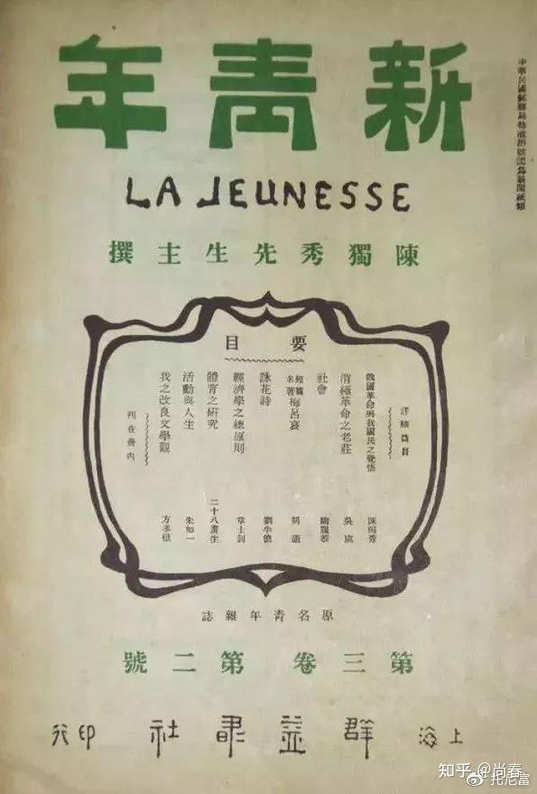
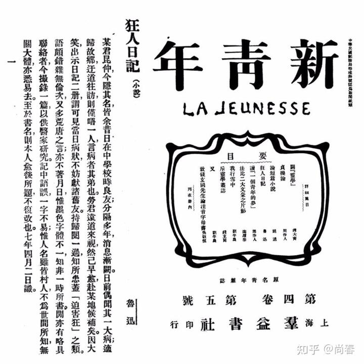
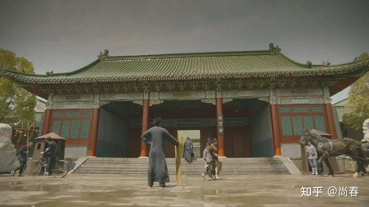
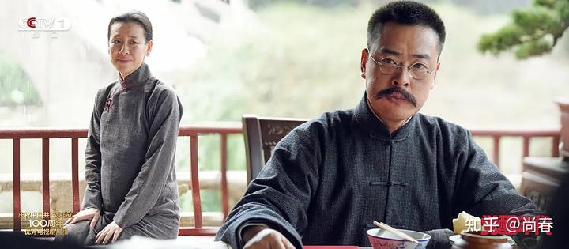
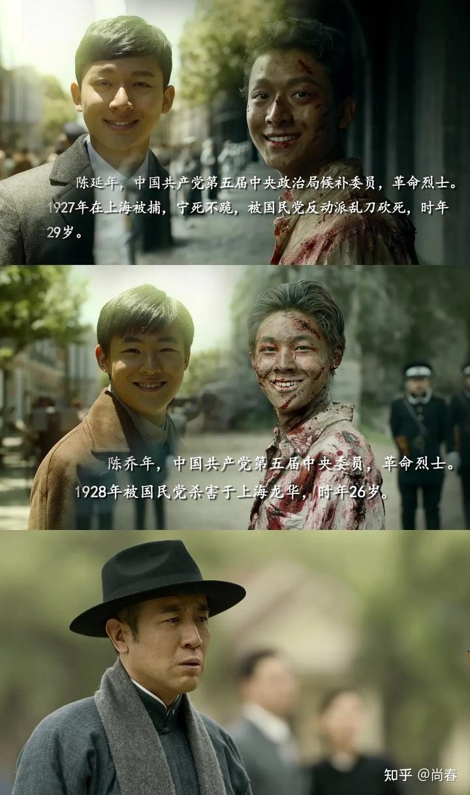

今天追完了“觉醒年代”，从来没有一部电视剧让我这样心潮澎湃，诸多思绪喷薄涌动，不吐不快。

## 总体

我对民国这段历史的了解除了历史书本之外，主要就是国史大纲最后的缪缪数语，以及各种民国大师们的点滴片段。觉醒年代自 1915 年袁世凯和日本签订二十一条开始，至 1921 年中国共产党正式成立剧终，期间重点以新青年杂志引领的新文化运动、五四运动、建立党组织为主线，生动演绎了陈独秀、李大钊、教员、蔡元培、北洋政府等各色人等的精彩故事和心路历程。

为了点题，剧中最为重要的一条线就是以陈独秀和李大钊为代表的，为探索救国救民道路奋斗不已的一群人的思想转变过程，最终找到了马克思主义这条真理。可以说是十分扣题的。这其中李大钊觉醒地最早也最为坚决，陈独秀紧随其后。教员显然道行更深，轻易不表态，坚持实践和检验，了解各种路线之后，最终一锤定音，并真的做到了“奋斗终生”。延年乔年也是多次尝试了无政府主义后，才在父亲的感召下幡然醒悟。这背后，还有被他们影响的一批青年志士。是他们这些觉醒者如星星之火，点燃了这个沉睡几百年的中国。

毫无疑问，这段历史是如此地鲜活、奋进、激动人心。一批人愿意放弃优渥的生活，放弃人上人的特权，放弃自己无限美好的未来，只是为了一个简单朴素的理想：救国救民。我想不到有什么更钦佩的话来向他们致敬，可能这一句能聊表心意：

> *中国总是被他们最勇敢的人保护*的*很好。*  
> ——基辛格《论*中国*》

## 教员

剧中粉墨登场的主要有两个人，教员是第一个。相信看了那段出场片段的朋友都会印象深刻：雨中各色人等粉墨登场，豪华轿车里吃着西洋面包的小公子，街边卖儿卖女的难民，生动刻画出那个年代阶级的巨大差异。一个青年匆匆走来，他把这一切都看在了眼里，手里倾心呵护着拿生活费买来的几本新青年，步伐坚定，斗志昂扬。他来了~

教员从湖南师范毕业，被引荐到北大担任图书馆管理员，从此和李大钊结识，因为思维深刻，很快成为良师益友。教员后来也曾说过早期李大钊对他影响巨大，侧面说明了这段时间他们交流的深入程度。

有两个事情让我对教员有了更深的理解。

其一是他为新青年投递的第一篇文章“体育之研究”：

据说这是他对于陈独秀创刊词中的六大标准的补遗：强壮的而非懦弱的。他认为“国力恭弱，武风不振，民族之体质，日趋轻细。此甚可忧之现象也”。都说湘人彪悍，看来都非常注重体育锻炼。另外他能独立思考，拾漏补遗，并写出来这篇体育研究的开篇之作，确实体现出了一代雄主的韬略。

另外一件事就是他非常喜欢了解各种思潮，并通过实际检验来做出决策。一开始李大钊跟他探讨救国之路时，教员还在研究无政府主义等几种方案，并没有什么明确的倾向。即便在马克思主义先驱守常的耳濡目染之下，都不动如山。后来他去上海又搞了一段时间的无政府主义实验，失败之后找到陈独秀，非常坚定的说明了自己接受马克思主义思想的决定，并坦言愿为之终身奋斗。轻易不下结论，谨慎再谨慎。而一旦有所定夺，则全力以赴，矢志不渝。

## 鲁迅

另外一个浓墨重彩出厂的就是大文豪鲁迅先生。和教员类似，鲁迅先生也属于人狠话不多的类型，而且尤甚。

之前这是从书本上的几篇课文了解到鲁迅是对旧社会充满了彻底的披露，对救国救民的学生志士充满了支持和同情。然而，通过这部电视剧，我对这位现代文学第一人有了更全方位的认识。

他对蔡元培毕恭毕敬，有求必应，总是回复说：我听蔡公的。其中一大壮举就是北大校徽的设计，当真是形神俱佳的上乘作品。

他有感而发，闷头写作，产出中国第一部白话文小说“狂人日记”，极力讽刺旧社会“吃人”的现实，社会影响力巨大。这并不是偶然，而是基于他多年来对于小说的深刻理解，新文化运动中的思潮变化，以及对这个“无可救药”的国家的深刻观察，最终因为一个疯掉的朋友作为引子喷涌而发。

他也有些孤傲，堂堂教育部司长，居然竖起一个“不干了”的木牌，来表明自己不懈与张勋复辟之流沦为同类的态度。当时的镜头竟让我不禁大笑，这个人物的形象也一下子跃动起来，还真是一个有些怪脾气的人啊。

他爱做比喻。大概是研究小说多年的缘故，鲁迅非常喜欢通过比喻来表达他的观点。譬如新青年准备取消同人编辑，需要决定是陈独秀来主编还是胡适，鲁迅就做了个比喻：

> 假如将韬略比作一间仓库罢，独秀先生的是外面竖一面大旗，大书道：“内皆武器，来者小心！”但那门却开着的，里面有几枝枪，几把刀，一目了然，用不着提防。适之先生的是紧紧的关着门，门上粘一条小纸条道：“内无武器，请勿疑虑。”这自然可以是真的，但有些人——至少是我这样的人——有时总不免要侧着头想一想

剧中还有一段非常精彩的文学评论环节，就是新青年编辑们一起探讨“狂人日记”，每个人都念出一段自己最为印象深刻的段落，美不胜收。

## 胡适

以前并没有觉得胡适怎么样，不过从电视剧中，以及后续我查阅的一些资料，总算有些轮廓。他大概就是典型的“精致利己主义者”吧，一直倡导专注学术，致力于温和社会改良，任何有风险的事情都退避三舍，有面子的事情趋之若鹜。

也难得，他居然同时被国共两党痛骂：

> 此人实为一个最无品格之文化买办，无以名之，只可名曰‘狐仙’，乃为害国家、为害民族文化之蟊贼。  
> 1960年10月13日 蒋介石日记  
>   
> 胡适这个人也真顽固，我们托人带信给他，劝他回来，也不知他到底贪恋什么。批判嘛，总没有什么好话。说实话，新文化运动他是有功劳的，不能一笔抹杀，应当实事求是。到了21世纪，那时候替他恢复名誉吧。  
> 毛泽东

当真是一个十足的“公知”！

## 李大钊

守常先生是我最为钦佩的，每当他主动担起一个新的职责，快步前往一个新的战场，毅然登上简陋的台子进行激动地演讲时，我就在想，如果当时是我在那里，我会如他一样身先士卒，慷慨激昂吗？非常惭愧，我很可能做不到。

有两个细节让我印象颇深：

1. 极度乐善好施。刚从日本回来，碰到街上的贫苦百姓慷慨解囊，居然还是当了很多自己的日常用品。后来到北大任职，月薪丰厚，但是却常常因为接济学生和赞助各种运动，最后蔡公不得不先行扣下 30 大洋来保证家用
2. 演讲精彩纷呈。我一度觉得中国人是讷于言的，很少有人能在公开场合即兴演讲。但是在剧中，守常先生的演讲不下几十次，每次都那么鼓舞人心，振聋发聩。尤其是他深入到工人群众中去，引领了马克思主义在最广大人民中的传播

先生千古！

## 陈独秀

坦白来说，这部剧我认识最深刻的就是男一号陈独秀同志。以前仲甫被黑的太凶，一般的认知就是一个错误的早期领导人。但是这部剧让我看到了他的真实情状，一个为民族大义奔波不已的人，一个激情洋溢毫无城府的人，一个坦坦荡荡的性情中人，一个用笔杆子唤醒了一代青年的人。

相比李大钊的坚毅，陈独秀更加真性情。他会因为看到这个国家受尽苦难的底层人民而哭泣，他会见到老相识后激烈地拥抱，他会不断地找鲁迅催稿，他会说出监狱也是研究室之类的言辞。

然而这样一个觉醒了的人，后面却过得异常凄惨。两个儿子 27 年牺牲，自己也因为共产国际等各方面原因辞去领导职务。后面还坐过牢，晚年居然落魄到隐居教书，最后因为误食中毒而亡。

> 他是五四运动时期的总司令，整个运动实际上是他领导的。他与周围的一群人，如李大钊同志等，是起了大作用的。我们那个时候学习作白话文，听他说什文章要加标点符号，这是一大发明，又听他说世界上有马克思主义。我们是他们那一代人的学生。五四运动，替中国共产党准备了干部。那个时候有《新青年》杂志，是陈独秀主编的。被这个杂志和五四运动警醒起来的人，后头有一部分进了共产党。这些人受陈独秀和他周围一群人的影响很大，可以说是由他们集合起来，这才成立了党。我说陈独秀在某几点上，好象俄国的普列汉诺夫，做了启蒙运动的工作，创造了党。  
> 毛泽东

在国家走向复兴的今天，这部剧代表了一种回归，开始给引领一个时代的仲甫一个正名，没有新青年引领的新文化运动，就没有后面的五四运动，没有五四运动，就没有后面的建党，没有党，就没有今天我们幸福的美好生活。他值得赞美，值得我们去歌颂！

## 尾声

絮絮叨叨，有感而发，不成文章。但是我依然觉得要记录些什么，要给这些给我们这个国家带来深刻变化的先辈们说几句话。这不一定能改变什么，不过，点点滴滴，如果很多人都开始做了，就会汇成涛涛江河，奔腾入海。
