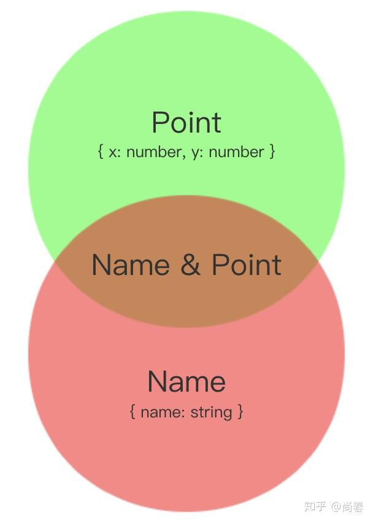
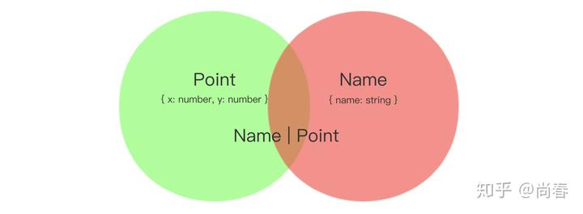
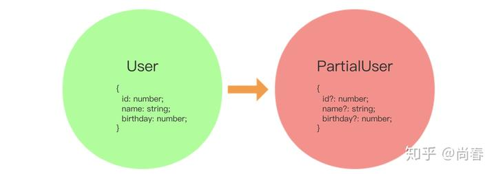
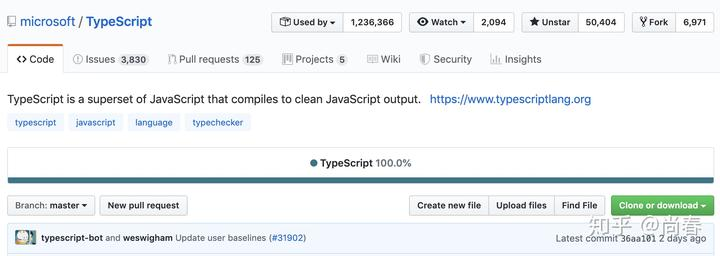

时下，TypeScript 可谓当红炸子鸡，众多知名开源项目纷纷采用，大型项目几乎成为必备。其中缘由，除了微软这一开源项目新势力的强大背书以外，最为核心的即是 TypeScript 的类型系统。JavaScript 太需要一套合适的类型体系来支撑日益规模化的协作开发了。

那么为什么 TypeScript 的类型系统能够做到这一点，而同时期的很多其它方案纷纷落入下风呢？本文着重从原理上剖析 TypeScript 的类型系统。

## 结构类型系统（Structural Type System）

TypeScript 和 C# 有着颇深的渊源，他们都是在微软大神 Anders Hejlsberg 的领导之下产生的编程语言，两者在诸多设计细节方面十分相似。然而，一个非常重要的不同之处在于，C# 采用的是 [Nominal Type System](https://en.wikipedia.org/wiki/Nominal_type_system)（标明类型系统），TypeScript 考虑到 JavaScript 本身的灵活特性，采用的是 [Structural Type System](https://en.wikipedia.org/wiki/Structural_type_system)。

下面我们通过一个例子解释下两者的不同。首先来看一段 C# 代码：

```csharp
public class Foo  
{
    public string Name { get; set; }
    public int Id { get; set;}
}

public class Bar  
{
    public string Name { get; set; }
    public int Id { get; set; }
}

Foo foo = new Foo(); // Okay.
Bar bar = new Foo(); // Error!!!
```

`Foo`和`Bar`两个类的内部定义完全一致，但是当将`Foo`实例赋值给`Bar`类型的变量时编译器报错，说明两者的类型并不一致。标明类型系统比较的是类型本身，具备非常强的一致性要求。

TypeScript 则不太一样：

```ts
class Foo {
  method(input: string): number { ... }
}

class Bar {
  method(input: string): number { ... }
}

const foo: Foo = new Foo(); // Okay.
const bar: Bar = new Foo(); // Okay.
```

<!--more-->

啊哈，没有任何错误发生。究其原因，TypeScript 比较的并不是类型定义本身，而是类型定义的形状（Shape），即各种约束条件：

> One of TypeScript’s core principles is that type checking focuses on the *shape *that values have. This is sometimes called “duck typing” or “structural subtyping”.  
> [https://www.typescriptlang.org/docs/handbook/interfaces.html](https://www.typescriptlang.org/docs/handbook/interfaces.html)

当我们实例化一个`Foo`对象然后将其赋值给一个`Bar`类型的变量时，TypeScript 检查发现该实例上具有`Bar`类型需要的所有约束条件，即一个名为`method`的接受一个`string`参数并返回一个`number`的方法（`method(input: string): number`），所以不会有任何报错。

这样做的好处是什么呢？一个好处是和 JavaScript 一脉相承。众所周知，JavaScript 是一门动态脚本语言，[Duck Typing](https://en.wikipedia.org/wiki/Duck_typing)（鸭子类型）应用广泛。一个典型等实例是 Iterable，它并不要求像 C++ 一样要求实例必须继承于某个父类或者像 Java 一样要求实例实现某个 `Interface`，它只检查当前的对象是否实现了`@@iterator`方法。TypeScript 对症下药，接地气地采用了 Structure Type System 来为 JavaScript 量身定制一套灵活的类型系统。

下面这个例子比较能够说明这一类型系统的灵活性：

```ts
type Point = {
  x: number;
  y: number;
};

function plot(point: Point) {
  // ...
}

plot({ x: 10, y: 25 }); // Okay.
plot({ x: 8, y: 13, name: 'foo' }); // Extra fields Okay. Need enable `suppressExcessPropertyError`
```

细细品味，当真没有一点违和感。理想中的 JavaScript 类型系统就应该是这样。

另外一个好处稍稍隐晦些。总体上来说面向对象型的语言更多地采用 Nominal Type System，函数式语言偏向于采用 Structure Type System，JavaScript 是一种非常独特的语言，两种编程范式兼而有之，不过近些年来主流方向是函数式，arrow function、Promise 等语言特性遍地开花，React、RxJS、Ramda 等社区方案备受推崇。TypeScript 顺势而为，解决 JavaScript 弱类型问题的同时，为函数式编程的发展狠狠地添了一把火。

## 集合与类型

TypeScript 只检查 Shape，即类型定义的约束条件，听起来和集合（Set）这一概念颇为相像。接下来，我们试着从集合的角度更深层次地理解 TypeScript 的类型。

上一个例子中定义的 Point 类型实际上可以理解为一个这样的集合：

```ts
{ obj | typeof obj === 'object' &&
        typeof obj.x === 'number' &&
        typeof obj.y === 'number' }
```

**交集**

假设我们再定义一个`Name`类型：

```ts
type Name = {
  name: string;
};
```

在所有的对象实例组成的集合中，有的对象实例符合 `Point` 类型，有的符合 `Name` 类型，有的符合它们两者，有的两者都不符合。问题来了，我们是否可以定义一个类型，要求符合它们两者呢？TypeScript 给出的答案是交集类型（Intersection Type）：

```ts
type NamedPoint = Name & Point;

function superPlot(point: NamedPoint) {
  console.log(point.name); // Okay.
  console.log(point.x); // Okay.
  console.log(point.sing); // Error!!!
}
```

通过集合来理解交集类型，一目了然：

*交集类型 NamedPoint*

**合集**

TypeScript 既然支持交集类型，那么合集类型（Union Type，也译作联合类型）呢？当然支持，而且更为强大。TypeScript 合集类型的构成元素既可以是类型，也可以是字面量，下面是一些例子：

```ts
type NameOrPoint = Name | Point;
type MyBoolean = true | false;
type Result = { status: 'ok' } | { status: 'error', reason: string };
```

类似地，上述例子中定义的`NameOrPoint`类型实际上可以理解为一个这样的集合：

```ts
{ item | item satisfies Name ||
          item satisfies Point }

===>

{ item | (typeof item === 'object' && typeof item.name === 'string') ||
         (typeof item === 'object' &&
          typeof item.x === 'number' &&
          typeof item.y === 'number') }
```

通过图形，我们可以更直观地理解合集类型：

*合集类型（Union Type）*

**类型收缩（Type Narrowing）**

实际开发中，合集的应用场景通常更多。一个常见场景是根据合集类型的具体构成类型进行不同的逻辑处理。例如：

```ts
function triple(input: number | string): number | string {
  if (typeof input === 'number') {
    return input * 3;
  } else {
    return (new Array(4)).join(input);
  }
}
```

TypeScript 能否正确推断出各个逻辑分支中的`input`类型呢？借助基于控制流的类型分析（[Control Flow Based Type Analysis](https://www.typescriptlang.org/docs/handbook/release-notes/typescript-2-0.html#control-flow-based-type-analysis)）以及`typeof`等类型哨兵（[Type Guard](https://www.typescriptlang.org/docs/handbook/advanced-types.html#type-guards-and-differentiating-types)），TypeScript 可以成功分析出上述示例中 if 分支中的`input`一定是 number 类型，else 分支`input`只能是其余的类型，即 string。这一贴心的功能显著提高了代码类型匹配的“智能”程度，有效降低了不必要的类型断言或者转换。微软大法真香~

然而，`typeof`、`instanceof` 等类型哨兵对于复合类型构成的合集类型并不奏效。在介绍解决方案之前，我们需要先理解字面量类型（literal Type）。

```ts
type GreetName = 'world' | 'moto';

function greet(name: GreetName) {
  return `hello, ${name}!`;
}

greet('world'); // Okay.
greet('moto'); // Okay.
greet('foo'); // Error!!!
```

`GreetName`只包含两个字面量 `world`和`moto`，任何其它值都不属于这一类型：

```ts
{ item | item === 'world' || item === 'moto' } 
```

字面量限定的不再是一个类似`string`的一个范围，而是具体的单值，因此这种类型又称作单例类型（Singleton Type）。

Ok，现在我们可以介绍如何收缩复合类型的合集类型了，解决方案的核心思路是：每一个合集中的构成类型都有一个同名不同值的单例类型属性，保证它们之间没有任何交集，然后通过在该属性上应用类型哨兵便可以唯一区分。一起看下这个稍长的示例：

```ts
type Square = {
  kind: 'square';
  size: number;
};

type Rectangle = {
  kind: 'rectangle';
  width: number;
  height: number;
};

type Circle = {
  kind: 'circle';
  radius: number;
}

type Shape = Square | Rectangle | Circle;

function area(shape: Shape): number {
  switch (shape.kind) {
    case 'square':
      return shape.size * shape.size;
    case 'rectangle':
      return shape.width * shape.height;
    case 'circle':
      return Math.PI * shape.radius * shape.radius;
  }
}
```

`Shape`合集类型中的各个构成类型都有一个`kind`属性，它的值是一个具体的字符串，在`area`方法中，switch 类型哨兵针对`kind`的不同取值可以分析出各个`case`分支中的具体类型。这种模式在很多情况下非常有用，所以给它起了一个别致的名字：可识别联合（Discriminated Union）。

## 类型编程

TypeScript 中不仅可以对各种类型进行类似集合一样的操作，进一步地，我们可以进行类型层面的编程。

**泛型（**[Generics](https://www.typescriptlang.org/docs/handbook/generics.html)**）**

主流的编程语言通常都支持泛型以提供更加出色的抽象能力，TypeScript 也不免俗：

```ts
function identity<T>(x: T): T {
  return x;
}

const outputString = identity<string>('foo'); // Okay. outputString is a string
const outputNumber = identity<number>(666); // Okay. outputNumber is a number
```

本质上，泛型可以理解为一个类型层面的函数，当我们指定具体的输入类型时，得到的结果是经过处理后的输出类型：

```ts
const identity = x => x; // value level
type Identity<T> = T; // type level

const pair = (x, y) => [x, y]; // value level
type Pair<T, U> = [T, U]; // type level
```

在定义泛型时，我们只是定义了一个逻辑处理过程，只有在用具体输入类型调用它时，才会得到真正的结果类型。所以我们在编写泛型时，实际上是在进行类型层面的编程，因为它是一个函数。

**片段（**[Partial](https://www.typescriptlang.org/docs/handbook/advanced-types.html#mapped-types)**）**

有时候我们定义了一个类型，但是在一些情况下只需要满足该类型的部分约束，例如：

```ts
type User = {
  id: number;
  name: string;
  birthday: number;
};

updateUser(user.id, {
  name,
});
```

在`updateUser`的第二个参数中，我们希望放松限制，满足`User`类型的部分约束即可，例如只有`name`。也就是说，我们希望有一个类型函数，能够完成如下操作：


前面我们提到过，泛型是类型的函数，TypeScript 提供了一些精简的类型操作符，例如`keyof`，`in`等，借助这些能力，我们可以实现上述的类型转换函数：

```ts
type Partial<T> = {
  [P in keyof T]?: T[P];
}

function updateUser(id: User['id'], data: Partial<User>) {}
```

鉴于`Partial`需求非常普遍，TypeScript 在 2.1 版本中加入了包含`Partial`、`Readonly`、`Pick`等工具类型。

**条件类型（**[Conditional Type](https://www.typescriptlang.org/docs/handbook/advanced-types.html#conditional-types)**）**

千呼万唤始出来，TypeScript 终于在 2.8 版本中引入了条件类型，用来表述非单一形式的类型。当时一位主要维护者甚至感慨道：

> Working through our (enormous) backlog of unsorted TypeScript "Suggestions" and it's remarkable how many of them are solved by conditional types.  
> -- Ryan Cavanaugh

究竟是什么功能让这么多人孜孜以求呢？我们需要从一个实际案例讲起：

```ts
function process(text: string | null): string | null {
  return text && text.replace(/f/g, 'p');
}

process('foo').toUpperCase(); // Error!!!
```

`process`方法可以接受一个字符串或者`null`的参数，如果这个参数是字符串，则返回一个字符串，否则返回`null`。上述实现由于欠缺输入类型和输出类型之间的关联关系，导致即便输入是字符串时 TypeScript 仍然不能推断出输出是字符串，最终编译报错。

条件类型一般形式是`T extends U ? X : Y` ，和 JavaScript 的三元表达式一致，其中条件部分`T extends U` 表示 T 是 U 的子集，即 T 类型的所有取值都包含在 U 类型中。借助这一能力，`process`遇到的困境迎刃而解：

```ts
function process<T extends string | null>(text: T): T extends string ? string : null {
  return text && text.replace(/f/g, 'p');
}

process('foo').toUpperCase(); // Okay.
process(null).toUpperCase(); // Error!!!
```

上述示例通过定义一个泛型 T，然后对输入类型（T）和输出类型进行关联，并通过条件类型进行不同类型处理达到预期效果。注：目前 TypeScript 支持还有问题，详见 [#24929](https://github.com/microsoft/TypeScript/issues/24929)。

条件类型支持嵌套，轻松支持类似 switch 的多条件分支效果。当 T 类型是合集类型时，条件类型可以进行展开：

```ts
(A | B) extends U ? X : Y ==> (A extends U ? X : Y) | (B extends U ? X : Y)
```

基于这一特性，我们可以创造出更多工具类型：

```ts
type Diff<T, U> = T extends U ? never : T;
type DiffDemo = Diff<'a' | 'b' | 'c', 'a' | 'd' | 'e'>;  // 'b' | 'c'
```

考虑到常见需求，TypeScript 在发布条件类型时，一并发布了`Exclude<T, U>`、`NonNullable<T>`等内置工具类型。

**递归**

有些情况下我们希望 TypeScript 能够描述存在递归关系的数据，例如一个堆栈：

```ts
type Stack<T> = {
  top: T;
  rest: Stack<T>;
} | null;
```

堆栈本身可能是`null`，如果存在的话，栈顶是一个类型为 T 的数据，其余部分又可以被描述为一个子堆栈。在前面我们提到，泛型本身可以认为是一个类型函数，因此这里的递归并不会导致无限循环发生，`rest`对应的类型是一个函数，只有当需要推断数据类型的时候才会调用。

对递归的支持这一特性往往被低估。事实上，递归是很多复杂操作的基础，例如条件类型可以通过递归实现。

**图灵完备（Turing Complete）**

有了类型层面的函数（泛型）、条件语句（条件类型）、递归等功能之后，我们不禁有一个疑问：TypeScript 能够描述所有的数据类型吗？是的，已经有人证明，[TypeScript 是图灵完备的](https://github.com/Microsoft/TypeScript/issues/14833)，它完全有能力完成任何类型层面的可计算问题。更通俗一点说，TypeScript 包含了一套完整的类型层面编程能力，就像我们可以用 JavaScript、C++、Go 等编程语言解决各种实际问题一样，TypeScript 可以解决各种类型问题，因为本质上它们的内核都和图灵机等价。

目前已经有一些“不安分” 的开发者开发出了判定素数的类型`IsPrime<T>` 、将合集类型转换为元组的类型`UnionToTuple<T>`、根据条件获取子集类型的类型`ConditionalSubset<T>` 等，每一个实现都令人叹为观止。

诚然，现在很多复杂类型仍然需要大量的深度类型编程才能实现，这种门槛一定程度上限制了 TypeScript 在一些复杂场景下的应用。不过我们也欣喜地注意到，作为一个流行的开源项目，TypeScript 也在聆听社区的声音，不断改进底层特性并推出新的工具类型，方便开发者多快好省地写代码。

## 结语

在引入 TypeScript 的过程中，我们基本都可以感受到它的类型约束带来的种种益处。明确的接口契约，一方面有力加强了工程质量，弥补了 JavaScript 的最大软肋，另一方面，借助一些基于此构建的周边工具，开发效率也获得了明显提升。然而 TypeScript 的中高级进阶并非易事，我们时常困惑于某些具体特性的要义，纠结在一个复杂类型的实现。最终我们发现，欠缺的实际上是一个对 TypeScript 类型系统的深层次理解。

本文深受 Drew Colthorp 先生的 [Understanding TypeScript’s Structural Type System ](https://youtu.be/MbZoQlmQaWQ)演讲启发，并在此基础上进行了适当外延，从原理层面由浅入深层层递进地阐述了 TypeScript 类型系统的特性和思想。期望这篇文章能够帮助你理解 TypeScript 类型系统的基本原理和强大功能，知其然且知其所以然，在 TypeScript 的进阶之路上一路狂奔。

## 彩蛋

TypeScript 是用什么编程语言写的呢？令人惊讶的是，它是 100% 用 TypeScript 完成的：


其实这种情况并不鲜见，很多编程语言，例如 C、C++ 等，都有自举（self-hosting，用自身语言实现）编译器，这种技术一般称作 [Compiler Bootstraping](https://en.wikipedia.org/wiki/Bootstrapping_(compilers))，有兴趣的小伙伴可以去进一步了解。

## 参考资料

1. [TypeScript Language Specification](https://github.com/Microsoft/TypeScript/blob/master/doc/spec.md)
2. [Understanding TypeScript's Structural Type System - Drew Colthorp](https://youtu.be/MbZoQlmQaWQ)
3. [Type System Differences in TypeScript (Structural Type System) VS C# & Java (Nominal Type System)](https://www.triplet.fi/blog/type-system-differences-in-typescript-structural-type-system-vs-c-java-nominal-type-system/)
4. [TypeScript 2.0: Control Flow Based Type Analysis](https://mariusschulz.com/blog/typescript-2-0-control-flow-based-type-analysis)
5. [Conditional types in TypeScript](https://artsy.github.io/blog/2018/11/21/conditional-types-in-typescript/)
6. [TypeScript: Create a condition-based subset types](https://medium.com/dailyjs/typescript-create-a-condition-based-subset-types-9d902cea5b8c)
