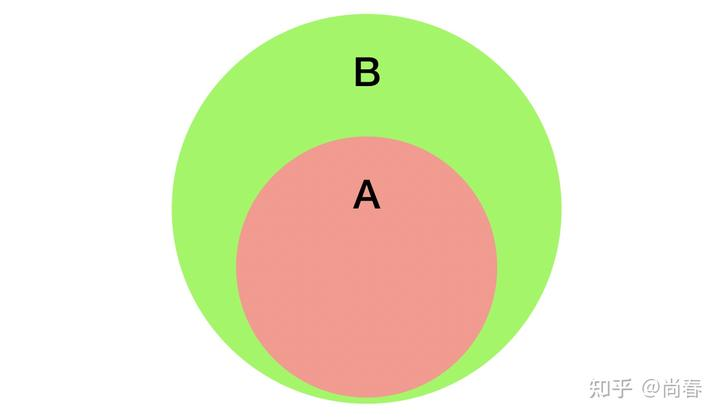
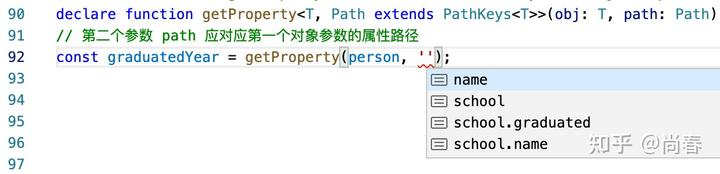
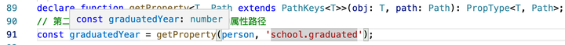

在上一篇文章[浅谈 TypeScript 类型系统](https://zhuanlan.zhihu.com/p/64446259)中，我们介绍了 TypeScript 的一些基础知识，也简要提到了泛型编程等进阶内容。在开发实践中，可能不少同学会发现虽然这些基础基本能够解决大部分问题，但是总时不时有一些解决不了的类型相关问题。

这篇文章在前文的基础上，进一步介绍一些 TypeScript 的进阶知识和应用，希望能够对你有所帮助。在内容编排上，我们首先引入一些典型问题，然后介绍相关的必备知识点，最后阐述这些问题的解决思路。

## 典型问题

**问题 A：**现有一个工具方法 compose(f, g) 用以整合两个函数，如何添加合适的 type？

```ts
function compose(f, g) {
  return (...args) => g(f(...args));
}
```

**问题 B：**如何获取返回 Promise<T> 类型的函数中的类型 T，从而能够实现一些类似 React Query 中 [useQuery](https://github.com/tannerlinsley/react-query/blob/v3.15.2/src/react/useQuery.ts#L26-L35) 的方法？

```ts
type User = {
  name: string;
  age?: number;
};
const fetchUser = (id: string): Promise<User> => { ... };

// status 为 'success' 时，data 类型应为 User
const { status, data } = useQuery(`getUser${id}`, () => fetchUser(id));
```

**问题 C：**如何为工具方法 getProperty(obj, path) 添加合适的类型，从而使得 TypeScript 自行推断出最终的返回结果的类型？

```ts
const person = { 
  name: 'Simon', 
  school: { name: 'MIT', graduated: 2018 },
};
// 第二个参数 path 应对应第一个对象参数的属性路径
const graduatedYear = getProperty(person, 'school.graduated');
```

<!--more-->

如果你对自己的 TypeScript 技能有信心，不妨在继续阅读之前挑战下这几个问题。

## 进阶知识点

**类型参数推断（Type argument inference）**

在使用泛型时，每次都必须显式地标明实例化类型是非常低效的，譬如：

```ts
function identity<T>(arg: T): T {
  return arg;
}
const output = identity<string>('myString');
```

上例在调用 identity 方法时传入的实参已经是一个字符串字面量，我们自然而然地期望 TypeScript 编译器足够聪明，能从这个参数推断出实例化类型是 string。官方团队很早就支持了类型参数推断，让开发者写代码更为舒爽：

```ts
const output = identity('myString'); // output 类型为 string
const output2 = identity(true); // output2 类型为 boolean
```

当然，和普通的类型推断一样，有些特定场景下你可能仍需要显式地指定实例化类型，以避免推断错误：

```ts
const output3 = identity([1, 'spring']); // output3 类型是 (number | string)[]
// 如果你期望传入的类型是一个 [number, string] 的 Tuple，可以显式指定实例化类型
const output4 = identity<[number, string]>([1, 'spring']);
```

**多重含义的 extends**

TypeScript 的类型操作符有一些和 JavaScript 操作符重合，譬如 typeof、in 等。然而最为关键的一个却是 extends，可谓集万千宠爱于一身。

Extends 的第一种用法是实现接口的继承：

```ts
// 继承接口
interface Animal {
  name: string;
}
interface Bird extends Animal {
  fly: boolean;
}
const pigeon: Bird = { name: 'pigeon', fly: true };
```

第二种用法也十分普遍，主要应用在[泛型约束](https://www.typescriptlang.org/docs/handbook/2/generics.html#generic-constraints)中：

```ts
function getProperty<T, K extends keyof T>(obj: T, key: K) {
  return obj[key];
}

let x = { a: 1, b: 2 };

getProperty(x, 'a'); // Okay
getProperty(x, 'm'); // Error!
```

根据类型参数推断 TypeScript 能够判断出 T 的实际类型是 { a: number, b: number }，附加的泛型约束是 K extends keyof T，即 K 是一个从 T 泛型衍生出来的类型 'a' | 'b'，因此第二个参数 key 只能是 a 或者 b。这一特性进一步提升了类型之间关系的表达力。

第三种用法是在 TypeScript 2.8 中引入的条件类型中，extends 担当条件语句关键的运算符角色：

```ts
SomeType extends OtherType ? TrueType : FalseType;
```

根据[定义](https://www.typescriptlang.org/docs/handbook/2/conditional-types.html)，如果 SomeType 可以[赋值](https://www.typescriptlang.org/docs/handbook/type-compatibility.html)给 OtherType，则返回 TrueType，否则返回 FalseType。所以可以理解成这里的 SomeType extends OtherType 应该是返回了一个布尔值。

以上三种不同的 extends 用法具体实践上有细微的差异，但究其根本，其实是一以贯之的：A extends B 意味着 A 应该是 B 的子集。借助上一篇文章的集合论观点的话，可以表示为  ：

*A extends B*

**infer 模式匹配**

和条件类型一同发布的，还有一个至关重要的特性：使用 infer 关键字在条件语句中进行类型推断，从而实现了类型层面的模式匹配（pattern matching）。

譬如下面示例，我们希望从数组类型中提取数组元素类型：

```ts
type Flatten<T> = T extends any[] ? T[number] : T;
type F1 = Flatten<string[]>; // F1 为 string
type F2 = Flatten<number[]>; // F2 为 number
```

相信很多人都会不太理解 T[number] 这种偏门的技巧，上例可以用 infer 重写为：

```ts
type FlattenInfer<T> = T extends (infer Item)[] ? Item : T;
type F3 = FlattenInfer<string[]>; // F3 为 string
type F4 = FlattenInfer<number[]>; // F4 为 number
```

在 F3 示例中，TypeScript 能够从传入的实例化类型 string[]，根据 (infer Item)[] 匹配出 string 类型并将其赋值给新声明的类型 Item，然后在条件为真的分支中使用。

让我们继续看一个更加实用的例子，使用 infer 提取函数返回类型：

```ts
type ReturnType<T> = T extends (...args: any[]) => infer R ? R : any;
type R1 = ReturnType<() => string>; // R1 为 string
type R2 = ReturnType<(a: number) => { name: string }>; // R2 为 { name: string }
type R3 = ReturnType<boolean>; // R3 为 any
```

模式匹配的威力再一次体现出来，infer R 准确匹配到了 () => string 与 (a: number) => { name: string } 两个方法的返回值，最后一个例子因为 boolean 并不是一个函数所以没有进入模式匹配。ReturnType 是如此常用，所以 TypeScript 直接将其作为内置工具类型。

**合集类型与分配律**

合集类型因为包含多个类型元素，且相互间属于或的关系，因此我们直觉上会认为在合集与其它类型进行复合运算时分配律应当成立，譬如：

```ts
type UnionCompositeType = ({ a: string } | { b: string }) & { c: string };

// 推导
({ a: string } | { b: string }) & { c: string }
==> ({ a: string } & { c: string }) | ({ b: string } & { c: string }) 
==> { a: string; c: string } | { b: string; c: string }

const objectA: UnionCompositeType = {  // Okay
  a: 'javascript',
  c: 'great',
};
const objectB: UnionCompositeType = {  // Okay
  b: 'javascript',
  c: 'not bad',
};
const objectC: UnionCompositeType = {  // Error!
  c: 'not good enough though',
};
```

TypeScript 在推出条件类型时，也第一时间支持了检查类型是合集时的分配律，并称之为[分布条件类型](https://www.typescriptlang.org/docs/handbook/2/conditional-types.html#distributive-conditional-types)。简单来说，就是 T extends U 中的 T 实例化类型为 A | B | C 时，那么条件类型表达式会被展开为：

```ts
(A extends U ? X : Y) | (B extends U ? X : Y) | (C extends U ? X : Y)
```

下面是一个简单示例：

```ts
type TypeName<T> = T extends string
  ? 'string'
  : T extends number
  ? 'number'
  : 'other';

type T1 = TypeName<string | number>; // 'string' | 'number'
type T2 = TypeName<string | () => void>; // 'string' | 'other'
type T3 = TypeName<boolean | void>; // 'other'
```

借助这一特性，我们可以实现很多高阶工具类型：

```ts
type Extract<T, U> = T extends U ? T : never;
type Extract1 = Extract<'a' | 'b' | 'c' | 'd', 'a' | 'c' | 'f'>; // 'a' | 'c'
type Extract2 = Extract<'a' | 'b', keyof { a: string, c: string }>; // 'a'

type Exclude<T, U> = T extends U ? never : T;
type Exclude1 = Exclude<'a' | 'b' | 'c' | 'd', 'a' | 'c' | 'f'>; // 'b' | 'd'
type Exclude2 = Exclude<string | () => void, Function>; // string
```

在新近发布的 4.1 中，TypeScript 新增的[模板字面量类型](https://www.typescriptlang.org/docs/handbook/release-notes/typescript-4-1.html#template-literal-types)也同样支持合集类型的分配律：

```ts
type Color = 'red' | 'blue';
type Quantity = 'one' | 'two';

type SeussFish = `${Quantity | Color} fish`; // 类型为 'one fish' | 'two fish' | 'red fish' | 'blue fish'
```

但并非所有的工具类型都支持合集的分配律，譬如 Pick<T, K> 和 Omit<T, K>，具体 TypeScript 有一些性能、复杂度等方面的[考量](https://davidgomes.com/pick-omit-over-union-types-in-typescript/)，且有一些 workarounds。

## 问题解答

在理解了上述进阶知识点后，我们接下来探讨前面三个问题的解法。

**问题 A：compose(f, g)**

首先我们需要厘清的问题是，什么样的类型算是比较合适的，具体到这个工具方法，应满足如下要求：

1. f 的输入类型应该是 compose 方法的输入类型
2. f 的输出类型应该是 g 方法的输入类型
3. g 方法的输出类型应是 compose 方法的输出类型

接下来我们尝试解题如下：

```ts
// 第一步：分别列出 f、g、compose 的类型：
// f: (...args: A) => B
// g: (arg: B) => C
// compose: (...args: A) => C

// 第二步：尝试将上述类型引入 compose 方法中
// TypeScript 报错：(...args: A) A rest parameter must be of an array type
function compose<A, B, C>(f: (...args: A) => B, g: (arg: B) => C) {
  return (...args: A) => g(f(...args));
}

// 第三步：添加泛型约束 A extends any[]
function compose<A extends any[], B, C>(f: (...args: A) => B, g: (arg: B) => C) {
  return (...args: A) => g(f(...args));
}
```

在实际调用 compose 方法时，绝大部分情况下我们并不需要显式指定 A、B、C 泛型的实例化类型，TypeScript 的类型参数推断会默默无闻地帮助我们：

```ts
function getName(obj: { name: string }) { return obj.name; }
function getLength(s: string) { return s.length; }
const lengthOfName = compose(getName, getLength); // lengthOfName 类型为 number
```

这个问题应用到了前文的类型参数推断和泛型约束两个知识点。

**问题 B：提取 Promise<T> 中的 T**

在有类型层面的模式匹配后解决这个问题实际上非常简单：

```ts
type UnPromisify<T> = T extends Promise<infer U> ? U : T;
```

是不是太过简单了？的确如此。接下来让我们继续尝试给 useQuery 添加类型吧：

```ts
// 第一步：定义 useQuery 的返回值类型，这里我们应用到了可辨析联合
type QueryIdleResult<TData, TError> = {
  status: 'idle';
  data: undefined;
  error: null;
};
type QueryLoadingResult<TData, TError> = {
  status: 'loading';
  data: undefined;
  error: null;
};
type QueryErrorResult<TData, TError> = {
  status: 'error';
  data: TData;
  error: TError;
};
type QuerySuccessResult<TData, TError> = {
  status: 'success';
  data: TData;
  error: null;
};
type QueryResult<TData, TError> =
  | QueryIdleResult<TData, TError>
  | QueryLoadingResult<TData, TError>
  | QueryErrorResult<TData, TError>
  | QuerySuccessResult<TData, TError>

// 第二步：尝试为 useQuery 添加类型签名，这里我们将 queryFn 定义为泛型 T，然后尝试析取它的返回类型并做 Promise 解包操作
function useQuery<T extends (...args: any[]) => any, TError = Error>
  (queryKey: string, queryFn: T): QueryResult<UnPromisify<ReturnType<T>>, TError> { ... }

// 最后，举个栗子
const id = '123';
const user = useQuery(`getUser${id}`, () => fetchUser(id));
if (user.status === 'loading') {
  console.log(result.data); // 类型为 undefined
}
if (user.status === 'success') {
  console.log(result.data);  // 类型为 User
}
if (user.status === 'error') {
  console.log(result.error);  // 类型为 Error
}
```

这个解法应用前文提到的类型参数推断、泛型约束和 infer 模式匹配等知识点。

然而，在 React Query 的官方实现中，采用了一种更为简洁的方式：

```ts
function useQuery<TData = unknown, TError = unknown>
  (queryKey: string, queryFn: () => Promise<TData>): QueryResult<TData, TError>
```

不得不感慨：一顿操作猛如虎，一看战绩零杠五。因此也不是什么情况下都需要用到非常复杂的类型特性，Keep it simple and stupid 反而是最优解。

**问题 C：getProperty(obj, path)**

在前文介绍泛型约束时，我们已经举例说明了 path 为简单属性情况下的解法，接下来，让我们继续探讨 path 为多层属性（'a.b.c'）时如何处理。

假定 obj 的类型为 T，path 的类型为 Path，显然 Path 应为 T 推导而来。最简单的情况为 path 仅包含简单属性：

```ts
type PathKeys<T> = T extends object ? keyof T : never;
getProperty<T, Path extends PathKeys<T>>(obj: T, path: Path);
```

考虑到有些情况下对象的 key 可能是 number、symbol 等其它类型，但这里我们期望只支持 string 类型，可以将 PathKeys<T> 定义改进为：

```ts
type PathKeys<T> = T extends object ? Extract<keyof T, string> : never;
```

类似数学归纳法，现在我们明确了简单情况下的类型，下一步处理 path 为多层属性的情况。可能有些敏感的同学已经嗅到了递归的味道，是的，因为多层属性是通过递归的思路规约到最简单情况的。思路大致为：

1. 扩展 PathKeys<T> 的条件为真的分支，继续处理下一层属性
2. 处理每个多层属性时，需加上当前层次的属性作为前缀，然后继续递归，从而最终得出所有可能属性路径
3. 为了支持上诉两条，结合一般情况下递归的解决办法，可以定义一个新的 SubKeys<T, K> 类型作为中间桥梁

代码为：

```ts
type PathKeys<T> = T extends object ?
  Extract<keyof T, string> | SubKeys<T, Extract<keyof T, string>> :
  never;
type SubKeys<T, K extends string> = K extends keyof T ?
  `${K}.${PathKeys<T[K]>}` : 
  never;
declare function getProperty<T, Path extends PathKeys<T>>(obj: T, path: Path);
```

下图为在 VSCode 里面运行时的自动补全提示，可以感受下完善的类型系统给我们带来的便利和惊喜：


然而这并不是结束，我们还有一个类型需要一并完成：返回值类型。理想的结果应该是，以上面的代码为例，TypeScript 应该可以根据我们传入的参数推断出 graduatedYear 的类型。

有了前面 PathKeys<T> 的思路作为借鉴，借助 infer 模式匹配，我们可以定义 PropertyType<T, Path> 如下：

```ts
type PropertyType<T, Path extends string> =
    Path extends keyof T ? T[Path] :
    Path extends `${infer K}.${infer R}` ? K extends keyof T ? PropertyType<T[K], R> : unknown :
    unknown;
declare function getProperty<T, Path extends PathKeys<T>>(obj: T, path: Path): PropertyType<T, Path>;
```

VSCode 中运行结果如下：


Aha！TypeScript 真是神奇！

有兴趣的朋友，可以进一步挑战下在 path 中支持数组索引等的复杂情况。

## 彩蛋

近些年，国内程序员圈感觉上越来越卷，35 岁甚至 30 岁不升管理岗就好像是异类，前途渺茫。然而不为人所知的是，TypeScript 的设计者 Anders Hejlsberg 是 1960 年生人，已然花甲之年，按照国内的标准来看，他老人家已经应该是退休在家，天天带娃或者环游世界了。但是，近期的很多 TypeScript 的重要功能都是他的 Pull Request 引入的，每年 TSConf 的主题演讲也常常是他出场，从代码质量和思维活跃度来看显然仍处于全盛时期。

*Anders 在 TSConf 2019 做主题演讲*

*Anders 在 TSConf 2020 展示他去年的 TS*

对比两次大会，可以看出 Anders 白发明显变多，可能是过度思考导致。没有他和 TypeScript 团队以及整个社区的辛苦付出，近几年前端的高质量发展不会如此迅猛。

笔者提这些，只是期望更多地鼓励那些对技术改变美好生活仍充满信仰的同学继续坚持下去，也许我们和 Anders 能力差距甚远，但是只要方向正确且执行到位，靠接地气的技术是可以一直写到退休的。

共勉！

## 参考

- [TSConf 2019 Keynote - Anders Hejlsberg](https://www.youtube.com/watch?v=jmPZztKIFf4&list=PLw5h0DiJ-9PBIgIyd2ZA1CVnJf0BLFJg2)
- [TSConf 2020: Keynote - Anders Hejlsberg](https://www.youtube.com/watch?v=IGw2MRI0YV8)
- [Magical TypeScript features - Alex Okrushko](https://youtu.be/T-vQoI_AM9E)
- [TypeScript: Union to intersection type](https://fettblog.eu/typescript-union-to-intersection/)
- [Typescript explained in Javascript: extends](https://skovy.dev/typescript-explained-in-javascript-extends/)

---

插个小广告：因为笔者所在团队业务发展远快于开发资源，人手很缺，非常希望有志于写代码到退休的攻城狮、程序媛加入。这里拒绝 996，坚信技术是一门严肃且充满创造力的脑力活动，既要高效率工作又要高质量生活，追求从代码到界面的双重完美。

具体职位可以移步：
[Tubi 中国团队](http://chinateam.tubi.tv/)
